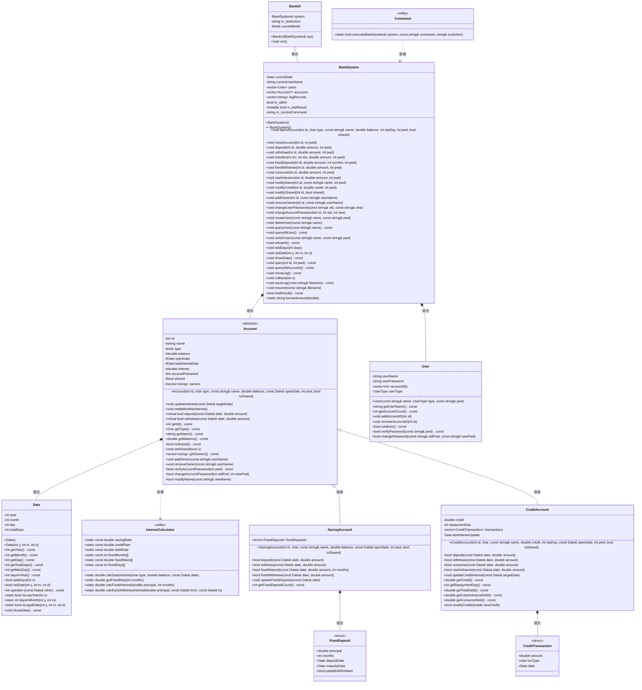

# 银行管理系统 — 设计说明书

---

## 第一章 系统概述

本系统是一个模拟银行核心业务的管理系统，采用 C++ 面向对象设计，基于控制台交互。系统支持以下核心功能：

- **账户体系**：储蓄账户（活期 + 定期存款）、信用账户（消费/取现分离计息）
- **用户管理**：管理员与普通用户两级权限，用户密码与账户密码分离
- **共享账户**：支持 2~5 人共管同一账户
- **操作日志**：事件溯源式回滚与持久化恢复
- **引导式界面**：三级菜单 + 逐参数输入，无需记忆命令格式

### 1.1 系统架构层次

系统采用前后端分离的三层架构：

```
┌─────────────────────────────────────────────┐
│            前端（表现层）                      │
│  BankUI（交互式TUI菜单）  Command（命令解析）  │
├─────────────────────────────────────────────┤
│            后端（业务逻辑层）                   │
│  BankSystem（核心调度、权限控制、日志记录）      │
├─────────────────────────────────────────────┤
│            数据模型层                         │
│  Account（储蓄/信用）  Date  InterestCalculator│
│  User                                          │
└─────────────────────────────────────────────┘
```

- **前端层**：`BankUI` 负责三级引导式菜单，收集用户输入并构造命令字符串；`Command` 负责解析命令文本并分发给后端。前端不包含任何业务逻辑。
- **后端层**：`BankSystem` 是核心调度器，负责权限验证、账户查找、日志记录、回滚恢复。所有操作的成功/失败结果通过 `m_lastResult` 标志传递回前端。
- **数据模型层**：`Account` 类层次（`SavingAccount`、`CreditAccount`）封装账户数据和业务规则；`InterestCalculator` 提供静态利率表和计算方法；`Date` 提供日期运算。

---

## 第二章 类图



---

## 第三章 各类数据成员说明

### 3.1 Date 类

| 成员 | 类型 | 说明 |
|------|------|------|
| `year` | `int` | 年份，存储绝对年份（如 1970） |
| `month` | `int` | 月份，范围 1~12 |
| `day` | `int` | 日，范围 1~当月最大天数 |
| `totalDays` | `int` | 自公元1年1月1日起的累计天数，日期运算的核心字段。通过 `getTotalDays()` 公开只读访问。所有日期比较、求差运算退化为 O(1) 整数操作 |

### 3.2 InterestCalculator 类（纯静态工具类，无实例）

| 成员 | 类型 | 初始值 | 说明 |
|------|------|--------|------|
| `savingRate` | `const double` | 0.0115 | 储蓄活期年利率（1.15%） |
| `creditRate` | `const double` | 0.0225 | 信用正余额年利率（2.25%） |
| `debtRate` | `const double` | 0.0005 | 信用透支日利率（0.05%，约年化18.25%） |
| `fixedMonths[]` | `const int[]` | {3,6,12,24,36,60} | 定期存款可选存期（月） |
| `fixedRates[]` | `const double[]` | {0.0135,0.0155,0.0175,0.0225,0.0275,0.0300} | 对应定期年利率 |
| `fixedDays[]` | `const int[]` | {90,180,365,730,1095,1825} | 对应定期天数 |

### 3.3 Account 基类

| 成员 | 类型 | 说明 |
|------|------|------|
| `id` | `int` | 账户唯一标识，开户时指定，全局唯一 |
| `name` | `string` | 账户名称（仅含字母和数字），可通过 MODIFY NAME 修改 |
| `type` | `char` | 账户类型：`'S'`=储蓄，`'C'`=信用 |
| `balance` | `double` | 当前活期余额。储蓄账户含活期+定期；信用账户可为负（透支） |
| `openDate` | `Date` | 开户日期，构造时初始化 |
| `lastInterestDate` | `Date` | 上次计息截止日期，每次 `updateInterest()` 后更新为当前日期 |
| `interest` | `double` | 当月累计未结利息。每月1日结入余额（复利），之后清零 |
| `accountPassword` | `int` | 6位数字账户密码（100000~999999），所有账户操作需验证 |
| `shared` | `bool` | 是否为共享账户。共享账户支持2~5人共管 |
| `owners` | `vector<string>` | 共有人用户名列表。开户者为首个 owner，管理员可添加/移除 |

### 3.4 SavingAccount 类

| 成员 | 类型 | 说明 |
|------|------|------|
| `fixedDeposits` | `vector<FixedDeposit>` | 定期存款列表，支持多笔并存。到期自动结算，支持部分提前支取 |

### 3.5 FixedDeposit 结构体

| 成员 | 类型 | 说明 |
|------|------|------|
| `principal` | `double` | 定期本金 |
| `months` | `int` | 存期（3/6/12/24/36/60月） |
| `depositDate` | `Date` | 存入日期 |
| `maturityDate` | `Date` | 到期日 = depositDate + fixedDays[index] |
| `partiallyWithdrawn` | `bool` | 一次性标记，防止同一笔定期存款被多次部分支取 |

### 3.8 CreditAccount 类

| 成员 | 类型 | 说明 |
|------|------|------|
| `credit` | `double` | 信用额度 |
| `repaymentDay` | `int` | 每月还款日（1~28），决定宽限期截止日 |
| `transactions` | `vector<CreditTransaction>` | 交易流水，债务从流水重放计算。`'P'`=消费，`'C'`=取现，`'R'`=还款 |
| `lastInterestUpdate` | `Date` | 上次透支计息截止日期 |

### 3.9 CreditTransaction 结构体

| 成员 | 类型 | 说明 |
|------|------|------|
| `amount` | `double` | 交易金额。消费/取现为正数，还款记录为负数 |
| `txnType` | `char` | 交易类型：`'P'`=消费，`'C'`=取现，`'R'`=还款 |
| `date` | `Date` | 交易日期 |

### 3.10 User 类

| 成员 | 类型 | 说明 |
|------|------|------|
| `userName` | `string` | 用户名，仅含字母和数字，唯一 |
| `userPassword` | `string` | 用户密码（字符串，无空格） |
| `accountIDs` | `vector<int>` | 关联的账户ID列表 |
| `userType` | `enum UserType` | 用户类型：`admin`（管理员）/ `normal`（普通用户） |

### 3.11 BankSystem 类

| 成员 | 类型 | 说明 |
|------|------|------|
| `currentDate` | `Date` | 系统当前日期，只能向前推进（不可回退） |
| `currentUserName` | `string` | 当前登录用户名 |
| `users` | `vector<User>` | 全部用户（按值存储） |
| `accounts` | `vector<Account*>` | 全部账户（原始指针，BankSystem 拥有所有权，析构时 delete） |
| `logRecords` | `vector<string>` | 操作命令日志，回滚/恢复的核心数据 |
| `m_silent` | `bool` | 静默模式标志，回放时不输出 |
| `m_lastResult` | `mutable bool` | 上次操作成功/失败标志，供 UI 判断 |
| `m_currentCommand` | `string` | 当前命令原始字符串，用于日志记录 |

### 3.12 Command 类（纯静态工具类）

| 成员 | 类型 | 说明 |
|------|------|------|
| `execute(system, command, outAction)` | `static bool` | 静态命令解析与执行：将命令字符串解析为命令词+参数，按 if-else 链匹配并调用对应 BankSystem 方法。`outAction` 接收命令词供 UI 反馈，解析失败返回 false |

### 3.13 BankUI 类

| 成员 | 类型 | 说明 |
|------|------|------|
| `system` | `BankSystem&` | 引用，不拥有 |
| `m_lastAction` | `string` | 最近执行的命令词，通过 `Command::execute()` 的输出参数获取，供 `feedback()` 做中文结果映射 |
| `currentMode` | `enum Mode` | 当前模式：`NONE`/`ADMIN`/`USER`。构造时初始化为 `NONE`，进入模式循环前赋为对应值，退出后重置为 `NONE` |

---

## 第四章 各类函数成员说明

### 4.1 Date 类

| 函数原型 | 功能说明 |
|----------|------|
| `Date()` | 默认构造，设为 1970-01-01，totalDays = 719163 |
| `Date(int y, int m, int d)` | 带参构造，非法日期抛出 `invalid_argument`。计算 totalDays = (y-1)×365 + 闰年修正 + 月前天数 + d |
| `int getYear() const` | 返回年份 |
| `int getMonth() const` | 返回月份（1~12） |
| `int getDay() const` | 返回日 |
| `int getTotalDays() const` | 返回 totalDays（自公元1年1月1日起的累计天数），供净值计算使用 |
| `int getMaxDay() const` | 返回当月最大天数（处理闰年2月=29） |
| `int daysInYear() const` | 返回当年天数（365或366），作为日利率分母 |
| `bool addDays(int n)` | 推进 n 天，n 必须 > 0，逐日进位同时更新 totalDays。用于模拟时间流逝 |
| `bool setDate(int y, int m, int d)` | 设置到指定日期。验证合法性后比较 totalDays，仅接受向前（拒绝倒退），保证利息不重复 |
| `int operator-(const Date& other) const` | 日期差 = totalDays 相减，O(1) 整数减法 |
| `static bool isLeapYear(int y)` | 判断闰年：能被4整除且不被100整除，或能被400整除 |
| `static int daysInMonth(int y, int m)` | 返回某年某月的天数 |
| `static bool isLegalDate(int y, int m, int d)` | 验证日期合法性：月1~12，日1~当月最大天数 |
| `void showDate() const` | 格式化输出到 cout，格式如 "Thursday, January 1, 1970" |

### 4.2 InterestCalculator 类（全部静态）

| 函数原型 | 功能说明 |
|----------|------|
| `static double calcDailyInterest(char type, double balance, const Date& date)` | 计算日利息。`'S'`: balance × savingRate / daysInYear；`'C'`正余额: balance × creditRate / daysInYear；`'C'`透支: balance × debtRate |
| `static double getFixedRate(int months)` | 在 fixedMonths[] 中线性查找匹配的定期利率，未匹配返回 0 |
| `static double calcFixedInterest(double principal, int months)` | 定期到期利息 = principal × rate × months / 12 |
| `static double calcEarlyWithdrawInterest(double principal, const Date& from, const Date& to)` | 提前支取利息 = principal × savingRate × 天数 / 365（惩罚性活期利率） |

### 4.3 Account 基类

| 函数原型 | 功能说明 |
|----------|------|
| `Account(...)` | 构造函数，初始化所有字段。`lastInterestDate` 初始化为 `openDate`，`interest` 初始化为 0 |
| `void updateInterest(const Date& targetDate)` | **逐日计息**：从 lastInterestDate 到 targetDate 逐天计算利息。每天累加日利息到 interest；每月1日执行 `settleMonthlyInterest()`（月复利）。最后更新 lastInterestDate |
| `void settleMonthlyInterest()` | 结息：`balance += interest; interest = 0`。实现月内单利、跨月复利 |
| `virtual bool deposit(const Date&, double) = 0` | 纯虚函数，存款 |
| `virtual bool withdraw(const Date&, double) = 0` | 纯虚函数，取款 |
| `void addOwner(const string& userName)` | 添加共有人：检查上限5人且不重复，满足条件则 push_back |
| `void removeOwner(const string& userName)` | 移除共有人：检查至少保留1人，找到匹配项则 erase |
| `bool modifyName(const string& newName)` | 修改账户名为 newName，无额外验证，直接赋值 |

### 4.4 SavingAccount 类

| 函数原型 | 功能说明 |
|----------|------|
| `SavingAccount(...)` | 构造函数，调用 `Account(id, 'S', ...)` |
| `bool deposit(const Date&, double amount)` | 活期存款：验证 `amount >= 0`，然后 `balance += amount` |
| `bool withdraw(const Date&, double amount)` | 活期取款：验证 `amount >= 0 && amount <= balance`，然后 `balance -= amount` |
| `bool fixedDeposit(const Date& date, double amount, int months)` | 定期存款：(1)验证金额>0且<=余额 (2)验证期限有对应利率 (3)查找对应天数并计算到期日 (4)`balance -= amount` (5)push_back FixedDeposit 记录 |
| `bool fixedWithdraw(const Date& date, double amount)` | 部分提前支取：(1)找首个 未到期+未支取+本金>=amount 的定期 (2)按活期利率计算利息 (3)`balance += amount + interest` (4)标记 `partiallyWithdrawn = true` |
| `void updateFixedDeposits(const Date& date)` | 到期自动结算：遍历所有定期，若 `date >= maturityDate`，则 `balance += principal + 定期利息`，并 erase 该记录 |

### 4.5 CreditAccount 类

| 函数原型 | 功能说明 |
|----------|------|
| `CreditAccount(...)` | 构造函数，调用 `Account(id, 'C', name, 0, ...)`，余额初始为 0 |
| `bool deposit(const Date& date, double amount)` | 还款：`balance += amount`，记录 `'R'` 交易（amount 为负数）。债务分配由流水重放自动完成（先冲抵取现，再冲抵消费） |
| `bool withdraw(const Date& date, double amount)` | 等同于调用 `cashAdvance()` |
| `bool consume(const Date& date, double amount)` | 消费：验证 `amount >= 0 && amount <= balance + credit`。`balance -= amount`，记录 `'P'` 交易。有宽限期（免息至下月还款日） |
| `bool cashAdvance(const Date& date, double amount)` | 取现：验证 `amount >= 0 && amount <= balance + credit`。`balance -= amount`，记录 `'C'` 交易。从 T+1 起按日利率计息，无宽限期 |
| `void updateCreditInterest(const Date& targetDate)` | 逐日透支计息：从 lastInterestUpdate 到 targetDate 逐天计算。对每个 `'C'` 交易从 T+1 起计息，对每个 `'P'` 交易仅宽限期过后计息。每日 `balance -= dailyInterest` |
| `double getCashAdvanceDebt() const` | 重放交易流水计算剩余取现债务。还款按顺序先冲抵取现 |
| `double getConsumeDebt() const` | 重放交易流水计算剩余消费债务。还款先冲抵取现，剩余冲抵消费 |
| `double getTotalDebt() const` | 总债务 = 取现债务 + 消费债务 |
| `bool modifyCredit(double newCredit)` | 修改信用额度，直接赋值 |

### 4.6 User 类

| 函数原型 | 功能说明 |
|----------|------|
| `User(const string&, UserType, const string&)` | 构造函数，初始化用户名、类型和密码 |
| `bool verifyPassword(const string& pwd)` | 验证密码，简单字符串相等比较 |
| `bool changePassword(const string& oldPwd, const string& newPwd)` | 修改密码：验证旧密码匹配且新密码非空，然后赋值 |
| `void addAccountID(int id)` / `removeAccountID(int id)` | 管理关联账户列表 |
| `bool isAdmin() const` | 返回 `userType == UserType::admin` |

### 4.7 BankSystem 类

#### 私有函数

| 函数原型 | 功能说明 |
|----------|------|
| `Account* findAccount(int id) const` | 按账户ID线性查找，返回指针，未找到返回 `nullptr` |
| `User* findUser(const string& name) const` | 按用户名线性查找，返回指针，未找到返回 `nullptr` |
| `void updateAllAccountsInterest(const Date& newDate)` | 遍历全部账户，依次调用储蓄账户的 `updateInterest`、`updateFixedDeposits` 和信用账户的 `updateCreditInterest`。日期推进时触发 |
| `void removeAccount(int id)` | 销毁指定账户：从所有用户的 `accountIDs` 中清除该ID，从 `accounts` 向量中 `delete` 并 `erase` |
| `void printSuccess() const` | 若非静默模式，输出 `[操作成功]`，并设置 `m_lastResult = true` |
| `void printFailure() const` | 若非静默模式，输出 `[操作失败]`，并设置 `m_lastResult = false` |
| `bool ownsAccount(int id) const` | 判断当前登录用户是否持有指定账户（账户的 `owners` 中包含 `currentUserName`） |
| `void printAccountInfo(int id) const` | 单行简洁输出账户摘要（ID、类型、名称、余额等） |
| `void printAccountDetail(int id) const` | 多行详细输出账户全部信息（基本信息、定期明细） |

#### 公有函数 — 构造/析构/辅助

| 函数原型 | 功能说明 |
|----------|------|
| `BankSystem()` | 默认构造：初始化日期为 1970-01-01，创建默认管理员用户 `admin`（密码 `admin`），`m_lastResult = true` |
| `~BankSystem()` | 析构函数：遍历 `accounts` 逐个 `delete`，清空向量。释放所有账户内存 |
| `void clearAccounts()` | 清空所有账户（`delete` + `clear`），清空所有用户，重建默认管理员 |
| `BankSystem(const BankSystem&) = delete` | 禁止拷贝构造（持有裸指针，避免双重释放） |
| `BankSystem& operator=(const BankSystem&) = delete` | 禁止赋值（同上） |

#### 公有函数 — 账户操作

| 函数原型 | 功能说明 |
|----------|------|
| `void openAccount(int id, char type, const string& accountName, double balance, int repaymentDay, int accountPassword, bool shared)` | 开户：验证ID>0且不重复、type为'S'/'C'、名称合法、余额≥0、信用账户还款日1~28、密码6位数字。创建对象加入 `accounts`，当前用户添加为持有人，记录日志 |
| `void closeAccount(int id, int accountPassword)` | 销户：验证存在+持有人+密码。余额须为0，储蓄账户须无定期存款。调用 `removeAccount` 清理，记录日志 |
| `void query(int id, int accountPassword) const` | 查询账户详情：验证存在+持有人+密码，调用 `printAccountDetail` 多行输出 |
| `void queryAllAccounts() const` | 查询当前用户全部账户：查找用户，排序后逐个调用 `printAccountInfo` 单行输出 |

#### 公有函数 — 存取转账

| 函数原型 | 功能说明 |
|----------|------|
| `void deposit(int id, double amount, int accountPassword)` | 存款：验证存在+持有人+密码，调用 `Account::deposit(currentDate, amount)`，记录日志 |
| `void withdraw(int id, double amount, int accountPassword)` | 取款：验证存在+持有人+密码，调用 `Account::withdraw(currentDate, amount)`，记录日志 |
| `void transfer(int srcId, int dstId, double amount, int srcAccountPassword)` | 转账：验证双账户存在、持有源账户+密码。先从源取款，成功后再向目标存款（原子操作），记录日志 |

#### 公有函数 — 定期存款

| 函数原型 | 功能说明 |
|----------|------|
| `void fixedDeposit(int id, double amount, int months, int accountPassword)` | 定期存款：验证存在+持有人+密码+类型为'S'，调用 `SavingAccount::fixedDeposit(currentDate, amount, months)`，记录日志 |
| `void fixedWithdraw(int id, double amount, int accountPassword)` | 定期部分提前支取：验证存在+持有人+密码+类型为'S'，调用 `SavingAccount::fixedWithdraw(currentDate, amount)`，记录日志 |

#### 公有函数 — 信用操作

| 函数原型 | 功能说明 |
|----------|------|
| `void consume(int id, double amount, int accountPassword)` | 信用消费：验证存在+持有人+密码+类型为'C'，调用 `CreditAccount::consume(currentDate, amount)`，消费有宽限期（免息至下月还款日），记录日志 |
| `void cashAdvance(int id, double amount, int accountPassword)` | 信用取现：验证存在+持有人+密码+类型为'C'，调用 `CreditAccount::cashAdvance(currentDate, amount)`，从T+1起按日利率计息、无宽限期，记录日志 |

#### 公有函数 — 信息修改

| 函数原型 | 功能说明 |
|----------|------|
| `void modifyName(int id, const string& newName, int accountPassword)` | 修改账户名：验证存在+持有人+密码+名称合法，调用 `Account::modifyName(newName)`，记录日志 |
| `void modifyCredit(int id, double newCredit, int accountPassword)` | 修改信用额度（仅管理员）：验证权限+存在+持有人+密码+类型为'C'，调用 `CreditAccount::modifyCredit(newCredit)`，记录日志 |
| `void modifyShared(int id, bool shared)` | 修改共享状态（仅管理员）：验证权限+存在，调用 `Account::setShared(shared)`，记录日志 |

#### 公有函数 — 密码管理

| 函数原型 | 功能说明 |
|----------|------|
| `void changeUserPassword(const string& oldPassword, const string& newPassword)` | 修改当前用户密码：查找当前用户，调用 `User::changePassword(old, new)`，记录日志 |
| `void changeAccountPassword(int id, int oldPassword, int newPassword)` | 修改账户密码：验证存在+持有人，调用 `Account::changeAccountPassword(old, new)`，验证新密码为6位数字，记录日志 |

#### 公有函数 — 共享管理

| 函数原型 | 功能说明 |
|----------|------|
| `void addOwner(int id, const string& userName)` | 添加共有人（仅管理员，仅共享账户）：验证权限+账户存在+共享状态，调用 `Account::addOwner(userName)`，将ID加入目标用户 `accountIDs`，记录日志 |
| `void removeOwner(int id, const string& userName)` | 移除共有人（仅管理员）：验证权限+账户存在，调用 `Account::removeOwner(userName)`，从目标用户 `accountIDs` 中移除该ID，记录日志 |

#### 公有函数 — 用户管理

| 函数原型 | 功能说明 |
|----------|------|
| `void createUser(const string& username, const string& password)` | 创建用户（仅管理员）：验证权限+名称合法+不重复，创建 `User(username, normal, password)` 加入 `users`，记录日志 |
| `void deleteUser(const string& username)` | 删除用户（仅管理员）：验证权限+不能删admin/自己+用户存在+无关联账户，从 `users` 中 `erase`，记录日志 |
| `void queryUser(const string& username) const` | 查询用户（仅管理员）：验证权限+用户存在，输出用户名、类型、关联账户数及详情 |
| `void queryAllUser() const` | 查询所有用户（仅管理员）：验证权限，遍历 `users` 逐个输出用户名和类型 |
| `void switchUser(const string& username, const string& password)` | 切换用户：验证用户存在+密码匹配，设置 `currentUserName = username`，记录日志 |
| `void whoami() const` | 输出当前登录用户名 `currentUserName` |

#### 公有函数 — 日期与日志

| 函数原型 | 功能说明 |
|----------|------|
| `void showDate() const` | 显示当前日期（仅管理员）：验证权限，调用 `currentDate.showDate()` 格式化输出 |
| `void addDays(int days)` | 推进日期（仅管理员）：验证权限+days>0，调用 `Date::addDays(days)`，然后触发 `updateAllAccountsInterest(currentDate)`（活期结算+定期到期），记录日志 |
| `void setDate(int year, int month, int day)` | 设置日期（仅管理员）：验证权限+日期合法，调用 `Date::setDate(y,m,d)`（拒绝倒退），触发 `updateAllAccountsInterest(currentDate)`，记录日志 |
| `void showLog() const` | 查看日志（仅管理员）：验证权限+日志非空，逐条输出 "序号 命令字符串" |
| `void rollback(int n)` | 回滚（仅管理员）：验证权限+n合法。完全销毁当前状态（delete所有账户、清空用户、重置日期），从空白状态静默重放前n条日志命令，截断 `logRecords` |
| `void saveLog(const string& filename) const` | 保存日志（仅管理员）：验证权限，打开文件输出流，逐条写入日志 |
| `void resume(const string& filename)` | 恢复日志（仅管理员）：验证权限+日志为空（仅在空白状态恢复），打开文件输入流，销毁当前状态，逐行静默重放命令 |

#### 公有函数 — 状态查询与工具

| 函数原型 | 功能说明 |
|----------|------|
| `bool isLoggedIn() const` | 返回 `!currentUserName.empty()`，判断是否有用户登录 |
| `bool isAdmin() const` | 查找当前用户并返回 `User::isAdmin()`，判断是否为管理员 |
| `bool isLegalName(const string& name) const` | 验证名称非空且仅含字母和数字 |
| `bool isInitialState() const` | 返回 `logRecords.empty()`，判断是否为初始空白状态（`resume` 前置条件） |
| `void setSilent(bool s)` | 设置静默模式标志，回放时关闭输出 |
| `void setRawCommand(const string& cmd)` | 设置当前命令原始字符串，用于日志记录 |
| `string getCurrentUserName() const` | 返回当前登录用户名 |
| `bool lastResult() const` | 返回 `m_lastResult`，上次操作成功/失败标志，供 UI 判断 |
| `void resetResult()` | 重置 `m_lastResult = true` |
| `static string formatAmount(double amount)` | 静态工具函数：将金额格式化为两位小数字符串（`fixed` + `setprecision(2)`） |

### 4.8 Command 类

| 函数原型 | 功能说明 |
|----------|------|
| `bool execute(const string& command)` | **核心函数**：将命令字符串通过 `istringstream` 解析为命令词+参数，按 `if/else if` 链匹配并调用对应 BankSystem 方法。解析失败返回 false。支持 28+ 种命令 |
| `const string& lastAction() const` | 获取最近解析的命令词，用于 UI 反馈映射 |

### 4.9 BankUI 类

| 函数原型 | 功能说明 |
|----------|------|
| `void run()` | 主入口：显示主菜单，分发到两种模式循环。进入模式前设置 `currentMode`（`ADMIN`/`USER`），退出模式后重置为 `NONE` |
| `string promptLine(label)` | 读取一行，输入 `b` 返回空串（取消） |
| `bool promptInt(label, &out)` | 循环提示直到输入合法整数，输入 `b` 取消 |
| `bool promptDouble(label, &out)` | 循环提示直到输入合法浮点数，输入 `b` 取消 |
| `void executeAndFeedback(cmd)` | 调用命令执行并输出中文反馈 |
| `void feedback(action, ok)` | 命令词→中文结果映射 |
| `void adminModeLoop()` | 管理员模式：9类功能 |
| `void userModeLoop()` | 普通用户模式：7类功能（隐藏共享/用户管理/日期与日志，账户信息修改仅限修改名和密码） |

---

## 第五章 命令算法设计

### 5.1 账户操作命令

#### OPEN（开户）

**格式**：`OPEN <id> <type> <name> <balance> [repaymentDay] <accountPassword> <sharedInt>`

**算法流程**：
1. 验证 `id > 0`
2. 验证 `id` 不重复（调用 `findAccount` 查重）
3. 验证 `type` 为 `'S'` 或 `'C'`
4. 验证 `name` 非空且仅含字母数字
5. 验证 `balance >= 0`
6. 若为信用账户，验证 `repaymentDay` 在 1~28
7. 验证 `accountPassword` 为6位数字（100000~999999）
8. 根据 type 创建 `SavingAccount` 或 `CreditAccount`
9. 调用 `addOwner(currentUserName)` 将当前用户添加为持有人
10. 将账户指针加入 `accounts` 向量
11. 将 `id` 加入当前用户的 `accountIDs`
12. 记录日志

#### CLOSE（销户）

**格式**：`CLOSE <id> <accountPassword>`

**算法流程**：
1. 查找账户，验证存在且当前用户为持有人
2. 验证账户密码
3. 验证 `balance == 0`
4. 若为储蓄账户，验证无定期存款
5. 调用 `removeAccount`：遍历所有 owner 清理关联，从 accounts 向量中 delete 并 erase

#### QUERY（查询账户详情）

**格式**：`QUERY <id> <accountPassword>`

**算法流程**：
1. 查找账户，验证存在且当前用户为持有人
2. 验证账户密码
3. 调用 `printAccountDetail`：多行格式化输出账户基本信息、信用/储蓄详情

#### QUERYALL（查询所有账户）

**格式**：`QUERYALL`

**算法流程**：
1. 查找当前用户
2. 获取用户的所有 `accountIDs`
3. 排序后逐个调用 `printAccountInfo`（单行简洁格式）

#### WHOAMI（查询当前用户）

**格式**：`WHOAMI`

**算法流程**：
1. 输出 `currentUserName`

### 5.2 存取转账命令

#### DEPOSIT（存款）

**格式**：`DEPOSIT <id> <amount> <accountPassword>`

**算法流程**：
1. 查找账户，验证存在且当前用户为持有人
2. 验证账户密码
3. 调用 `Account::deposit(currentDate, amount)`
4. 储蓄账户：验证 `amount >= 0`，`balance += amount`
5. 信用账户：`balance += amount`，记录 `'R'` 交易
6. 成功则记录日志

#### WITHDRAW（取款）

**格式**：`WITHDRAW <id> <amount> <accountPassword>`

**算法流程**：
1. 查找账户，验证存在且当前用户为持有人
2. 验证账户密码
3. 调用 `Account::withdraw(currentDate, amount)`
4. 储蓄账户：验证 `amount >= 0 && amount <= balance`，`balance -= amount`
5. 信用账户：等同于 `cashAdvance`
6. 成功则记录日志

#### TRANSFER（转账）

**格式**：`TRANSFER <srcId> <dstId> <amount> <accountPassword>`

**算法流程**：
1. 查找源账户和目标账户，验证均存在
2. 验证当前用户持有源账户，验证账户密码
3. 从源账户取款：`src->withdraw(currentDate, amount)`
4. 向目标账户存款：`dst->deposit(currentDate, amount)`
5. 若取款失败则不执行存款（原子操作）
6. 成功则记录日志

### 5.3 定期存款命令

#### FIXED_DEPOSIT（定期存款）

**格式**：`FIXED_DEPOSIT <id> <amount> <months> <accountPassword>`

**算法流程**：
1. 验证账户存在、持有人、密码、类型为 `'S'`
2. 调用 `SavingAccount::fixedDeposit(currentDate, amount, months)`
3. 验证金额有效且有对应利率
4. 计算到期日 = currentDate + fixedDays[index]
5. `balance -= amount`，创建 FixedDeposit 记录
6. 成功则记录日志

#### FIXED_WITHDRAW（定期部分提前支取）

**格式**：`FIXED_WITHDRAW <id> <amount> <accountPassword>`

**算法流程**：
1. 验证账户存在、持有人、密码、类型为 `'S'`
2. 调用 `SavingAccount::fixedWithdraw(currentDate, amount)`
3. 遍历定期存款，找首个满足：未到期、未支取、本金 >= amount
4. 按活期利率计算利息（惩罚性低利率）
5. `balance += amount + interest`，标记 `partiallyWithdrawn = true`
6. 成功则记录日志

### 5.4 信用账户命令

#### CONSUME（消费）

**格式**：`CONSUME <id> <amount> <accountPassword>`

**算法流程**：
1. 验证账户存在、持有人、密码、类型为 `'C'`
2. 调用 `CreditAccount::consume(currentDate, amount)`
3. 验证 `amount >= 0 && amount <= balance + credit`
4. `balance -= amount`，记录 `'P'` 交易
5. 消费有宽限期（免息至下月还款日）
6. 成功则记录日志

#### CASH_ADVANCE（取现）

**格式**：`CASH_ADVANCE <id> <amount> <accountPassword>`

**算法流程**：
1. 验证账户存在、持有人、密码、类型为 `'C'`
2. 调用 `CreditAccount::cashAdvance(currentDate, amount)`
3. 验证 `amount >= 0 && amount <= balance + credit`
4. `balance -= amount`，记录 `'C'` 交易
5. 从 T+1 起按日利率计息，无宽限期
6. 成功则记录日志

### 5.5 信息修改命令

#### MODIFY NAME（修改账户名）

**格式**：`MODIFY NAME <id> <newName> <accountPassword>`

**算法流程**：
1. 查找账户，验证存在且当前用户为持有人
2. 验证账户密码
3. 验证 `newName` 非空且仅含字母数字
4. 调用 `Account::modifyName(newName)` 直接赋值
5. 成功则记录日志

#### MODIFY CREDIT（修改信用额度，仅管理员）

**格式**：`MODIFY CREDIT <id> <newCredit> <accountPassword>`

**算法流程**：
1. **管理员权限检查**：`if (!isAdmin())` 失败
2. 查找账户，验证存在且当前用户为持有人
3. 验证账户密码
4. 验证账户类型为 `'C'`
5. 验证 `newCredit >= 0`
6. 调用 `CreditAccount::modifyCredit(newCredit)` 直接赋值
7. 成功则记录日志

#### MODIFY SHARED（修改共享状态，仅管理员）

**格式**：`MODIFY SHARED <id> <ys|ns>`

**算法流程**：
1. **管理员权限检查**
2. 查找账户，验证存在
3. 解析参数：`ys` = true，`ns` = false
4. 调用 `Account::setShared(shared)` 直接赋值
5. 成功则记录日志

#### MODIFY_USERPASSWORD（修改用户密码）

**格式**：`MODIFY_USERPASSWORD <oldPassword> <newPassword>`

**算法流程**：
1. 查找当前用户
2. 调用 `User::changePassword(oldPwd, newPwd)`：验证旧密码匹配且新密码非空
3. 成功则记录日志

#### MODIFY_ACCOUNTPASSWORD（修改账户密码）

**格式**：`MODIFY_ACCOUNTPASSWORD <id> <oldPassword> <newPassword>`

**算法流程**：
1. 查找账户，验证存在且当前用户为持有人
2. 调用 `Account::changeAccountPassword(oldPwd, newPwd)`：验证旧密码匹配且新密码为6位数字
3. 成功则记录日志

### 5.6 共享管理命令

#### ADD_OWNER（添加共有人，仅管理员）

**格式**：`ADD_OWNER <id> <userName>`

**算法流程**：
1. **管理员权限检查**
2. 查找账户，验证存在
3. 验证账户为共享账户（`isShared() == true`）
4. 调用 `Account::addOwner(userName)`：检查上限5人且不重复
5. 将 `id` 加入目标用户的 `accountIDs`
6. 成功则记录日志

#### REMOVE_OWNER（移除共有人，仅管理员）

**格式**：`REMOVE_OWNER <id> <userName>`

**算法流程**：
1. **管理员权限检查**
2. 查找账户，验证存在
3. 调用 `Account::removeOwner(userName)`：检查至少保留1人
4. 将 `id` 从目标用户的 `accountIDs` 中移除
5. 成功则记录日志

### 5.7 用户管理命令

#### CREATE_USER（创建用户，仅管理员）

**格式**：`CREATE_USER <username> <password>`

**算法流程**：
1. **管理员权限检查**
2. 验证 `username` 合法（仅字母数字）
3. 验证 `username` 不重复
4. 创建 `User(username, UserType::normal, password)`，emplace_back 到 users
5. 成功则记录日志

#### DELETE_USER（删除用户，仅管理员）

**格式**：`DELETE_USER <username>`

**算法流程**：
1. **管理员权限检查**
2. 不允许删除 `admin` 或当前登录用户
3. 验证用户存在
4. 验证用户无关联账户（`accountIDs` 为空）
5. 从 users 向量中 erase
6. 成功则记录日志

#### QUERY_USER（查询用户，仅管理员）

**格式**：`QUERY_USER <username>`

**算法流程**：
1. **管理员权限检查**
2. 查找用户，输出用户名、类型、关联账户数
3. 逐个输出关联账户的详细信息

#### QUERY_USERLIST（查询所有用户，仅管理员）

**格式**：`QUERY_USERLIST`

**算法流程**：
1. **管理员权限检查**
2. 遍历 users 向量，逐个输出用户名和类型

#### SWITCH（切换用户）

**格式**：`SWITCH <username> <password>`

**算法流程**：
1. 查找用户，验证存在
2. 验证密码
3. 设置 `currentUserName = username`
4. 成功则记录日志

### 5.9 日期命令

#### SHOW_DATE（显示当前日期，仅管理员）

**格式**：`SHOW_DATE`

**算法流程**：
1. **管理员权限检查**
2. 调用 `currentDate.showDate()` 输出格式化日期

#### ADD_DAY（推进日期，仅管理员）

**格式**：`ADD_DAY <days>`

**算法流程**：
1. **管理员权限检查**
2. 验证 `days > 0`
3. 调用 `Date::addDays(days)` 推进日期
4. 调用 `updateAllAccountsInterest(currentDate)` 触发全账户计息（活期利息结算、定期到期结算）
5. 成功则记录日志

#### SET_DATE（设置日期，仅管理员）

**格式**：`SET_DATE <year> <month> <day>`

**算法流程**：
1. **管理员权限检查**
2. 验证日期合法性
3. 调用 `Date::setDate(y, m, d)`（内部拒绝倒退）
4. 调用 `updateAllAccountsInterest(currentDate)` 触发全账户计息
5. 成功则记录日志

### 5.10 日志命令

#### LOG（查看日志，仅管理员）

**格式**：`LOG`

**算法流程**：
1. **管理员权限检查**
2. 验证 `logRecords` 非空
3. 逐条输出 "序号 命令字符串"

#### ROLLBACK（回滚，仅管理员）

**格式**：`ROLLBACK <n>`

**算法流程**：
1. **管理员权限检查**
2. 验证 `n` 在合法范围
3. 完全销毁当前状态（delete 所有账户，清空用户，重置日期和当前用户）
4. 从空白状态重放 `logRecords[0..n)` 中的前 n 条命令
5. 重放使用静默模式（`m_silent = true`），不产生输出
6. 重放完成后截断 `logRecords` 为前 n 条

#### SAVE（保存日志，仅管理员）

**格式**：`SAVE <filename>`

**算法流程**：
1. **管理员权限检查**
2. 打开文件输出流
3. 逐条写入 "序号 命令字符串"

#### RESUME（恢复日志，仅管理员）

**格式**：`RESUME <filename>`

**算法流程**：
1. **管理员权限检查**
2. 验证 `logRecords` 为空（只能在空白状态恢复）
3. 打开文件输入流
4. 完全销毁当前状态
5. 逐行读取命令并在静默模式下重放
6. 重放完成后恢复正常模式

---

## 第六章 用户界面与命令输入输出

### 6.1 系统启动与主菜单

```
============================
    银行管理系统
============================
 [1] 管理员登录
 [2] 普通用户登录
 [0] 退出系统
============================
请选择:
```

### 6.2 管理员模式

```
===== 管理员模式 =====
 [1] 账户管理
 [2] 存取转账
 [3] 定期存款
 [4] 信用账户
 [5] 账户信息修改
 [6] 共享账户管理
 [7] 用户管理
 [8] 日期与日志
 [9] 查询当前用户
 [0] 返回主菜单
```

### 6.3 普通用户模式

```
===== 普通用户模式 =====
 [1] 账户管理
 [2] 存取转账
 [3] 定期存款
 [4] 信用账户
 [5] 账户信息修改
 [6] 个人设置
 [7] 查询当前用户
 [0] 返回主菜单
```

---

## 第七章 标准输入输出样例

以下样例基于 TUI 交互模式，经终端实际运行验证。每个样例展示用户操作路径与系统输出。

**前置条件**：系统默认包含管理员用户 `admin`（密码 `admin`）和默认用户 `default`（密码 `default`），初始日期为 1970-01-01。

### 7.1 管理员登录与用户管理

```
操作路径: 主菜单 → [1] 管理员登录
输入密码: admin
输出: ===== 管理员登录成功 =====

操作路径: 管理员模式 → [7] 用户管理 → [5] 切换用户
输入用户名: admin
输入密码: admin
输出: [操作成功]

操作路径: 管理员模式 → [7] 用户管理 → [1] 创建用户
输入用户名: zhangsan
输入密码: abc123
输出: [创建用户成功]
```

### 7.2 开户与查询所有账户

```
操作路径: 管理员模式 → [1] 账户管理 → [1] 开户
输入账户ID: 1001
输入账户类型: S
输入账户名称: mysavings
输入初始余额: 50000
输入账户密码: 123456
是否共享: 0
输出: [开户成功]

操作路径: 管理员模式 → [1] 账户管理 → [1] 开户（信用账户）
输入账户ID: 2001
输入账户类型: C
输入账户名称: creditcard
输入初始余额: 10000
输入还款日: 15
输入账户密码: 654321
是否共享: 0
输出: [开户成功]

操作路径: 管理员模式 → [1] 账户管理 → [1] 开户（储蓄账户）
输入账户ID: 3001
输入账户类型: S
输入账户名称: second
输入初始余额: 10000
输入账户密码: 111111
是否共享: 0
输出: [开户成功]

操作路径: 管理员模式 → [1] 账户管理 → [4] 查询所有账户
输出: 1001 S mysavings 50000.00 NOT_SHARED 0 0 0
      2001 C creditcard 0.00 NOT_SHARED 10000.00 15 0.00 0.00
      3001 S second 10000.00 NOT_SHARED 0 0 0
      [操作成功]

操作路径: 管理员模式 → [9] 查询当前用户
输出: admin
      [操作成功]
```

### 7.3 日期设置与显示

```
操作路径: 管理员模式 → [8] 日期与日志 → [3] 设置日期
输入年份: 2024
输入月份: 1
输入日期: 1
输出: [日期更新成功]

操作路径: 管理员模式 → [8] 日期与日志 → [1] 显示当前日期
输出: Monday, January 1, 2024
      [操作成功]
```

### 7.4 修改共享状态与添加共有人

```
操作路径: 管理员模式 → [5] 账户信息修改 → [3] 修改共享状态
输入账户ID: 1001
是否共享: ys
输出: [修改成功]

操作路径: 管理员模式 → [6] 共享账户管理 → [1] 添加共有人
输入账户ID: 1001
输入要添加的用户名: zhangsan
输出: [添加共有人成功]
```

### 7.5 保存日志

```
操作路径: 管理员模式 → [8] 日期与日志 → [6] 保存日志
输入文件名: test_backup.log
输出: [操作成功]
```

### 7.6 存取转账（储蓄账户 1001）

```
操作路径: 管理员模式 → [2] 存取转账 → [1] 存款
输入账户ID: 1001
输入存款金额: 10000
输入账户密码: 123456
输出: [存款成功]

操作路径: 管理员模式 → [2] 存取转账 → [2] 取款
输入账户ID: 1001
输入取款金额: 2000
输入账户密码: 123456
输出: [取款成功]

操作路径: 管理员模式 → [2] 存取转账 → [3] 转账
输入转出账户ID: 1001
输入转入账户ID: 3001
输入转账金额: 1000
输入账户密码: 123456
输出: [转账成功]
```

### 7.7 定期存款

```
操作路径: 管理员模式 → [3] 定期存款 → [1] 定期存款
输入账户ID: 1001
输入存款金额: 10000
输入存款期限(月): 12
输入账户密码: 123456
输出: [定期存款成功]

操作路径: 管理员模式 → [3] 定期存款 → [1] 定期存款
输入账户ID: 1001
输入存款金额: 5000
输入存款期限(月): 6
输入账户密码: 123456
输出: [定期存款成功]

操作路径: 管理员模式 → [3] 定期存款 → [2] 定期部分提前支取
输入账户ID: 1001
输入支取金额: 3000
输入账户密码: 123456
输出: [定期部分提前支取成功]
```

### 7.8 查询账户详情

```
操作路径: 管理员模式 → [1] 账户管理 → [3] 查询账户
输入账户ID: 1001
输入账户密码: 123456
输出:
  账户ID: 1001
  类型: 储蓄账户
  名称: mysavings
  余额: 83011.71
  共享: 是  共有人: admin zhangsan
  定期存款: 2笔
    [0] 本金:7000.00 期限:12月 存入:2024-1-1 到期:2024-12-31 [已部分支取]
    [1] 本金:5000.00 期限:6月 存入:2024-1-1 到期:2024-6-29
  [操作成功]

操作路径: 管理员模式 → [1] 账户管理 → [4] 查询所有账户
输出: 1001 S mysavings 83011.71 SHARED admin zhangsan 2 12 7000.00 2024-1-1 2024-12-31 1 6 5000.00 2024-1-1 2024-6-29 0
      2001 C creditcard 0.00 NOT_SHARED 10000.00 15 0.00 0.00
      3001 S second 19602.34 NOT_SHARED 0
      [操作成功]
```

### 7.9 修改账户信息

```
操作路径: 管理员模式 → [5] 账户信息修改 → [1] 修改账户名
输入账户ID: 1001
输入新账户名称: newsavings
输入账户密码: 123456
输出: [修改成功]

操作路径: 管理员模式 → [5] 账户信息修改 → [4] 修改账户密码
输入账户ID: 1001
输入旧密码: 123456
输入新密码: 999888
输出: [账户密码修改成功]

操作路径: 管理员模式 → [9] 查询当前用户
输出: admin
      [操作成功]
```

### 7.10 信用账户操作（账户 2001）

```
操作路径: 管理员模式 → [4] 信用账户 → [1] 消费
输入账户ID: 2001
输入消费金额: 3000
输入账户密码: 654321
输出: [消费成功]

操作路径: 管理员模式 → [4] 信用账户 → [2] 取现
输入账户ID: 2001
输入取现金额: 1000
输入账户密码: 654321
输出: [取现成功]

操作路径: 管理员模式 → [2] 存取转账 → [1] 存款（还款）
输入账户ID: 2001
输入存款金额: 2000
输入账户密码: 654321
输出: [存款成功]

操作路径: 管理员模式 → [1] 账户管理 → [3] 查询账户
输入账户ID: 2001
输入账户密码: 654321
输出:
  账户ID: 2001
  类型: 信用账户
  名称: creditcard
  余额: -2000.00
  共享: 否
  信用额度: 10000.00
  还款日: 每月15日
  取现债务: 0.00
  消费债务: 2000.00
  [操作成功]
```

### 7.11 普通用户模式

```
操作路径: 主菜单 → [2] 普通用户登录
输入用户名: zhangsan
输入密码: abc123
输出: ===== 登录成功 =====

操作路径: 普通用户模式 → [1] 账户管理 → [4] 查询所有账户
输出: 1001 S newsavings 83011.71 SHARED admin zhangsan 2 12 7000.00 2024-1-1 2024-12-31 1 6 5000.00 2024-1-1 2024-6-29 0
      [操作成功]

操作路径: 普通用户模式 → [7] 查询当前用户
输出: zhangsan
      [操作成功]

操作路径: 普通用户模式 → [7] 个人设置 → [2] 修改用户密码
输入旧密码: abc123
输入新密码: xyz789
输出: [用户密码修改成功]
```

### 7.12 管理员模式 — 推进日期与利息结算

```
操作路径: 主菜单 → [1] 管理员登录 → 输入密码: admin
输出: ===== 管理员登录成功 =====

操作路径: 管理员模式 → [8] 日期与日志 → [2] 推进日期
输入推进天数: 365
输出: [日期更新成功]

操作路径: 管理员模式 → [8] 日期与日志 → [1] 显示当前日期
输出: Tuesday, December 31, 2024
      [操作成功]
```

### 7.13 管理员模式 — 查询用户与所有用户

```
操作路径: 管理员模式 → [7] 用户管理 → [3] 查询用户
输入要查询的用户名: zhangsan
输出: 1001 S newsavings 101061.21 SHARED admin zhangsan 0 0 0
      [操作成功]
（注：余额 101061.21 包含推进365天后自动结算的活期利息和定期到期利息）

操作路径: 管理员模式 → [7] 用户管理 → [4] 查询所有用户
输出: USER admin 3
      USER default 0
      USER zhangsan 1
      [操作成功]
```

### 7.14 管理员模式 — 修改信用额度

```
操作路径: 管理员模式 → [5] 账户信息修改 → [2] 修改信用额度
输入账户ID: 2001
输入新信用额度: 20000
输入账户密码: 654321
输出: [修改成功]
```

### 7.15 管理员模式 — 移除共有人与删除用户

```
操作路径: 管理员模式 → [6] 共享账户管理 → [2] 移除共有人
输入账户ID: 1001
输入要移除的用户名: zhangsan
输出: [移除共有人成功]

操作路径: 管理员模式 → [7] 用户管理 → [2] 删除用户
输入要删除的用户名: zhangsan
输出: [删除用户成功]

操作路径: 管理员模式 → [7] 用户管理 → [4] 查询所有用户
输出: USER admin 3
      USER default 0
      [操作成功]
```

### 7.16 管理员模式 — 查看日志

```
操作路径: 管理员模式 → [8] 日期与日志 → [4] 操作日志
输出:
1
2 SWITCH admin admin
3 CREATE_USER zhangsan abc123
4 OPEN 1001 S mysavings 50000 123456 0
5 OPEN 2001 C creditcard 10000 15 654321 0
6 OPEN 3001 S second 10000 111111 0
7 SET_DATE 2024 1 1
8 MODIFY SHARED 1001 ys
9 ADD_OWNER 1001 zhangsan
10 DEPOSIT 1001 10000 123456
11 WITHDRAW 1001 2000 123456
12 TRANSFER 1001 3001 1000 123456
13 FIXED_DEPOSIT 1001 10000 12 123456
14 FIXED_DEPOSIT 1001 5000 6 123456
15 FIXED_WITHDRAW 1001 3000 123456
16 MODIFY NAME 1001 newsavings 123456
17 MODIFY_ACCOUNTPASSWORD 1001 123456 999888
18 CONSUME 2001 3000 654321
19 CASH_ADVANCE 2001 1000 654321
20 DEPOSIT 2001 2000 654321
21 QUERY 2001 654321
22 MODIFY_USERPASSWORD abc123 xyz789
23 MODIFY_USERPASSWORD abc123 xyz789
24 ADD_DAY 365
25 MODIFY CREDIT 2001 20000 654321
26 REMOVE_OWNER 1001 zhangsan
27 DELETE_USER zhangsan
      [操作成功]
```

### 7.17 管理员模式 — 回滚（ROLLBACK）

```
操作路径: 管理员模式 → [8] 日期与日志 → [5] 回滚
输入回滚操作数: 9
输出: [操作成功]

（回滚到第9条命令后的状态，验证日期已恢复）

操作路径: 管理员模式 → [8] 日期与日志 → [1] 显示当前日期
输出: Monday, January 1, 2024
      [操作成功]

（验证用户已恢复）

操作路径: 管理员模式 → [7] 用户管理 → [4] 查询所有用户
输出: USER admin 3
      USER default 0
      USER zhangsan 1
      [操作成功]
（注：zhangsan 通过回滚重放被重建，账户1001恢复为共享状态）

操作路径: 管理员模式 → [9] 查询当前用户
输出: admin
      [操作成功]
```

### 7.18 退出系统

```
操作路径: 管理员模式 → [0] 返回主菜单 → 主菜单 → [0] 退出系统
输出: 感谢使用，再见！
```

---

## 第八章 主要技术难点及实现方案

### 8.1 类的继承与多态

**技术点**：C++ 类继承、虚函数、纯虚函数、`static_cast` 向下转型

**实现方案**：

`Account` 是抽象基类，定义了两个纯虚函数 `deposit()` 和 `withdraw()`，强制子类实现不同的存取款逻辑。`SavingAccount` 和 `CreditAccount` 继承自 `Account`，分别实现各自版本。

BankSystem 中使用 `Account*` 指针管理所有账户（多态），通过 `getType()` 判断类型后使用 `static_cast<SavingAccount*>` 或 `static_cast<CreditAccount*>` 向下转型调用子类特有方法（如 `fixedDeposit`、`consume` 等）。

```cpp
Account* acc = findAccount(id);
if (acc->getType() == 'S') {
    SavingAccount* sa = static_cast<SavingAccount*>(acc);
    sa->fixedDeposit(currentDate, amount, months);
}
```

### 8.2 vector 容器的使用

**技术点**：`std::vector` 的遍历、增删、查找操作

**实现方案**：

- **遍历**：使用范围 for 循环遍历所有账户、用户、交易流水
- **增删**：`push_back` 添加记录，`erase` + 迭代器删除特定元素（定期到期结算、删除用户）
- **查找**：线性查找 `findAccount(id)`、`findUser(name)`，遍历向量比较标识

```cpp
// 遍历 + erase 模式（到期结算）
for (auto it = fixedDeposits.begin(); it != fixedDeposits.end(); ) {
    if (date - it->maturityDate >= 0) {
        balance += it->principal + interest;
        it = fixedDeposits.erase(it);  // erase 返回下一个有效迭代器
    } else {
        ++it;
    }
}
```

### 8.3 指向类的指针

**技术点**：原始指针管理、`new`/`delete`、多态指针

**实现方案**：

BankSystem 使用 `vector<Account*>` 存储账户指针。开户时 `new` 创建对象，销户/析构时 `delete` 释放。通过基类指针 `Account*` 实现多态调用，需要子类方法时向下转型。

```cpp
// 析构时释放所有账户
BankSystem::~BankSystem() {
    for (auto acc : accounts) delete acc;
    accounts.clear();
}
```

### 8.4 标准输入输出流

**技术点**：`istringstream` 命令解析、`ostringstream` 格式化、`cout/cin` 交互

**实现方案**：

- **`istringstream`**：Command::execute() 将命令字符串解析为命令词和参数，通过 `>>` 运算符逐个提取
- **`ostringstream`**：UI collector 函数构造命令字符串
- **`ifstream/ofstream`**：日志的 SAVE/RESUME 功能读写文件
- **`cout`**：所有输出（账户信息、反馈消息、日期显示）都通过 `std::cout`

```cpp
// 命令解析
std::istringstream iss(command);
std::string cmd;
iss >> cmd;  // 提取命令词
int id; double amount;
iss >> id >> amount;  // 提取参数

// 格式化输出
static std::string formatAmount(double amount) {
    std::ostringstream oss;
    oss << std::fixed << std::setprecision(2) << amount;
    return oss.str();
}
```

### 8.5 日期正交化表示（totalDays）

**技术点**：将年月日三字段编码为单一整数，简化日期运算

**实现方案**：引入 `totalDays`，采用公历累加公式：

```
totalDays = (year-1)×365 + (year-1)/4 - (year-1)/100 + (year-1)/400
          + daysBeforeMonth[month-1] + day
          + (闰年且month>2 ? 1 : 0)
```

运算退化：日期差 = `totalDays` 相减（O(1)）；星期 = `totalDays % 7` 查表。`setDate()` 拒绝倒退保证利息不重复。

### 8.6 逐日计息与月复利

**技术点**：日利息按日累计、按月结息（月内单利、跨月复利）

**实现方案**：`updateInterest()` 逐日迭代，每天累加 `balance × 年利率 / daysInYear`，每月1日执行 `settleMonthlyInterest()`（`balance += interest; interest = 0`）。

### 8.7 信用账户消费/取现分离计息

**技术点**：消费有宽限期，取现无宽限期；还款优先冲抵取现债务

**实现方案**：
- 交易流水重放计算债务（不存储可变字段）
- 宽限期：`graceDeadline = 下月 + repaymentDay`，`checkDate < graceDeadline` 则免息
- 逐日透支计息：取现从 T+1 起，消费仅宽限期过后

### 8.8 事件溯源式回滚（Event Sourcing）

**技术点**：不存储快照，通过重放命令恢复任意历史状态

**实现方案**：命令日志是唯一数据来源。回滚 = 完全销毁当前状态 + 重放前 n 条命令。`saveLog`/`resume` 实现持久化。

### 8.9 定期存款提前支取惩罚

**技术点**：允许部分提前支取但防止无限次

**实现方案**：`partiallyWithdrawn` 一次性标记——设为 true 后永不再匹配。提前支取利息按活期低利率计算。

---

## 第九章 编译与运行

```bash
cd include
g++ -std=c++11 -o bank.exe *.cpp
./bank.exe
```

**测试流程**：

1. 管理员登录 → 创建用户 → 开户 → 存款 → 定期存款 → 推进日期 → 到期自动结算
2. 普通用户登录 → 存取转账 → 推进日期 → 验证利息结算
3. 共享账户：添加/移除共有人
4. 回滚：ROLLBACK n → 验证状态恢复
5. 持久化：SAVE → 重启 → RESUME → 验证一致
