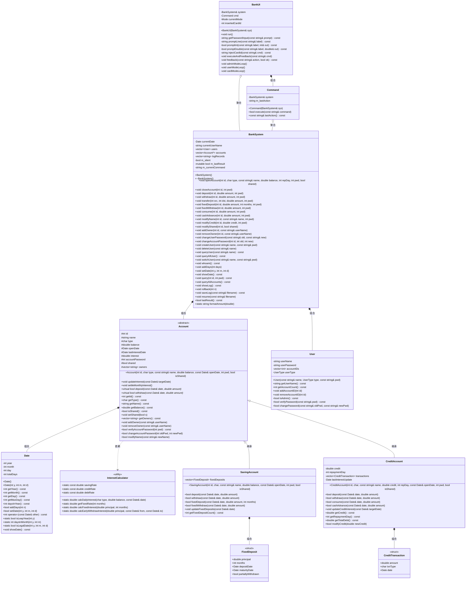

# 银行管理系统 — 设计说明书

---

## 第一章 系统概述

本系统是一个模拟银行核心业务的管理系统，采用 C++ 面向对象设计，基于控制台交互。系统支持以下核心功能：

- **账户体系**：储蓄账户（活期 + 定期存款）、信用账户（消费/取现分离计息）
- **用户管理**：管理员与普通用户两级权限，用户密码与账户密码分离
- **共享账户**：支持 2~5 人共管同一账户
- **操作日志**：事件溯源式回滚与持久化恢复
- **引导式界面**：三级菜单 + 逐参数输入，无需记忆命令格式

---

## 第二章 类图



---

## 第三章 各类数据成员说明

### 3.1 Date 类

| 成员 | 类型 | 说明 |
|------|------|------|
| `year` | `int` | 年份 |
| `month` | `int` | 月份（1-12） |
| `day` | `int` | 日 |
| `totalDays` | `int` | 自公元1年1月1日起的累计天数，日期运算的核心字段。所有日期比较、求差运算退化为 O(1) 整数操作 |

### 3.2 InterestCalculator 类（纯静态工具类，无实例）

| 成员 | 类型 | 说明 |
|------|------|------|
| `savingRate` | `const double` = 0.0115 | 储蓄活期年利率（1.15%） |
| `creditRate` | `const double` = 0.0225 | 信用正余额年利率（2.25%） |
| `debtRate` | `const double` = 0.0005 | 信用透支日利率（0.05%，约年化18.25%） |

### 3.3 Account 基类

| 成员 | 类型 | 说明 |
|------|------|------|
| `id` | `int` | 账户唯一标识，开户时指定 |
| `name` | `string` | 账户名称，可通过 MODIFY 修改 |
| `type` | `char` | 账户类型：'S'=储蓄，'C'=信用 |
| `balance` | `double` | 当前余额（活期），储蓄账户含活期+定期，信用账户可为负（透支） |
| `openDate` | `Date` | 开户日期 |
| `lastInterestDate` | `Date` | 上次计息截止日期，每次 updateInterest 后更新 |
| `interest` | `double` | 当月累计未结利息。每月1日结入余额（复利），之后清零 |
| `accountPassword` | `int` | 6位数字账户密码（100000~999999），所有账户操作需验证 |
| `shared` | `bool` | 是否为共享账户。共享账户支持2~5人共管 |
| `owners` | `vector<string>` | 共有人用户名列表。开户者为首个owner，管理员可添加/移除 |

### 3.4 SavingAccount 类

| 成员 | 类型 | 说明 |
|------|------|------|
| `fixedDeposits` | `vector<FixedDeposit>` | 定期存款列表，支持多笔并存。到期自动结算，支持部分提前支取 |

### 3.5 FixedDeposit 结构体

| 成员 | 类型 | 说明 |
|------|------|------|
| `principal` | `double` | 定期本金 |
| `months` | `int` | 存期（3/6/12/24/36/60月） |
| `depositDate` | `Date` | 存入日期 |
| `maturityDate` | `Date` | 到期日 = depositDate + fixedDays |
| `partiallyWithdrawn` | `bool` | 一次性标记，防止同一FD多次部分支取 |

### 3.6 CreditAccount 类

| 成员 | 类型 | 说明 |
|------|------|------|
| `credit` | `double` | 信用额度 |
| `repaymentDay` | `int` | 每月还款日（1-28），决定宽限期截止日 |
| `transactions` | `vector<CreditTransaction>` | 交易流水，债务从流水重放计算 |
| `lastInterestUpdate` | `Date` | 上次透支计息截止日期 |

### 3.7 CreditTransaction 结构体

| 成员 | 类型 | 说明 |
|------|------|------|
| `amount` | `double` | 交易金额 |
| `txnType` | `char` | 'P'=消费，'C'=取现，'R'=还款 |
| `date` | `Date` | 交易日期 |

### 3.8 User 类

| 成员 | 类型 | 说明 |
|------|------|------|
| `userName` | `string` | 用户名，仅字母和数字 |
| `userPassword` | `string` | 用户密码（字符串，无空格） |
| `accountIDs` | `vector<int>` | 关联的账户ID列表 |
| `userType` | `enum UserType` | 用户类型：admin（管理员）/ normal（普通用户） |

### 3.9 BankSystem 类

| 成员 | 类型 | 说明 |
|------|------|------|
| `currentDate` | `Date` | 系统当前日期，只能向前推进 |
| `currentUserName` | `string` | 当前登录用户名 |
| `users` | `vector<User>` | 全部用户（按值存储） |
| `accounts` | `vector<Account*>` | 全部账户（原始指针，BankSystem 拥有所有权） |
| `logRecords` | `vector<string>` | 操作命令日志，回滚/恢复的核心数据 |
| `m_silent` | `bool` | 静默模式，回放时不输出 |
| `m_lastResult` | `mutable bool` | 上次操作成功/失败，供 UI 判断 |
| `m_currentCommand` | `string` | 当前命令原始字符串，用于日志记录 |

### 3.10 Command 类

| 成员 | 类型 | 说明 |
|------|------|------|
| `system` | `BankSystem&` | 引用，调用业务方法 |
| `m_lastAction` | `string` | 最近解析的命令词，供 UI 做中文反馈 |

### 3.11 BankUI 类

| 成员 | 类型 | 说明 |
|------|------|------|
| `system` | `BankSystem&` | 引用，不拥有 |
| `cmd` | `Command` | 命令解析器，按值持有 |
| `currentMode` | `enum Mode` | 当前模式：NONE/ADMIN/USER/CARD |
| `insertedCardId` | `int` | 插卡模式锁定的账户ID，-1表示无卡 |

---

## 第四章 各类函数成员说明

### 4.1 Date 类

| 函数原型 | 功能 |
|----------|------|
| `Date()` | 默认构造，设为 1970-01-01 |
| `Date(int y, int m, int d)` | 带参构造，非法日期抛出 invalid_argument |
| `int getYear() / getMonth() / getDay() const` | 获取年/月/日 |
| `int getMaxDay() const` | 获取当月最大天数（处理闰年2月=29） |
| `int daysInYear() const` | 返回当年天数（365或366），**供日利率分母** |
| `bool addDays(int n)` | 推进n天，n必须>0，逐日进位同时更新totalDays |
| `bool setDate(int y, int m, int d)` | 设置日期，**仅接受向前**（拒绝倒退） |
| `int operator-(const Date& other) const` | 日期差 = totalDays相减，O(1) |
| `static bool isLeapYear(int y)` | 判断闰年 |
| `static int daysInMonth(int y, int m)` | 获取某月天数 |
| `static bool isLegalDate(int y, int m, int d)` | 验证日期合法性 |
| `void showDate() const` | 格式化输出日期到cout |

### 4.2 InterestCalculator 类（全部静态）

| 函数原型 | 功能 |
|----------|------|
| `static double calcDailyInterest(char type, double balance, const Date& date)` | 计算日利息。S: balance×savingRate/daysInYear；C正余额: balance×creditRate/daysInYear；C透支: balance×debtRate |
| `static double getFixedRate(int months)` | 线性查找定期利率，未匹配返回0 |
| `static double calcFixedInterest(double principal, int months)` | 定期利息 = principal × rate × months/12 |
| `static double calcEarlyWithdrawInterest(double principal, const Date& from, const Date& to)` | 提前支取利息 = principal × savingRate × days/365（惩罚性低利率） |

### 4.3 Account 基类

| 函数原型 | 功能 |
|----------|------|
| `Account(...)` | 构造函数，初始化所有字段 |
| `void updateInterest(const Date& targetDate)` | **逐日计息**：从lastInterestDate到targetDate逐天计算利息，每月1日结息（月复利） |
| `void settleMonthlyInterest()` | 结息：balance += interest; interest = 0 |
| `virtual bool deposit(const Date&, double) = 0` | 纯虚，存款 |
| `virtual bool withdraw(const Date&, double) = 0` | 纯虚，取款 |
| `void addOwner(const string& userName)` | 添加共有人（上限5，不重复） |
| `void removeOwner(const string& userName)` | 移除共有人（至少保留1人） |
| `bool verifyAccountPassword(int pwd) const` | 验证账户密码 |
| `bool changeAccountPassword(int old, int new)` | 修改密码，旧密码须匹配，新须6位 |
| `bool modifyName(const string&)` | 修改账户名 |
| `void setShared(bool)` | 设置共享状态 |

### 4.4 SavingAccount 类

| 函数原型 | 功能 |
|----------|------|
| `bool deposit(const Date&, double)` | 活期存款，amount ≥ 0 |
| `bool withdraw(const Date&, double)` | 活期取款，amount ≤ balance |
| `bool fixedDeposit(const Date&, double amount, int months)` | 定期存款：验证金额和期限→扣减活期余额→创建FD记录 |
| `bool fixedWithdraw(const Date&, double amount)` | 部分提前支取：找首个未到期未支取FD→按活期利率退还→标记partiallyWithdrawn |
| `void updateFixedDeposits(const Date&)` | 到期自动结算：本金+定期利息→活期余额，删除FD |

### 4.5 CreditAccount 类

| 函数原型 | 功能 |
|----------|------|
| `bool deposit(const Date&, double)` | 还款：**优先偿还取现债务→再还消费债务**，剩余保留正余额 |
| `bool withdraw(const Date&, double)` | 取现（等同于cashAdvance） |
| `bool consume(const Date&, double)` | 消费：记录'P'交易，有宽限期（免息至下月还款日） |
| `bool cashAdvance(const Date&, double)` | 取现：记录'C'交易，**T+1**起按日利率0.05%计息，无宽限期 |
| `void updateCreditInterest(const Date&)` | 逐日透支计息：区分消费(有宽限)/取现(无) |
| `bool modifyCredit(double)` | 修改信用额度 |
| `double getTotalDebt() const` | 总债务 = 取现债务 + 消费债务 |

### 4.6 User 类

| 函数原型 | 功能 |
|----------|------|
| `User(const string&, UserType, const string&)` | 构造 |
| `bool verifyPassword(const string&)` | 验证密码 |
| `bool changePassword(const string&, const string&)` | 修改密码 |
| `void addAccountID(int) / removeAccountID(int)` | 管理关联账户 |
| `bool isAdmin() const` | 是否管理员 |

### 4.7 BankSystem 类

**账户操作**：`openAccount`（验证参数+创建对象）、`closeAccount`（余额须为0）、`query`（验证密码后输出详情）、`queryAllAccounts`

**存取转账**：`deposit`、`withdraw`、`transfer`（源取款→目标存款，原子操作）

**定期存款**：`fixedDeposit`（仅储蓄账户）、`fixedWithdraw`（部分提前支取）

**信用操作**：`consume`（消费，有宽限期）、`cashAdvance`（取现，T+1计息）

**信息修改**：`modifyName`、`modifyCredit`、`modifyShared`（管理员）

**密码管理**：`changeUserPassword`（当前用户）、`changeAccountPassword`（须为持有人）

**共享管理**：`addOwner`、`removeOwner`（仅管理员，仅共享账户）

**用户管理**：`createUser`、`deleteUser`（不能删admin/自己/有关联账户的用户）、`queryUser`、`queryAllUser`、`switchUser`、`whoami`

**日期日志**：`addDays`/`setDate`（触发全账户计息）、`showDate`、`showLog`、`rollback`（事件溯源重放）、`saveLog`/`resume`

### 4.8 Command 类

| 函数原型 | 功能 |
|----------|------|
| `bool execute(const string& command)` | **核心函数**：提取命令词→按序解析参数→调用BankSystem方法。解析失败返回false。支持25+种命令 |
| `const string& lastAction() const` | 获取最近解析的命令词 |

### 4.9 BankUI 类

| 函数原型 | 功能 |
|----------|------|
| `void run()` | 主入口：显示主菜单，分发到三种模式循环 |
| `string promptLine(label)` | 读取一行，输入b返回空串（取消） |
| `bool promptInt(label, &out)` | 循环提示直到输入合法整数 |
| `bool promptDouble(label, &out)` | 循环提示直到输入合法浮点数 |
| `string injectCardId(cmd)` | 将卡ID注入命令第二参数 |
| `void executeAndFeedback(cmd)` | 静默执行→输出中文反馈 |
| `void feedback(action, ok)` | 命令词→中文结果映射 |
| `void adminModeLoop()` | 管理员模式：9类功能 |
| `void userModeLoop()` | 普通用户模式：8类功能（隐藏共享/用户管理） |
| `void cardModeLoop()` | 插卡模式：7类功能（仅账户操作，ID自动注入） |

---

## 第五章 用户界面与命令输入输出

### 5.1 系统启动与主菜单

系统启动后显示主菜单：

```
============================
    银行管理系统
============================
 [1] 管理员登录
 [2] 普通用户登录
 [3] 插卡操作
 [0] 退出系统
============================
请选择: 
```

### 5.2 管理员模式

管理员输入密码登录后进入9类功能菜单：

```
===== 管理员模式 =====
 [1] 账户管理
 [2] 存取转账
 [3] 定期存款
 [4] 信用账户
 [5] 账户信息修改
 [6] 共享账户管理
 [7] 用户管理
 [8] 日期与日志
 [9] 查询当前用户
 [0] 返回主菜单
请选择: 
```

**示例：开户流程**

```
请选择: 1

--- 账户管理 ---
 [1] 开户
 [2] 销户
 [3] 查询账户
 [4] 查询所有账户
 [0] 返回
请选择: 1
请输入账户ID: 1001
请输入账户类型 (S=储蓄, C=信用): S
请输入账户名称: mysavings
请输入初始余额: 50000
请输入账户密码(6位数字): 123456
是否共享账户? (1=共享, 0=独占): 0
 [开户成功]
```

**示例：创建用户**

```
请选择: 7

--- 用户管理 ---
 [1] 创建用户
 [2] 删除用户
 [3] 查询用户
 [4] 查询所有用户
 [5] 切换用户
 [6] 修改用户密码
 [0] 返回
请选择: 1
请输入用户名: zhangsan
请输入密码: abc123
 [创建用户成功]
```

**示例：定期存款**

```
请选择: 3

--- 定期存款 ---
 [1] 定期存款
 [2] 定期部分提前支取
 [0] 返回
请选择: 1
请输入存款金额: 10000
请输入存款期限(月): 12
请输入账户密码: 123456
 [定期存款成功]
```

**示例：推进日期触发到期结算**

```
请选择: 8

--- 日期与日志 ---
 [1] 显示当前日期
 [2] 推进日期
 [3] 设置日期
 ...
请选择: 2
请输入推进天数: 365
 [日期更新成功]
```

### 5.3 普通用户模式

普通用户登录后进入8类功能菜单（隐藏共享管理和用户管理，替换为"个人设置"）：

```
===== 普通用户模式 =====
 [1] 账户管理
 [2] 存取转账
 [3] 定期存款
 [4] 信用账户
 [5] 账户信息修改
 [6] 个人设置
 [7] 日期与日志
 [8] 查询当前用户
 [0] 返回主菜单
请选择: 
```

**示例：存款**

```
请选择: 2

--- 存取转账 ---
 [1] 存款
 [2] 取款
 [3] 转账
 [0] 返回
请选择: 1
请输入存款金额: 5000
请输入账户密码: 123456
 [存款成功]
```

**示例：个人设置**

```
请选择: 6

--- 个人设置 ---
 [1] 切换用户
 [2] 修改用户密码
 [0] 返回
请选择: 2
请输入旧密码: abc123
请输入新密码: xyz789
 [用户密码修改成功]
```

### 5.4 插卡模式

用户通过账户ID和账户密码认证后进入插卡模式。所有操作自动锁定到当前账户，**无需输入账户ID**。

```
===== 插卡模式 (账户 #1001) =====
 [1] 存取转账
 [2] 定期存款
 [3] 信用账户
 [4] 账户信息修改
 [5] 查询账户
 [6] 销户
 [7] 查询当前用户
 [0] 退卡返回主菜单
请选择: 
```

**示例：插卡存款（省略ID）**

```
请选择: 1

--- 存取转账 ---
 [1] 存款
 [2] 取款
 [3] 转账
 [0] 返回
请选择: 1
请输入存款金额: 2000
请输入账户密码: 123456
 [存款成功]
```

**示例：插卡转账（源账户自动填充，目标账户需输入）**

```
请选择: 3
请输入转入账户ID: 2002
请输入转账金额: 1000
请输入账户密码: 123456
 [转账成功]
```

### 5.5 操作反馈说明

系统对每一步操作都给出中文反馈，分为成功和失败两类：

| 操作 | 成功提示 | 失败提示 |
|------|----------|----------|
| 开户 | `[开户成功]` | `[开户失败: 参数错误或ID重复]` |
| 销户 | `[销户成功]` | `[销户失败]` |
| 存款 | `[存款成功]` | `[存款失败]` |
| 取款 | `[取款成功]` | `[取款失败]` |
| 转账 | `[转账成功]` | `[转账失败]` |
| 定期存款 | `[定期存款成功]` | `[操作失败]` |
| 定期支取 | `[定期部分提前支取成功]` | `[操作失败]` |
| 消费 | `[消费成功]` | `[操作失败]` |
| 取现 | `[取现成功]` | `[操作失败]` |
| 创建用户 | `[创建用户成功]` | `[创建用户失败]` |
| 修改密码 | `[用户密码修改成功]`/`[账户密码修改成功]` | `[修改失败]` |
| 添加共有人 | `[添加共有人成功]` | `[添加共有人失败]` |
| 修改共享 | `[修改共享状态成功]` | `[修改失败]` |
| 日期更新 | `[日期更新成功]` | `[操作失败]` |

当输入格式错误时统一提示 `[命令格式错误]`，输入 `b` 可在任意步骤取消返回上级菜单。

---

## 第六章 主要技术难点及实现方案

### 6.1 日期正交化表示（totalDays）

**难点**：银行系统频繁进行日期推算（到期日、计息天数、宽限期判断），直接用年-月-日三字段计算涉及大量分支判断和进位处理。

**方案**：引入 `totalDays` 将日期编码为单一整数，采用公历累加公式：

```
totalDays = (year-1)×365 + (year-1)/4 - (year-1)/100 + (year-1)/400
          + daysBeforeMonth[month-1] + day
          + (闰年且month>2 ? 1 : 0)
```

此公式精确处理闰年规则（每4年一闰、每100年不闰、每400年再闰）。

**运算退化**：
- 日期差：`d1 - d2 = d1.totalDays - d2.totalDays`（O(1)整数减法）
- 星期计算：`totalDays % 7` 查表（O(1)）
- 闰年天数：`isLeapYear(year) ? 366 : 365`

**时间不可逆**：`setDate()` 内部比较 `newTotal > totalDays`，拒绝回退，保证利息不重复/不遗漏。

---

### 6.2 逐日计息与月复利

**难点**：银行活期利息按日累计、按月结息。月内单利，跨月复利——须精确建模。

**方案**：`updateInterest()` 逐日迭代，每天计算 `daily = balance × 日利率`，累加至 `interest`；每月1日执行 `settleMonthlyInterest()`（`balance += interest; interest = 0`）。

```
for (d = lastInterestDate; d < targetDate; d.addDays(1)) {
    interest += balance × (年利率 / d.daysInYear())
    if (d.getDay() == 1) { balance += interest; interest = 0 }
}
lastInterestDate = targetDate
```

**亮点**：月内单利、跨月复利，真实模拟银行规则。日利率分母根据年份动态选择365/366。

---

### 6.3 信用账户消费/取现分离计息

**难点**：消费有宽限期（免息至下月还款日），取现从次日起计息无宽限期。还款须优先偿还取现债务。

**方案**：三大机制协同：

**(1) 交易流水重放计算债务**——债务不存储可变字段，从交易历史重放：

```
遍历transactions:
  C(取现) → 累计 cashDebt
  P(消费) → 累计 consumeDebt
  R(还款) → 先冲抵cashDebt，剩余冲抵consumeDebt
```

**(2) 宽限期公式**——`graceDeadline = 下月 + repaymentDay`，`checkDate < graceDeadline` 则免息。

**(3) 逐日透支计息**——取现从 T+1 起计息，消费仅宽限期过后计息，每日 `amount × 0.05%`。

---

### 6.4 事件溯源式回滚（Event Sourcing）

**难点**：如何在不存储状态快照的情况下支持回滚到任意历史点？

**方案**：命令日志是唯一的真相来源。回滚 = 完全销毁当前状态 + 重放前n条命令：

```
rollback(n):
  销毁所有账户、用户、日期
  从空白状态重放 logRecords[0..n)
  状态精确恢复
```

**亮点**：
- 零快照开销
- 日志可审计
- `saveLog`/`resume` 实现持久化
- 静默重放不产生冗余输出

---

### 6.5 定期存款提前支取惩罚

**难点**：允许部分提前支取但须防止无限次支取，利息按活期低利率计息。

**方案**：`partiallyWithdrawn` 一次性标记——设为 true 后永不再匹配。

```
fixedWithdraw(amount):
  找首个 未到期 + 未支取 + 本金≥amount 的FD
  利息 = amount × 活期利率 × 天数 / 365   // 惩罚
  返回 amount + 利息 到活期余额
  标记 partiallyWithdrawn = true
```

---

### 6.6 插卡模式ID自动注入

**难点**：插卡模式下所有操作自动作用于当前账户，用户无需重复输入ID，但底层BankSystem和Command不能感知卡的存在。

**方案**：UI层完成注入。collector在卡模式下跳过ID提示，构造命令字符串后通过 `injectCardId()` 将卡ID插入为第二参数。底层代码零修改。

```
用户输入: DEPOSIT 金额 密码（无ID）
injectCardId: DEPOSIT <卡号> 金额 密码
Command正常解析执行
```

---

### 6.7 三级引导式交互菜单

**难点**：传统命令行需记忆完整命令格式（如 `OPEN 1 S savings 1000 123456 0`），易错。

**方案**：三级引导——主菜单→分类菜单→逐参数输入。每个命令有独立 collector 函数，逐步提示每个参数并即时验证（密码6位、类型S/C、还款日1-28、共享ys/ns）。输入 `b` 可取消。

**亮点**：用户零记忆负担，每参数单独验证，三种模式按权限过滤菜单项，底层仍构造标准命令字符串复用业务逻辑。

---

### 6.8 共享账户多人共管

**难点**：允许多用户共同管理同一账户，权限一致但须约束上限和下限。

**方案**：Account 维护 owners 向量。`addOwner` 上限5人且不重复，`removeOwner` 至少保留1人。非共享账户拒绝 ADD_OWNER。销户时遍历所有 owners 清理关联。

---

## 第七章 编译与运行

```bash
cd include
g++ -o bank.exe *.cpp
./bank.exe
```

**测试流程**：

1. 管理员登录 → 创建用户 → 开户 → 存款 → 定期存款 → 推进日期 → 到期自动结算
2. 普通用户登录 → 存取转账 → 修改密码 → 切换用户
3. 插卡操作 → 存款/取款（省略ID）→ 消费/取现
4. 共享账户：添加/移除共有人
5. 回滚：ROLLBACK n → 验证状态恢复
6. 持久化：SAVE → 重启 → RESUME → 验证一致
