# 银行管理系统 — 设计说明书

---

## 第一章 系统概述

本系统是一个模拟银行核心业务的管理系统，采用 C++ 面向对象设计，基于控制台交互。系统支持以下核心功能：

- **账户体系**：储蓄账户（活期 + 定期存款）、信用账户（消费/取现分离计息）
- **用户管理**：管理员与普通用户两级权限，用户密码与账户密码分离
- **共享账户**：支持 2~5 人共管同一账户
- **操作日志**：事件溯源式回滚与持久化恢复
- **引导式界面**：三级菜单 + 逐参数输入，无需记忆命令格式

### 1.1 系统架构层次

系统采用前后端分离的三层架构：

```
┌──────────────────────────────────────────────────────────┐
│                  前端（表现层）                              │
│  BankUI（交互式TUI菜单）  Command（命令解析）                │
├──────────────────────────────────────────────────────────┤
│                  后端（业务逻辑层）                           │
│  BankSystem（Facade 协调者：权限控制、日志记录、跨模块协调）    │
│  ┌──────────────────────────────────────────────────────┐ │
│  │    AccountManager    │  UserManager  │  LogManager   │ │
│  └──────────────────────────────────────────────────────┘ │
├──────────────────────────────────────────────────────────┤
│                  数据模型层                                  │
│         Account（储蓄/信用）  Date  User                    │
└──────────────────────────────────────────────────────────┘
```

- **前端层**：`BankUI` 负责二级引导式菜单，收集用户输入并构造命令字符串；`Command` 为纯静态工具类，负责解析命令文本并分发给后端。前端不包含任何业务逻辑。
- **后端层**：`BankSystem` 作为 Facade 协调者，负责权限验证、日志记录、跨模块协调（开户、销户、共享管理、回滚）。内部将职责委托给 3 个 Manager：`AccountManager`（账户 CRUD、日期推进、利息计算、交易操作）、`UserManager`（用户管理与权限）、`LogManager`（日志记录与操作结果）。Manager 之间零指针依赖，BankSystem 是唯一胶水层。所有操作的成功/失败结果通过 `LogManager::lastResult()` 传递回前端。
- **数据模型层**：`Account` 类层次（`SavingAccount`、`CreditAccount`）封装账户数据和业务规则；`Date` 提供日期运算。

---

## 第二章 类图

### 2.1 数据模型层

#### 2.1.1 Date 类

```mermaid
classDiagram
    direction TB
    class Date {
        -int year
        -int month
        -int day
        -int totalDays
        +Date()
        +Date(int y, int m, int d)
        +int getYear() const
        +int getMonth() const
        +int getDay() const
        +int getTotalDays() const
        +int getMaxDay() const
        +int daysInYear() const
        +bool addDays(int n)
        +bool setDate(int y, int m, int d)
        +int operator-(const Date& other) const
        +static bool isLeapYear(int y)
        +static int daysInMonth(int y, int m)
        +static bool isLegalDate(int y, int m, int d)
        +void showDate() const
    }


    class Account {
        <<abstract>>
        #int id
        #string name
        #char type
        #double balance
        #Date openDate
        #Date lastInterestDate
        #double interest
        #int accountPassword
        #bool shared
        #vector~string~ owners
        +Account(int id, char type, const string& name, double balance, const Date& openDate, int pwd, bool isShared)
        +void updateInterest(const Date& targetDate)
        +void settleMonthlyInterest()
        +virtual bool deposit(const Date& date, double amount)*
        +virtual bool withdraw(const Date& date, double amount)*
        +int getId() const
        +char getType() const
        +string getName() const
        +double getBalance() const
        +bool isShared() const
        +void setShared(bool s)
        +vector~string~ getOwners() const
        +void addOwner(const string& userName)
        +void removeOwner(const string& userName)
        +bool verifyAccountPassword(int pwd) const
        +bool changeAccountPassword(int oldPwd, int newPwd)
        +bool modifyName(const string& newName)
    }

    class FixedDeposit {
        <<struct>>
        +double principal
        +int months
        +Date depositDate
        +Date maturityDate
        +bool partiallyWithdrawn
    }

    class SavingAccount {
        -vector~FixedDeposit~ fixedDeposits
        +SavingAccount(int id, char, const string& name, double balance, const Date& openDate, int pwd, bool isShared)
        +bool deposit(const Date& date, double amount)
        +bool withdraw(const Date& date, double amount)
        +bool fixedDeposit(const Date& date, double amount, int months)
        +bool fixedWithdraw(const Date& date, double amount)
        +void updateFixedDeposits(const Date& date)
        +int getFixedDepositCount() const
    }

    SavingAccount *-- FixedDeposit : 组合（内含多笔定期存款）

    class CreditAccount {
        -double credit
        -int repaymentDay
        -double cash_debt
        -double consume_debt
        -double consume_debt_overdue
        -Date lastInterestUpdate
        -bool isWithinGracePeriod(const Date&, const Date&) const
        +CreditAccount(int id, char, const string& name, double credit, int repDay, const Date& openDate, int pwd, bool isShared)
        +bool deposit(const Date& date, double amount)
        +bool withdraw(const Date& date, double amount)
        +bool consume(const Date& date, double amount)
        +void updateCreditInterest(const Date& targetDate)
        +double getCredit() const
        +int getRepaymentDay() const
        +double getCashDebt() const
        +double getConsumeDebt() const
        +double getConsumeDebtGrace() const
        +double getConsumeDebtOverdue() const
        +bool modifyCredit(double newCredit)
        +bool modifyRepaymentDay(int newDay)
    }

    class User {
        -string userName
        -string userPassword
        -vector~int~ accountIDs
        -UserType userType
        +User(const string& name, UserType type, const string& pwd)
        +string getUserName() const
        +int getAccountCount() const
        +void addAccountID(int id)
        +void removeAccountID(int id)
        +bool isAdmin() const
        +bool verifyPassword(const string& pwd) const
        +bool changePassword(const string& oldPwd, const string& newPwd)
    }

    class BankSystem {
        -AccountManager accountMgr
        -UserManager userMgr
        -LogManager logMgr
        -void replayCommands(const vector~string~& commands)
        -bool requireAdmin() const
        -bool requireAccount(int id) const
        -bool requireAccount(int id, int pwd) const
        -void logResult(bool ok)
        +BankSystem()
        +~BankSystem()
        +void openAccount(int id, char type, const string& name, double balance, int repDay, int pwd, bool shared)
        +void closeAccount(int id, int pwd)
        +void deposit(int id, double amount, int pwd)
        +void withdraw(int id, double amount, int pwd)
        +void transfer(int src, int dst, double amount, int pwd)
        +void fixedDeposit(int id, double amount, int months, int pwd)
        +void fixedWithdraw(int id, double amount, int pwd)
        +void consume(int id, double amount, int pwd)
        +void cashAdvance(int id, double amount, int pwd)
        +void modifyName(int id, const string& name, int pwd)
        +void modifyCredit(int id, double credit, int pwd)
        +void modifyShared(int id, bool shared)
        +void addOwner(int id, const string& userName)
        +void removeOwner(int id, const string& userName)
        +void changeUserPassword(const string& old, const string& new)
        +void changeAccountPassword(int id, int old, int new)
        +void createUser(const string& name, const string& pwd)
        +void deleteUser(const string& name)
        +void queryUser(const string& name) const
        +void queryAllUser() const
        +void switchUser(const string& name, const string& pwd)
        +void whoami() const
        +void addDays(int days)
        +void setDate(int y, int m, int d)
        +void showDate() const
        +void query(int id, int pwd) const
        +void queryAllAccounts() const
        +void showLog() const
        +void rollback(int n)
        +void saveLog(const string& filename) const
        +void resume(const string& filename)
        +bool lastResult() const
        +static string formatAmount(double)
    }

    class AccountManager {
        -vector~Account*~ accounts
        -Date currentDate
        -void updateAllAccountsInterest(const Date& newDate)
        +Account* findAccount(int id) const
        +bool addAccount(Account* acc)
        +bool removeAccount(int id)
        +void clearAccounts()
        +void printAccountInfo(int id) const
        +void printAccountDetail(int id) const
        +const vector~Account*~ getAccounts() const
        +static string formatAmount(double amount)
        +void showDate() const
        +bool addDays(int days)
        +bool setDate(int year, int month, int day)
        +const Date& getCurrentDate() const
        +void reset()
        +bool deposit(int id, double amount, int pwd)
        +bool withdraw(int id, double amount, int pwd)
        +bool transfer(int src, int dst, double amount, int pwd)
        +bool fixedDeposit(int id, double amount, int months, int pwd)
        +bool fixedWithdraw(int id, double amount, int pwd)
        +bool consume(int id, double amount, int pwd)
        +bool cashAdvance(int id, double amount, int pwd)
        +static const double savingRate
        +static const double creditRate
        +static const double debtRate
        +static double calcDailyInterest(char type, double balance, const Date& date)
        +static double getFixedRate(int months)
        +static double calcFixedInterest(double principal, int months)
        +static double calcEarlyWithdrawInterest(double principal, const Date& from, const Date& to)
    }

    class UserManager {
        -vector~User~ users
        -string currentUserName
        -AccountManager* accountMgr
        +UserManager(AccountManager* am)
        +User* findUser(const string& name) const
        +bool isAdmin() const
        +bool isLoggedIn() const
        +static bool isLegalName(const string& name)
        +bool ownsAccount(int id) const
        +bool createUser(const string& username, const string& password)
        +bool deleteUser(const string& username)
        +bool switchUser(const string& username, const string& password)
        +bool queryAllUser() const
        +void whoami() const
        +void reset()
    }



    class LogManager {
        -vector~string~ logRecords
        -bool m_silent
        -mutable bool m_lastResult
        -string m_currentCommand
        +void recordLog(const string& cmd)
        +void showLog() const
        +void printSuccess() const
        +void printFailure() const
        +void setSilent(bool s)
        +void setRawCommand(const string& cmd)
        +bool isInitialState() const
        +bool lastResult() const
        +void resetResult()
        +void saveLog(const string& filename) const
        +void clear()
    }

    class Command {
        <<utility>>
        +static bool execute(BankSystem& system, const string& command, string& outAction)
    }

    class BankUI {
        -BankSystem& system
        -string m_lastAction
        -Mode currentMode
        +BankUI(BankSystem& sys)
        +void run()
    }

    Account <|-- SavingAccount : 继承
    Account <|-- CreditAccount : 继承
    SavingAccount *-- FixedDeposit : 组合
    BankSystem *-- AccountManager : 组合
    BankSystem *-- UserManager : 组合
    BankSystem *-- LogManager : 组合
    AccountManager *-- Account : 组合
    UserManager *-- User : 组合
    UserManager ..> AccountManager : 依赖
    BankUI o-- BankSystem : 聚合
    Command ..> BankSystem : 依赖
    Account *-- Date : 组合
```



---

## 第三章 各类数据成员说明

### 3.1 Date 类

| 成员 | 类型 | 说明 |
|------|------|------|
| `year` | `int` | 年份，存储绝对年份（如 1970） |
| `month` | `int` | 月份，范围 1~12 |
| `day` | `int` | 日，范围 1~当月最大天数 |
| `totalDays` | `int` | 自公元1年1月1日起的累计天数，日期运算的核心字段。通过 `getTotalDays()` 公开只读访问。所有日期比较、求差运算退化为 O(1) 整数操作 |

### 3.3 Account 基类

| 成员 | 类型 | 说明 |
|------|------|------|
| `id` | `int` | 账户唯一标识，开户时指定，全局唯一 |
| `name` | `string` | 账户名称（仅含字母和数字），可通过 MODIFY NAME 修改 |
| `type` | `char` | 账户类型：`'S'`=储蓄，`'C'`=信用 |
| `balance` | `double` | 当前活期余额。储蓄账户含活期+定期；信用账户可为负（透支） |
| `openDate` | `Date` | 开户日期，构造时初始化 |
| `lastInterestDate` | `Date` | 上次计息截止日期，每次 `updateInterest()` 后更新为当前日期 |
| `interest` | `double` | 当月累计未结利息。每月1日结入余额（复利），之后清零 |
| `accountPassword` | `int` | 6位数字账户密码（100000~999999），所有账户操作需验证 |
| `shared` | `bool` | 是否为共享账户。共享账户支持2~5人共管 |
| `owners` | `vector<string>` | 共有人用户名列表。开户者为首个 owner，管理员可添加/移除 |

### 3.4 SavingAccount 类

| 成员 | 类型 | 说明 |
|------|------|------|
| `fixedDeposits` | `vector<FixedDeposit>` | 定期存款列表，支持多笔并存。到期自动结算，支持部分提前支取 |

### 3.5 FixedDeposit 结构体

| 成员 | 类型 | 说明 |
|------|------|------|
| `principal` | `double` | 定期本金 |
| `months` | `int` | 存期（3/6/12/24/36/60月） |
| `depositDate` | `Date` | 存入日期 |
| `maturityDate` | `Date` | 到期日 = depositDate + fixedDays[index] |
| `partiallyWithdrawn` | `bool` | 一次性标记，防止同一笔定期存款被多次部分支取 |

### 3.8 CreditAccount 类

| 成员 | 类型 | 说明 |
|------|------|------|
| `credit` | `double` | 信用额度 |
| `repaymentDay` | `int` | 每月还款日（1~28，默认15），决定免息期截止日 |
| `cash_debt` | `double` | 取现透支债务余额（透支部分才计入，无免息期） |
| `consume_debt` | `double` | 消费透支债务余额（免息期内） |
| `consume_debt_overdue` | `double` | 消费透支债务余额（已过免息期，按日计息） |
| `lastInterestUpdate` | `Date` | 上次透支计息截止日期 |

### 3.9 User 类

| 成员 | 类型 | 说明 |
|------|------|------|
| `userName` | `string` | 用户名，仅含字母和数字，唯一 |
| `userPassword` | `string` | 用户密码（字符串，无空格） |
| `accountIDs` | `vector<int>` | 关联的账户ID列表 |
| `userType` | `enum UserType` | 用户类型：`admin`（管理员）/ `normal`（普通用户） |

### 3.11 BankSystem 类（Facade 协调者）

| 成员 | 类型 | 说明 |
|------|------|------|
| `accountMgr` | `AccountManager` | 账户管理器，负责账户 CRUD、日期推进、利息计算、交易操作 |
| `userMgr` | `UserManager` | 用户管理器，负责用户管理、权限校验 |
| `logMgr` | `LogManager` | 日志管理器，负责日志记录、操作结果标志 |

### 3.12 AccountManager 类

| 成员 | 类型 | 说明 |
|------|------|------|
| `accounts` | `vector<Account*>` | 全部账户（原始指针，AccountManager 拥有所有权，析构时 delete） |

### 3.13 UserManager 类

| 成员 | 类型 | 说明 |
|------|------|------|
| `users` | `vector<User>` | 全部用户（按值存储） |
| `currentUserName` | `string` | 当前登录用户名 |
| `accountMgr` | `AccountManager*` | 指向 AccountManager 的指针，用于 ownsAccount 查询 |

### 3.16 LogManager 类

| 成员 | 类型 | 说明 |
|------|------|------|
| `logRecords` | `vector<string>` | 操作命令日志，回滚/恢复的核心数据 |
| `m_silent` | `bool` | 静默模式标志，回放时不输出 |
| `m_lastResult` | `mutable bool` | 上次操作成功/失败标志，供 UI 判断 |
| `m_currentCommand` | `string` | 当前命令原始字符串，用于日志记录 |

### 3.17 Command 类（纯静态工具类）

| 成员 | 类型 | 说明 |
|------|------|------|
| `execute(system, command, outAction)` | `static bool` | 静态命令解析与执行：将命令字符串解析为命令词+参数，按 if-else 链匹配并调用对应 BankSystem 方法。`outAction` 接收命令词供 UI 反馈，解析失败返回 false |

### 3.18 BankUI 类

| 成员 | 类型 | 说明 |
|------|------|------|
| `system` | `BankSystem&` | 引用，不拥有 |
| `m_lastAction` | `string` | 最近执行的命令词，通过 `Command::execute()` 的输出参数获取，供 `feedback()` 做中文结果映射 |
| `currentMode` | `enum Mode` | 当前模式：`NONE`/`ADMIN`/`USER`。构造时初始化为 `NONE`，进入模式循环前赋为对应值，退出后重置为 `NONE` |

---

## 第四章 各类函数成员说明

### 4.1 Date 类

| 函数原型 | 功能说明 |
|----------|------|
| `Date()` | 默认构造，设为 1970-01-01，totalDays = 719163 |
| `Date(int y, int m, int d)` | 带参构造，非法日期抛出 `invalid_argument`。计算 totalDays = (y-1)×365 + 闰年修正 + 月前天数 + d |
| `int getYear() const` | 返回年份 |
| `int getMonth() const` | 返回月份（1~12） |
| `int getDay() const` | 返回日 |
| `int getTotalDays() const` | 返回 totalDays（自公元1年1月1日起的累计天数），供净值计算使用 |
| `int getMaxDay() const` | 返回当月最大天数（处理闰年2月=29） |
| `int daysInYear() const` | 返回当年天数（365或366），作为日利率分母 |
| `bool addDays(int n)` | 推进 n 天，n 必须 > 0，逐日进位同时更新 totalDays。用于模拟时间流逝 |
| `bool setDate(int y, int m, int d)` | 设置到指定日期。验证合法性后比较 totalDays，仅接受向前（拒绝倒退），保证利息不重复 |
| `int operator-(const Date& other) const` | 日期差 = totalDays 相减，O(1) 整数减法 |
| `static bool isLeapYear(int y)` | 判断闰年：能被4整除且不被100整除，或能被400整除 |
| `static int daysInMonth(int y, int m)` | 返回某年某月的天数 |
| `static bool isLegalDate(int y, int m, int d)` | 验证日期合法性：月1~12，日1~当月最大天数 |
| `void showDate() const` | 格式化输出到 cout，格式如 "Thursday, January 1, 1970" |

### 4.3 Account 基类

| 函数原型 | 功能说明 |
|----------|------|
| `Account(...)` | 构造函数，初始化所有字段。`lastInterestDate` 初始化为 `openDate`，`interest` 初始化为 0 |
| `void updateInterest(const Date& targetDate)` | **逐日计息**：从 lastInterestDate 到 targetDate 逐天计算利息。每天累加日利息到 interest；每月1日执行 `settleMonthlyInterest()`（月复利）。最后更新 lastInterestDate |
| `void settleMonthlyInterest()` | 结息：`balance += interest; interest = 0`。实现月内单利、跨月复利 |
| `virtual bool deposit(const Date&, double) = 0` | 纯虚函数，存款 |
| `virtual bool withdraw(const Date&, double) = 0` | 纯虚函数，取款 |
| `void addOwner(const string& userName)` | 添加共有人：检查上限5人且不重复，满足条件则 push_back |
| `void removeOwner(const string& userName)` | 移除共有人：检查至少保留1人，找到匹配项则 erase |
| `bool modifyName(const string& newName)` | 修改账户名为 newName，无额外验证，直接赋值 |

### 4.4 SavingAccount 类

| 函数原型 | 功能说明 |
|----------|------|
| `SavingAccount(...)` | 构造函数，调用 `Account(id, 'S', ...)` |
| `bool deposit(const Date&, double amount)` | 活期存款：验证 `amount >= 0`，然后 `balance += amount` |
| `bool withdraw(const Date&, double amount)` | 活期取款：验证 `amount >= 0 && amount <= balance`，然后 `balance -= amount` |
| `bool fixedDeposit(const Date& date, double amount, int months)` | 定期存款：(1)验证金额>0且<=余额 (2)验证期限有对应利率 (3)查找对应天数并计算到期日 (4)`balance -= amount` (5)push_back FixedDeposit 记录 |
| `bool fixedWithdraw(const Date& date, double amount)` | 部分提前支取：(1)找首个 未到期+未支取+本金>=amount 的定期 (2)按活期利率计算利息 (3)`balance += amount + interest` (4)标记 `partiallyWithdrawn = true` |
| `void updateFixedDeposits(const Date& date)` | 到期自动结算：遍历所有定期，若 `date >= maturityDate`，则 `balance += principal + 定期利息`，并 erase 该记录 |

### 4.5 CreditAccount 类

| 函数原型 | 功能说明 |
|----------|------|
| `CreditAccount(...)` | 构造函数，调用 `Account(id, 'C', name, 0, ...)`，余额初始为 0，债务为 0 |
| `bool deposit(const Date& date, double amount)` | 还款：`balance += amount`。若余额为正，多余部分按顺序冲抵债务：取现(cash_debt) → 逾期消费(consume_debt_overdue) → 免息期内消费(consume_debt) |
| `bool withdraw(const Date& date, double amount)` | 透支取现：验证额度后 `balance -= amount`。若余额为负，透支部分计入 `cash_debt`（次日起按日计息，无免息期） |
| `bool consume(const Date& date, double amount)` | 透支消费：验证额度后 `balance -= amount`。若余额为负，透支部分计入 `consume_debt`（免息至下月还款日） |
| `void updateCreditInterest(const Date& targetDate)` | 逐日透支计息：每日若为还款日则将 `consume_debt` 移入 `consume_debt_overdue`。日利息 = `cash_debt * debtRate` + `consume_debt_overdue * debtRate` |
| `double getCashDebt() const` | 返回 `cash_debt`（取现透支债务实时余额） |
| `double getConsumeDebt() const` | 返回 `consume_debt + consume_debt_overdue`（消费透支债务总余额） |
| `bool modifyCredit(double newCredit)` | 修改信用额度，直接赋值 |
| `bool modifyRepaymentDay(int newDay)` | 修改还款日（1~28），处理特殊日期 |

### 4.6 User 类

| 函数原型 | 功能说明 |
|----------|------|
| `User(const string&, UserType, const string&)` | 构造函数，初始化用户名、类型和密码 |
| `bool verifyPassword(const string& pwd)` | 验证密码，简单字符串相等比较 |
| `bool changePassword(const string& oldPwd, const string& newPwd)` | 修改密码：验证旧密码匹配且新密码非空，然后赋值 |
| `void addAccountID(int id)` / `removeAccountID(int id)` | 管理关联账户列表 |
| `bool isAdmin() const` | 返回 `userType == UserType::admin` |

### 4.7 BankSystem 类（Facade 协调者）

#### 私有函数

| 函数原型 | 功能说明 |
|----------|------|
| `void replayCommands(const vector<string>& commands)` | 静默重放命令列表：遍历命令，跳过查询/显示类命令，调用 `Command::execute()` 执行状态变更命令。用于 `rollback()` 和 `resume()` |

#### 公有函数

BankSystem 的所有公有函数接口保持不变，内部实现委托给各 Manager：

- **权限检查**：在 BankSystem 层调用 `userMgr.isAdmin()` 进行管理员权限验证
- **日志记录**：操作成功时调用 `logMgr.recordLog()` + `logMgr.printSuccess()`，失败时调用 `logMgr.printFailure()`
- **跨模块协调**：`openAccount()`、`closeAccount()`、`addOwner()`、`removeOwner()`、`rollback()` 留在 BankSystem 中协调多个 Manager
- **简单委托**：`deposit`/`withdraw`/`transfer`/`fixedDeposit`/`fixedWithdraw`/`consume`/`cashAdvance` 委托给 `transactionMgr`，返回 bool 决定日志记录

| 函数原型 | 委托目标 |
|----------|------|
| `void openAccount(...)` | BankSystem 自行协调（创建 Account → accountMgr.addAccount → userMgr.addAccountToUser） |
| `void closeAccount(...)` | BankSystem 自行协调（清理 owners → accountMgr.removeAccount） |
| `void deposit/withdraw/transfer/fixedDeposit/fixedWithdraw/consume/cashAdvance(...)` | accountMgr → 成功时 logMgr 记录 |
| `void addOwner/removeOwner(...)` | BankSystem 自行协调（acc->addOwner/removeOwner + userMgr） |
| `void showDate() / addDays / setDate` | dateMgr（含权限检查）|
| `void createUser / deleteUser / switchUser` | userMgr |
| `void queryAllUser / whoami` | userMgr |
| `void query / queryAllAccounts` | accountMgr |
| `void showLog / saveLog` | logMgr（含权限检查）|
| `void rollback` | BankSystem 自行协调（清空所有 Manager + replayCommands）|
| `void resume` | BankSystem 自行协调（读文件 + replayCommands）|
| `void modifyName / modifyCredit / modifyShared / changeUserPassword / changeAccountPassword` | 各 Manager（含权限检查）|

### 4.8 AccountManager 类

| 函数原型 | 功能说明 |
|----------|------|
| `Account* findAccount(int id) const` | 按账户ID线性查找，返回指针，未找到返回 `nullptr` |
| `bool addAccount(Account* acc)` | 添加账户，检查ID不重复后 push_back，返回是否成功 |
| `bool removeAccount(int id)` | 从向量中 delete 并 erase 指定账户，返回是否成功 |
| `void clearAccounts()` | 遍历 delete 所有账户并清空向量 |
| `void printAccountInfo(int id) const` | 单行简洁输出账户摘要（ID、类型、名称、余额、共享状态、信用/定期详情） |
| `void printAccountDetail(int id) const` | 多行详细中文输出账户全部信息 |
| `static string formatAmount(double amount)` | 将金额格式化为两位小数字符串 |
| `const vector<Account*>& getAccounts() const` | 返回账户列表的只读引用 |

### 4.9 UserManager 类

| 函数原型 | 功能说明 |
|----------|------|
| `User* findUser(const string& name) const` | 按用户名线性查找，返回指针 |
| `bool isAdmin() const` | 判断当前用户是否为管理员 |
| `bool isLoggedIn() const` | 判断是否有用户登录 |
| `static bool isLegalName(const string& name)` | 验证名称非空且仅含字母和数字 |
| `bool ownsAccount(int id) const` | 通过 AccountManager 查询 Account 的 owners 列表，判断当前用户是否持有 |
| `bool createUser(const string& username, const string& password)` | 创建用户（含权限+合法性检查），返回是否成功 |
| `bool deleteUser(const string& username)` | 删除用户（含权限+前置条件检查），返回是否成功 |
| `bool switchUser(const string& username, const string& password)` | 切换用户（含密码验证），返回是否成功 |
| `bool queryAllUser() const` | 输出所有用户（含权限检查），返回是否成功 |
| `void whoami() const` | 输出当前用户名 |
| `void addAccountToUser(const string& username, int id)` | 将账户ID添加到用户的关联列表 |
| `void removeAccountFromUser(const string& username, int id)` | 从用户的关联列表中移除账户ID |
| `void reset()` | 清空用户列表，重建 admin + default |

### 4.12 LogManager 类

| 函数原型 | 功能说明 |
|----------|------|
| `void recordLog(const string& cmd)` | 记录一条命令到日志 |
| `void showLog() const` | 逐条输出日志（序号 + 命令字符串） |
| `void printSuccess() const` | 设置 `m_lastResult = true` |
| `void printFailure() const` | 设置 `m_lastResult = false` |
| `void setSilent(bool s)` | 设置静默模式 |
| `void setRawCommand(const string& cmd)` | 设置当前命令字符串 |
| `bool isInitialState() const` | 判断日志是否为空（resume 前置条件） |
| `bool lastResult() const` | 返回上次操作成功/失败标志 |
| `void resetResult()` | 重置 `m_lastResult = true` |
| `void saveLog(const string& filename) const` | 将日志写入文件 |
| `void clear()` | 清空日志 |

### 4.13 Command 类（纯静态工具类）

| 函数原型 | 功能说明 |
|----------|------|
| `static bool execute(BankSystem& system, const string& command, string& outAction)` | **核心静态函数**：将命令字符串通过 `istringstream` 解析为命令词+参数，按 `if/else if` 链匹配并调用对应 BankSystem 方法。成功时 `outAction` 接收命令词，解析失败返回 false。支持 28+ 种命令。被 BankUI 和 BankSystem::replayCommands() 共用 |

### 4.14 BankUI 类

| 函数原型 | 功能说明 |
|----------|------|
| `void run()` | 主入口：显示主菜单，分发到两种模式循环。进入模式前设置 `currentMode`（`ADMIN`/`USER`），退出模式后重置为 `NONE` |
| `string promptLine(label)` | 读取一行，输入 `b` 返回空串（取消） |
| `bool promptInt(label, &out)` | 循环提示直到输入合法整数，输入 `b` 取消 |
| `bool promptDouble(label, &out)` | 循环提示直到输入合法浮点数，输入 `b` 取消 |
| `void executeAndFeedback(cmd)` | 调用命令执行并输出中文反馈 |
| `void feedback(action, ok)` | 命令词→中文结果映射 |
| `void adminModeLoop()` | 管理员模式：9类功能 |
| `void userModeLoop()` | 普通用户模式：7类功能（隐藏共享/用户管理/日期与日志，账户信息修改仅限修改名和密码） |

---

## 第五章 命令算法设计

### 5.1 账户操作命令

#### OPEN（开户）

**格式**：`OPEN <id> <type> <name> <balance> [repaymentDay] <accountPassword> <sharedInt>`

**算法流程**：
1. 验证 `id > 0`
2. 验证 `id` 不重复（调用 `findAccount` 查重）
3. 验证 `type` 为 `'S'` 或 `'C'`
4. 验证 `name` 非空且仅含字母数字
5. 验证 `balance >= 0`
6. 若为信用账户，验证 `repaymentDay` 在 1~28
7. 验证 `accountPassword` 为6位数字（100000~999999）
8. 根据 type 创建 `SavingAccount` 或 `CreditAccount`
9. 调用 `addOwner(currentUserName)` 将当前用户添加为持有人
10. 将账户指针加入 `accounts` 向量
11. 将 `id` 加入当前用户的 `accountIDs`
12. 记录日志

#### CLOSE（销户）

**格式**：`CLOSE <id> <accountPassword>`

**算法流程**：
1. 查找账户，验证存在且当前用户为持有人
2. 验证账户密码
3. 验证 `balance == 0`
4. 若为储蓄账户，验证无定期存款
5. 调用 `removeAccount`：遍历所有 owner 清理关联，从 accounts 向量中 delete 并 erase

#### QUERY（查询账户详情）

**格式**：`QUERY <id> <accountPassword>`

**算法流程**：
1. 查找账户，验证存在且当前用户为持有人
2. 验证账户密码
3. 调用 `printAccountDetail`：多行格式化输出账户基本信息、信用/储蓄详情

#### QUERYALL（查询所有账户）

**格式**：`QUERYALL`

**算法流程**：
1. 查找当前用户
2. 获取用户的所有 `accountIDs`
3. 排序后逐个调用 `printAccountInfo`（单行简洁格式）

#### WHOAMI（查询当前用户）

**格式**：`WHOAMI`

**算法流程**：
1. 输出 `currentUserName`

### 5.2 存取转账命令

#### DEPOSIT（存款）

**格式**：`DEPOSIT <id> <amount> <accountPassword>`

**算法流程**：
1. 查找账户，验证存在且当前用户为持有人
2. 验证账户密码
3. 调用 `Account::deposit(currentDate, amount)`
4. 储蓄账户：验证 `amount >= 0`，`balance += amount`
5. 信用账户：`balance += amount`，记录 `'R'` 交易
6. 成功则记录日志

#### WITHDRAW（取款）

**格式**：`WITHDRAW <id> <amount> <accountPassword>`

**算法流程**：
1. 查找账户，验证存在且当前用户为持有人
2. 验证账户密码
3. 调用 `Account::withdraw(currentDate, amount)`
4. 储蓄账户：验证 `amount >= 0 && amount <= balance`，`balance -= amount`
5. 信用账户：等同于 `cashAdvance`
6. 成功则记录日志

#### TRANSFER（转账）

**格式**：`TRANSFER <srcId> <dstId> <amount> <accountPassword>`

**算法流程**：
1. 查找源账户和目标账户，验证均存在
2. 验证当前用户持有源账户，验证账户密码
3. 从源账户取款：`src->withdraw(currentDate, amount)`
4. 向目标账户存款：`dst->deposit(currentDate, amount)`
5. 若取款失败则不执行存款（原子操作）
6. 成功则记录日志

### 5.3 定期存款命令

#### FIXED_DEPOSIT（定期存款）

**格式**：`FIXED_DEPOSIT <id> <amount> <months> <accountPassword>`

**算法流程**：
1. 验证账户存在、持有人、密码、类型为 `'S'`
2. 调用 `SavingAccount::fixedDeposit(currentDate, amount, months)`
3. 验证金额有效且有对应利率
4. 计算到期日 = currentDate + fixedDays[index]
5. `balance -= amount`，创建 FixedDeposit 记录
6. 成功则记录日志

#### FIXED_WITHDRAW（定期部分提前支取）

**格式**：`FIXED_WITHDRAW <id> <amount> <accountPassword>`

**算法流程**：
1. 验证账户存在、持有人、密码、类型为 `'S'`
2. 调用 `SavingAccount::fixedWithdraw(currentDate, amount)`
3. 遍历定期存款，找首个满足：未到期、未支取、本金 >= amount
4. 按活期利率计算利息（惩罚性低利率）
5. `balance += amount + interest`，标记 `partiallyWithdrawn = true`
6. 成功则记录日志

### 5.4 信用账户命令

#### CONSUME（消费）

**格式**：`CONSUME <id> <amount> <accountPassword>`

**算法流程**：
1. 验证账户存在、持有人、密码、类型为 `'C'`
2. 调用 `CreditAccount::consume(currentDate, amount)`
3. 验证 `amount >= 0 && amount <= balance + credit`
4. `balance -= amount`，记录 `'P'` 交易
5. 消费有宽限期（免息至下月还款日）
6. 成功则记录日志

#### CASH_ADVANCE（透支取现）

**格式**：`CASH_ADVANCE <id> <amount> <accountPassword>`

**算法流程**：
1. 验证账户存在、持有人、密码、类型为 `'C'`
2. 调用 `CreditAccount::withdraw(currentDate, amount)`（透支取现）
3. 验证 `amount >= 0 && amount <= balance + credit`
4. `balance -= amount`。若余额为负，透支部分计入 `cash_debt`
5. 取现债务从次日起按日利率计息，无免息期
6. 成功则记录日志

注：信用账户的 `WITHDRAW` 命令等同于透支取现。

### 5.5 信息修改命令

#### MODIFY NAME（修改账户名）

**格式**：`MODIFY NAME <id> <newName> <accountPassword>`

**算法流程**：
1. 查找账户，验证存在且当前用户为持有人
2. 验证账户密码
3. 验证 `newName` 非空且仅含字母数字
4. 调用 `Account::modifyName(newName)` 直接赋值
5. 成功则记录日志

#### MODIFY CREDIT（修改信用额度，仅管理员）

**格式**：`MODIFY CREDIT <id> <newCredit> <accountPassword>`

**算法流程**：
1. **管理员权限检查**：`if (!isAdmin())` 失败
2. 查找账户，验证存在且当前用户为持有人
3. 验证账户密码
4. 验证账户类型为 `'C'`
5. 验证 `newCredit >= 0`
6. 调用 `CreditAccount::modifyCredit(newCredit)` 直接赋值
7. 成功则记录日志

#### MODIFY SHARED（修改共享状态，仅管理员）

**格式**：`MODIFY SHARED <id> <ys|ns>`

**算法流程**：
1. **管理员权限检查**
2. 查找账户，验证存在
3. 解析参数：`ys` = true，`ns` = false
4. 调用 `Account::setShared(shared)` 直接赋值
5. 成功则记录日志

#### MODIFY_USERPASSWORD（修改用户密码）

**格式**：`MODIFY_USERPASSWORD <oldPassword> <newPassword>`

**算法流程**：
1. 查找当前用户
2. 调用 `User::changePassword(oldPwd, newPwd)`：验证旧密码匹配且新密码非空
3. 成功则记录日志

#### MODIFY_ACCOUNTPASSWORD（修改账户密码）

**格式**：`MODIFY_ACCOUNTPASSWORD <id> <oldPassword> <newPassword>`

**算法流程**：
1. 查找账户，验证存在且当前用户为持有人
2. 调用 `Account::changeAccountPassword(oldPwd, newPwd)`：验证旧密码匹配且新密码为6位数字
3. 成功则记录日志

### 5.6 共享管理命令

#### ADD_OWNER（添加共有人，仅管理员）

**格式**：`ADD_OWNER <id> <userName>`

**算法流程**：
1. **管理员权限检查**
2. 查找账户，验证存在
3. 验证账户为共享账户（`isShared() == true`）
4. 调用 `Account::addOwner(userName)`：检查上限5人且不重复
5. 将 `id` 加入目标用户的 `accountIDs`
6. 成功则记录日志

#### REMOVE_OWNER（移除共有人，仅管理员）

**格式**：`REMOVE_OWNER <id> <userName>`

**算法流程**：
1. **管理员权限检查**
2. 查找账户，验证存在
3. 调用 `Account::removeOwner(userName)`：检查至少保留1人
4. 将 `id` 从目标用户的 `accountIDs` 中移除
5. 成功则记录日志

### 5.7 用户管理命令

#### CREATE_USER（创建用户，仅管理员）

**格式**：`CREATE_USER <username> <password>`

**算法流程**：
1. **管理员权限检查**
2. 验证 `username` 合法（仅字母数字）
3. 验证 `username` 不重复
4. 创建 `User(username, UserType::normal, password)`，emplace_back 到 users
5. 成功则记录日志

#### DELETE_USER（删除用户，仅管理员）

**格式**：`DELETE_USER <username>`

**算法流程**：
1. **管理员权限检查**
2. 不允许删除 `admin` 或当前登录用户
3. 验证用户存在
4. 验证用户无关联账户（`accountIDs` 为空）
5. 从 users 向量中 erase
6. 成功则记录日志

#### QUERY_USER（查询用户，仅管理员）

**格式**：`QUERY_USER <username>`

**算法流程**：
1. **管理员权限检查**
2. 查找用户，输出用户名、类型、关联账户数
3. 逐个输出关联账户的详细信息

#### QUERY_USERLIST（查询所有用户，仅管理员）

**格式**：`QUERY_USERLIST`

**算法流程**：
1. **管理员权限检查**
2. 遍历 users 向量，逐个输出用户名和类型

#### SWITCH（切换用户）

**格式**：`SWITCH <username> <password>`

**算法流程**：
1. 查找用户，验证存在
2. 验证密码
3. 设置 `currentUserName = username`
4. 成功则记录日志

### 5.9 日期命令

#### SHOW_DATE（显示当前日期，仅管理员）

**格式**：`SHOW_DATE`

**算法流程**：
1. **管理员权限检查**
2. 调用 `currentDate.showDate()` 输出格式化日期

#### ADD_DAY（推进日期，仅管理员）

**格式**：`ADD_DAY <days>`

**算法流程**：
1. **管理员权限检查**
2. 验证 `days > 0`
3. 调用 `Date::addDays(days)` 推进日期
4. 调用 `updateAllAccountsInterest(currentDate)` 触发全账户计息（活期利息结算、定期到期结算）
5. 成功则记录日志

#### SET_DATE（设置日期，仅管理员）

**格式**：`SET_DATE <year> <month> <day>`

**算法流程**：
1. **管理员权限检查**
2. 验证日期合法性
3. 调用 `Date::setDate(y, m, d)`（内部拒绝倒退）
4. 调用 `updateAllAccountsInterest(currentDate)` 触发全账户计息
5. 成功则记录日志

### 5.10 日志命令

#### LOG（查看日志，仅管理员）

**格式**：`LOG`

**算法流程**：
1. **管理员权限检查**
2. 验证 `logRecords` 非空
3. 逐条输出 "序号 命令字符串"

#### ROLLBACK（回滚，仅管理员）

**格式**：`ROLLBACK <n>`

**算法流程**：
1. **管理员权限检查**
2. 验证 `n` 在合法范围
3. 完全销毁当前状态（delete 所有账户，清空用户，重置日期和当前用户）
4. 从空白状态重放 `logRecords[0..n)` 中的前 n 条命令
5. 重放使用静默模式（`m_silent = true`），不产生输出
6. 重放完成后截断 `logRecords` 为前 n 条

#### SAVE（保存日志，仅管理员）

**格式**：`SAVE <filename>`

**算法流程**：
1. **管理员权限检查**
2. 打开文件输出流
3. 逐条写入 "序号 命令字符串"

#### RESUME（恢复日志，仅管理员）

**格式**：`RESUME <filename>`

**算法流程**：
1. **管理员权限检查**
2. 验证 `logRecords` 为空（只能在空白状态恢复）
3. 打开文件输入流
4. 完全销毁当前状态
5. 逐行读取命令并在静默模式下重放
6. 重放完成后恢复正常模式

---

## 第六章 用户界面与命令输入输出

### 6.1 系统启动与主菜单

```
============================
    银行管理系统
============================
 [1] 管理员登录
 [2] 普通用户登录
 [0] 退出系统
============================
请选择:
```

### 6.2 管理员模式

```
===== 管理员模式 =====
 [1] 账户管理
 [2] 存取转账
 [3] 定期存款
 [4] 信用账户
 [5] 账户信息修改
 [6] 共享账户管理
 [7] 用户管理
 [8] 日期与日志
 [9] 查询当前用户
 [0] 返回主菜单
```

### 6.3 普通用户模式

```
===== 普通用户模式 =====
 [1] 账户管理
 [2] 存取转账
 [3] 定期存款
 [4] 信用账户
 [5] 账户信息修改
 [6] 个人设置
 [7] 查询当前用户
 [0] 返回主菜单
```

---

## 第七章 标准输入输出样例

以下样例基于 TUI 交互模式，经终端实际运行验证。每个样例展示用户操作路径与系统输出。

**前置条件**：系统默认包含管理员用户 `admin`（密码 `admin`）和默认用户 `default`（密码 `default`），初始日期为 1970-01-01。

### 7.1 管理员登录与用户管理

```
操作路径: 主菜单 → [1] 管理员登录
输入密码: admin
输出: ===== 管理员登录成功 =====

操作路径: 管理员模式 → [7] 用户管理 → [5] 切换用户
输入用户名: admin
输入密码: admin
输出: [操作成功]

操作路径: 管理员模式 → [7] 用户管理 → [1] 创建用户
输入用户名: zhangsan
输入密码: abc123
输出: [创建用户成功]
```

### 7.2 开户与查询所有账户

```
操作路径: 管理员模式 → [1] 账户管理 → [1] 开户
输入账户ID: 1001
输入账户类型: S
输入账户名称: mysavings
输入初始余额: 50000
输入账户密码: 123456
是否共享: 0
输出: [开户成功]

操作路径: 管理员模式 → [1] 账户管理 → [1] 开户（信用账户）
输入账户ID: 2001
输入账户类型: C
输入账户名称: creditcard
输入初始余额: 10000
输入还款日: 15
输入账户密码: 654321
是否共享: 0
输出: [开户成功]

操作路径: 管理员模式 → [1] 账户管理 → [1] 开户（储蓄账户）
输入账户ID: 3001
输入账户类型: S
输入账户名称: second
输入初始余额: 10000
输入账户密码: 111111
是否共享: 0
输出: [开户成功]

操作路径: 管理员模式 → [1] 账户管理 → [4] 查询所有账户
输出: 1001 S mysavings 50000.00 NOT_SHARED 0 0 0
      2001 C creditcard 0.00 NOT_SHARED 10000.00 15 0.00 0.00
      3001 S second 10000.00 NOT_SHARED 0 0 0
      [操作成功]

操作路径: 管理员模式 → [9] 查询当前用户
输出: admin
      [操作成功]
```

### 7.3 日期设置与显示

```
操作路径: 管理员模式 → [8] 日期与日志 → [3] 设置日期
输入年份: 2024
输入月份: 1
输入日期: 1
输出: [日期更新成功]

操作路径: 管理员模式 → [8] 日期与日志 → [1] 显示当前日期
输出: Monday, January 1, 2024
      [操作成功]
```

### 7.4 修改共享状态与添加共有人

```
操作路径: 管理员模式 → [5] 账户信息修改 → [3] 修改共享状态
输入账户ID: 1001
是否共享: ys
输出: [修改成功]

操作路径: 管理员模式 → [6] 共享账户管理 → [1] 添加共有人
输入账户ID: 1001
输入要添加的用户名: zhangsan
输出: [添加共有人成功]
```

### 7.5 保存日志

```
操作路径: 管理员模式 → [8] 日期与日志 → [6] 保存日志
输入文件名: test_backup.log
输出: [操作成功]
```

### 7.6 存取转账（储蓄账户 1001）

```
操作路径: 管理员模式 → [2] 存取转账 → [1] 存款
输入账户ID: 1001
输入存款金额: 10000
输入账户密码: 123456
输出: [存款成功]

操作路径: 管理员模式 → [2] 存取转账 → [2] 取款
输入账户ID: 1001
输入取款金额: 2000
输入账户密码: 123456
输出: [取款成功]

操作路径: 管理员模式 → [2] 存取转账 → [3] 转账
输入转出账户ID: 1001
输入转入账户ID: 3001
输入转账金额: 1000
输入账户密码: 123456
输出: [转账成功]
```

### 7.7 定期存款

```
操作路径: 管理员模式 → [3] 定期存款 → [1] 定期存款
输入账户ID: 1001
输入存款金额: 10000
输入存款期限(月): 12
输入账户密码: 123456
输出: [定期存款成功]

操作路径: 管理员模式 → [3] 定期存款 → [1] 定期存款
输入账户ID: 1001
输入存款金额: 5000
输入存款期限(月): 6
输入账户密码: 123456
输出: [定期存款成功]

操作路径: 管理员模式 → [3] 定期存款 → [2] 定期部分提前支取
输入账户ID: 1001
输入支取金额: 3000
输入账户密码: 123456
输出: [定期部分提前支取成功]
```

### 7.8 查询账户详情

```
操作路径: 管理员模式 → [1] 账户管理 → [3] 查询账户
输入账户ID: 1001
输入账户密码: 123456
输出:
  账户ID: 1001
  类型: 储蓄账户
  名称: mysavings
  余额: 83011.71
  共享: 是  共有人: admin zhangsan
  定期存款: 2笔
    [0] 本金:7000.00 期限:12月 存入:2024-1-1 到期:2024-12-31 [已部分支取]
    [1] 本金:5000.00 期限:6月 存入:2024-1-1 到期:2024-6-29
  [操作成功]

操作路径: 管理员模式 → [1] 账户管理 → [4] 查询所有账户
输出: 1001 S mysavings 83011.71 SHARED admin zhangsan 2 12 7000.00 2024-1-1 2024-12-31 1 6 5000.00 2024-1-1 2024-6-29 0
      2001 C creditcard 0.00 NOT_SHARED 10000.00 15 0.00 0.00
      3001 S second 19602.34 NOT_SHARED 0
      [操作成功]
```

### 7.9 修改账户信息

```
操作路径: 管理员模式 → [5] 账户信息修改 → [1] 修改账户名
输入账户ID: 1001
输入新账户名称: newsavings
输入账户密码: 123456
输出: [修改成功]

操作路径: 管理员模式 → [5] 账户信息修改 → [4] 修改账户密码
输入账户ID: 1001
输入旧密码: 123456
输入新密码: 999888
输出: [账户密码修改成功]

操作路径: 管理员模式 → [9] 查询当前用户
输出: admin
      [操作成功]
```

### 7.10 信用账户操作（账户 2001）

```
操作路径: 管理员模式 → [4] 信用账户 → [1] 消费
输入账户ID: 2001
输入消费金额: 3000
输入账户密码: 654321
输出: [消费成功]

操作路径: 管理员模式 → [4] 信用账户 → [2] 取现
输入账户ID: 2001
输入取现金额: 1000
输入账户密码: 654321
输出: [取现成功]

操作路径: 管理员模式 → [2] 存取转账 → [1] 存款（还款）
输入账户ID: 2001
输入存款金额: 2000
输入账户密码: 654321
输出: [存款成功]

操作路径: 管理员模式 → [1] 账户管理 → [3] 查询账户
输入账户ID: 2001
输入账户密码: 654321
输出:
  账户ID: 2001
  类型: 信用账户
  名称: creditcard
  余额: -2000.00
  共享: 否
  信用额度: 10000.00
  还款日: 每月15日
  取现债务: 0.00
  消费债务: 2000.00
  [操作成功]
```

### 7.11 普通用户模式

```
操作路径: 主菜单 → [2] 普通用户登录
输入用户名: zhangsan
输入密码: abc123
输出: ===== 登录成功 =====

操作路径: 普通用户模式 → [1] 账户管理 → [4] 查询所有账户
输出: 1001 S newsavings 83011.71 SHARED admin zhangsan 2 12 7000.00 2024-1-1 2024-12-31 1 6 5000.00 2024-1-1 2024-6-29 0
      [操作成功]

操作路径: 普通用户模式 → [7] 查询当前用户
输出: zhangsan
      [操作成功]

操作路径: 普通用户模式 → [7] 个人设置 → [2] 修改用户密码
输入旧密码: abc123
输入新密码: xyz789
输出: [用户密码修改成功]
```

### 7.12 管理员模式 — 推进日期与利息结算

```
操作路径: 主菜单 → [1] 管理员登录 → 输入密码: admin
输出: ===== 管理员登录成功 =====

操作路径: 管理员模式 → [8] 日期与日志 → [2] 推进日期
输入推进天数: 365
输出: [日期更新成功]

操作路径: 管理员模式 → [8] 日期与日志 → [1] 显示当前日期
输出: Tuesday, December 31, 2024
      [操作成功]
```

### 7.13 管理员模式 — 查询用户与所有用户

```
操作路径: 管理员模式 → [7] 用户管理 → [3] 查询用户
输入要查询的用户名: zhangsan
输出: 1001 S newsavings 101061.21 SHARED admin zhangsan 0 0 0
      [操作成功]
（注：余额 101061.21 包含推进365天后自动结算的活期利息和定期到期利息）

操作路径: 管理员模式 → [7] 用户管理 → [4] 查询所有用户
输出: USER admin 3
      USER default 0
      USER zhangsan 1
      [操作成功]
```

### 7.14 管理员模式 — 修改信用额度

```
操作路径: 管理员模式 → [5] 账户信息修改 → [2] 修改信用额度
输入账户ID: 2001
输入新信用额度: 20000
输入账户密码: 654321
输出: [修改成功]
```

### 7.15 管理员模式 — 移除共有人与删除用户

```
操作路径: 管理员模式 → [6] 共享账户管理 → [2] 移除共有人
输入账户ID: 1001
输入要移除的用户名: zhangsan
输出: [移除共有人成功]

操作路径: 管理员模式 → [7] 用户管理 → [2] 删除用户
输入要删除的用户名: zhangsan
输出: [删除用户成功]

操作路径: 管理员模式 → [7] 用户管理 → [4] 查询所有用户
输出: USER admin 3
      USER default 0
      [操作成功]
```

### 7.16 管理员模式 — 查看日志

```
操作路径: 管理员模式 → [8] 日期与日志 → [4] 操作日志
输出:
1
2 SWITCH admin admin
3 CREATE_USER zhangsan abc123
4 OPEN 1001 S mysavings 50000 123456 0
5 OPEN 2001 C creditcard 10000 15 654321 0
6 OPEN 3001 S second 10000 111111 0
7 SET_DATE 2024 1 1
8 MODIFY SHARED 1001 ys
9 ADD_OWNER 1001 zhangsan
10 DEPOSIT 1001 10000 123456
11 WITHDRAW 1001 2000 123456
12 TRANSFER 1001 3001 1000 123456
13 FIXED_DEPOSIT 1001 10000 12 123456
14 FIXED_DEPOSIT 1001 5000 6 123456
15 FIXED_WITHDRAW 1001 3000 123456
16 MODIFY NAME 1001 newsavings 123456
17 MODIFY_ACCOUNTPASSWORD 1001 123456 999888
18 CONSUME 2001 3000 654321
19 CASH_ADVANCE 2001 1000 654321
20 DEPOSIT 2001 2000 654321
21 QUERY 2001 654321
22 MODIFY_USERPASSWORD abc123 xyz789
23 MODIFY_USERPASSWORD abc123 xyz789
24 ADD_DAY 365
25 MODIFY CREDIT 2001 20000 654321
26 REMOVE_OWNER 1001 zhangsan
27 DELETE_USER zhangsan
      [操作成功]
```

### 7.17 管理员模式 — 回滚（ROLLBACK）

```
操作路径: 管理员模式 → [8] 日期与日志 → [5] 回滚
输入回滚操作数: 9
输出: [操作成功]

（回滚到第9条命令后的状态，验证日期已恢复）

操作路径: 管理员模式 → [8] 日期与日志 → [1] 显示当前日期
输出: Monday, January 1, 2024
      [操作成功]

（验证用户已恢复）

操作路径: 管理员模式 → [7] 用户管理 → [4] 查询所有用户
输出: USER admin 3
      USER default 0
      USER zhangsan 1
      [操作成功]
（注：zhangsan 通过回滚重放被重建，账户1001恢复为共享状态）

操作路径: 管理员模式 → [9] 查询当前用户
输出: admin
      [操作成功]
```

### 7.18 退出系统

```
操作路径: 管理员模式 → [0] 返回主菜单 → 主菜单 → [0] 退出系统
输出: 感谢使用，再见！
```

---

## 第八章 主要技术难点及实现方案

### 8.1 日期正交化算法（totalDays 编码与公式推导）

**问题背景**：银行系统需要频繁进行日期比较、求差、推进、星期计算。若每次操作都处理年-月-日三字段，需要考虑各月天数不同、闰年判定、跨年进位等复杂情况，代码冗长且容易出错。

**核心思路**：将公历日期编码为单一整数 `totalDays`——表示"自公元 1 年 1 月 1 日起的累计天数"。所有日期运算退化为整数操作：

```
totalDays = (year-1) × 365                  // 平年基础天数
          + (year-1) / 4                     // 每4年一闰
          − (year-1) / 100                   // 每100年不闰
          + (year-1) / 400                   // 每400年又闰
          + daysBeforeMonth[month-1]         // 查表：前(month-1)个月累计天数
          + day                              // 当月第几天
          + (isLeapYear(year) && month > 2 ? 1 : 0)  // 闰年2月后+1
```

**公式推导**：前四项计算从公元 1 年到 `year-1` 年的总天数。`(year-1)×365` 是平年基准，`/4 − /100 + /400` 是闰日修正（格里高利历规则）。`daysBeforeMonth[13] = {0, 31, 59, 90, 120, 151, 181, 212, 243, 273, 304, 334, 365}` 存储了到每月初的累计天数。最后两项叠加当月日期和闰年修正。

**算法收益**：
- **日期差** = `totalDays2 − totalDays1`，O(1) 整数减法。用于判断定期是否到期（`date − maturityDate >= 0`）、免息期是否结束
- **星期几** = `totalDays % 7` 查表，O(1)。星期日起点为 `totalDays(1970-01-01) = 719163`，719163 % 7 = 4 对应 Thursday
- **`setDate()` 拒绝倒退**：计算 `newTotal` 后检查 `newTotal <= totalDays`，拒绝日期回退，保证利息不会对同一时间段重复计息
- **`daysInYear()`**：`isLeapYear(year) ? 366 : 365`，用于年利率 → 日利率转换

### 8.2 逐日利息累加 + 月复利结算

**问题背景**：储蓄账户按日计息，但利息仅按月结算（月内单利，跨月后上月利息滚入本金参与计息）。需要精确追踪每一天的利息累积，在月初触发复利。

**算法流程**：`Account::updateInterest(targetDate)` 从 `lastInterestDate` 逐日推进到 `targetDate`：

```cpp
Date current = lastInterestDate;
while (current - targetDate < 0) {
    double daily = AccountManager::calcDailyInterest(type, balance, current);
    interest += daily;                                // ① 当日利息累加到待结字段
    current.addDays(1);                                // ② 推进到下一天
    if (current.getDay() == 1)                         // ③ 进入新月首日
        settleMonthlyInterest();                       // ④ balance += interest; interest = 0
}
lastInterestDate = targetDate;                         // ⑤ 记录截止日防止重复计息
```

**关键设计**：
- `interest` 字段充当"待结利息缓冲区"：每日计息只累加到此字段，不修改 `balance`，保证同日多次推进不会造成复利叠加
- `settleMonthlyInterest()` 仅在每月 1 日触发：`balance += interest; interest = 0`，将上月累积的利息一次性滚入本金
- `lastInterestDate` 记录上次计息截止日，防止日期回退或重复推进导致的重复计息
- 日利率 = 年利率 / 当年天数（`daysInYear()` 自动处理闰年 366 天）

### 8.3 信用透支计息：债务状态机 + 免息期滚动

**问题背景**：信用账户的透支分两类——取现（无免息期，T+1 起按日计息）和消费（免息至下月还款日，逾期后按日计息）。还款时需按"先取现、后消费"的顺序冲抵。传统做法是存储交易流水然后逐日重放计算剩余债务，时间复杂度高。

**状态变量设计**：用三个 `double` 变量替代交易流水，O(1) 查询任意时刻的债务状态：

```
cash_debt              → 取现透支余额（全部按日计息中）
consume_debt           → 消费透支余额（免息期内，尚未计息）
consume_debt_overdue   → 消费透支余额（已过免息期，按日计息中）
```

**免息期滚动算法**（`updateCreditInterest`）：

```cpp
while (current - targetDate < 0) {
    Date next = current;  next.addDays(1);

    // 若当天等于还款日，上月消费全部移出免息期
    int maxDay = Date::daysInMonth(next.getYear(), next.getMonth());
    int day = std::min(repaymentDay, maxDay);
    if (next.getDay() == day) {
        consume_debt_overdue += consume_debt;
        consume_debt = 0;
    }

    double dailyInterest = 0;
    dailyInterest += cash_debt * debtRate;                  // 取现全额计息
    dailyInterest += consume_debt_overdue * debtRate;        // 逾期消费计息
    balance -= dailyInterest;

    current = next;
}
```

**还款冲抵算法**（`deposit`）：`balance += amount` 后，若余额为正则依次冲抵：

```cpp
double remain = balance;  if (remain <= 0) return;  // 尚在透支，不冲抵
if (cash_debt >= remain) { cash_debt -= remain; return; }          // ① 先冲取现
remain -= cash_debt;  cash_debt = 0;
if (consume_debt_overdue >= remain) { consume_debt_overdue -= remain; return; }  // ② 再冲逾期消费
remain -= consume_debt_overdue;  consume_debt_overdue = 0;
if (consume_debt >= remain) { consume_debt -= remain; }  // ③ 最后冲免息期消费
```

**透支判定**：`withdraw()` / `consume()` 仅在 `balance` 变为负数时，将 `-balance` 部分计入对应债务变量。余额为正时的消费直接从余额扣减，不产生债务。

**特殊日期处理**：`repaymentDay` 默认 15 日，用户可通过 `modifyRepaymentDay(n)` 修改（限 1~28 以避免 2 月问题）。当月天数不足时（如 2 月只有 28 天而还款日为 30），取当月最大天数。

### 8.4 定期存款：固定利率查表 + 到期自动结算 + 提前支取惩罚

**问题背景**：支持 6 种期限（3/6/12/24/36/60 月），每种有独立利率。允许多笔定期并存，到期自动本利退回。支持部分提前支取，但按活期低利率计算惩罚收益，且每笔只允许支取一次。

**固定利率查表**（`AccountManager` 静态数组）：

```cpp
const int   fixedMonths[6] = {3, 6, 12, 24, 36, 60};
const double fixedRates[6] = {0.0135, 0.0155, 0.0175, 0.0225, 0.0275, 0.0300};
const int   fixedDays[6]  = {90, 180, 365, 730, 1095, 1825};  // 近似天数

double getFixedRate(int months) {
    for (int i = 0; i < 6; i++)
        if (fixedMonths[i] == months) return fixedRates[i];
    return 0;  // 未匹配 → 开户失败
}
```

**到期自动结算**（`updateFixedDeposits`）：遍历 `fixedDeposits` 向量，若 `date − maturityDate >= 0`：`到期收益 = 本金 × 固定利率 × 期限 ÷ 12`。本利退回 `balance`，该笔从列表中 `erase`。使用 `for (auto it = ...; ) { if(到期) it = erase(it); else ++it; }` 安全删除模式。

**提前支取惩罚**（`fixedWithdraw`）：查找首笔"未到期 + 未标记 + 金额 ≤ 本金"的定期存款。利息按活期 `savingRate` 重算：`利息 = 支取金额 × 活期年利率 × 持有天数 ÷ 365`。标记 `partiallyWithdrawn = true` 后该笔不再参与后续匹配，防止同一笔被多次部分支取。

**设计意图**：`fixedDays[]` 用近似天数（如 1 年 ≈ 365 天）计算到期日，而非精确的"实际日历日"，简化了跨闰年的处理。

### 8.5 事件溯源式回滚（Event Sourcing）

**问题背景**：系统需要支持"撤销"操作：回滚到第 n 条命令执行后的状态。传统方案需要存储每个操作点的完整快照（状态副本），内存开销大且复杂度高。

**核心思路**：不存储任何状态快照。命令日志是唯一的数据来源——每条可改变状态的命令在被执行后都追加到 `logRecords` 中。

**回滚算法**：
1. 截取前 n 条日志：`cmdsToReplay = logRecords[0..n)`
2. 完全销毁当前状态：`clearAccounts()`（delete 所有账户）、`reset()`（重建用户列表）、`currentDate = Date(1970,1,1)`、日志清空
3. 进入静默模式（`setSilent(true)`，不输出到终端）
4. 逐条重放 `cmdsToReplay` 中的命令：解析命令词，跳过纯查询命令（QUERY、SHOW_DATE、LOG 等），仅重放状态变更命令（OPEN、DEPOSIT、WITHDRAW 等）
5. 退出静默模式

```cpp
// 跳过查询类命令（仅重放状态变更命令）
if (action == "QUERY" || action == "QUERYALL" || action == "SHOW_DATE"
    || action == "WHOAMI" || action == "LOG" || ...) continue;
Command::execute(*this, cmd, ignored);  // 重放
```

**持久化支持**：`saveLog(filename)` 将日志逐行写入文件（格式 `序号 命令字符串`）。`resume(filename)` 读取文件并调用 `replayCommands`，实现跨会话恢复。

**正确性保证**：由于重放的是**完全相同的命令序列**，且系统状态从空白开始重建，最终状态必然与"当时执行前 n 条命令后的状态"一致。这是确定性的——每次回滚到同一个 n 得到相同结果。

### 8.6 Facade 模式 + Manager 零耦合架构

**问题背景**：原始 BankSystem 是单一巨型类（~600 行），所有状态变量和业务逻辑混杂在一起，难以测试、难以替换某个模块。

**拆分策略**：按领域职责将系统拆分为 3 个 Manager，每个 Manager 仅持有自己领域的状态数据：

| Manager | 持有状态 | 职责 |
|---------|---------|------|
| `AccountManager` | `vector<Account*> accounts`、`Date currentDate` | 账户 CRUD、日期推进、利息计算、交易操作 |
| `UserManager` | `vector<User> users`、`string currentUserName` | 用户管理、权限校验、持有人查询 |
| `LogManager` | `vector<string> logRecords`、`bool m_silent`、`string m_currentCommand` | 日志记录、静默控制、操作结果标志 |

**解耦原则**：Manager 之间**零指针依赖**。`UserManager` 仅持有 `AccountManager*` 用于 `ownsAccount` 查询（查 Account 的 owners 列表）。其他 Manager 互不引用。

**BankSystem 的胶水角色**：
- `requireAdmin()`：封装 `isAdmin()` 检查 + 失败输出，消除 12 处重复
- `requireAccount(id)`：封装 `findAccount()` + `ownsAccount()`，消除 12 处重复
- `requireAccount(id, pwd)`：在上述基础上增加 `verifyAccountPassword()`，消除 7 处重复
- `logResult(bool)`：统一处理成功/失败日志记录，消除 12 处 if-else 模式

```cpp
void BankSystem::deposit(int id, double amount, int accountPassword) {
    if (!requireAccount(id)) return;                           // BankSystem 做权限
    logResult(accountMgr.deposit(id, amount, accountPassword)); // AccountManager 做业务
}
```

### 8.7 命令日志静默重放与持久化恢复

**问题背景**：回滚和恢复操作需要重放大量命令，重放过程中的 printSuccess/printFailure 输出会干扰终端显示。需要静默执行。

**实现方案**：`LogManager` 维护 `bool m_silent` 标志。`replayCommands()` 进入前设 `setSilent(true)`，退出后恢复 `false`。`printSuccess/printFailure` 检查 `m_silent`，静默时跳过 `std::cout` 输出，仅设置 `m_lastResult` 标志位供 Command 判断执行是否成功。

**日志文件格式**：每行 `序号 命令字符串`，SAVE 时写入，RESUME 时按行读取，跳过序号（`line.find(' ')` 截取命令部分）。RESUME 的前置条件：`isInitialState()`（日志为空），防止覆盖当前会话数据。

### 8.8 利息计算多态分派

**问题背景**：同一日期推进操作对储蓄账户和信用账户需要执行不同的利息更新逻辑：
- 储蓄账户：`updateInterest`（活期逐日计息）+ `updateFixedDeposits`（定期到期检查）
- 信用账户：`updateCreditInterest`（透支债务逐日计息 + 免息期滚动）

**实现方案**：`AccountManager::updateAllAccountsInterest()` 遍历所有账户，通过 `getType()` 判断类型后向下转型：

```cpp
for (auto acc : accounts) {
    if (acc->getType() == 'S') {
        acc->updateInterest(newDate);                          // 基类方法：活期计息
        static_cast<SavingAccount*>(acc)->updateFixedDeposits(newDate);  // 子类特有：定期到期
    } else if (acc->getType() == 'C') {
        static_cast<CreditAccount*>(acc)->updateCreditInterest(newDate);  // 子类特有：透支计息
    }
}
```

信用账户不调用 `updateInterest`（信用账户的透支计息由 `updateCreditInterest` 独立处理，不参与储蓄活期利率计算）。

### 8.9 共享账户双向关联一致性

**问题背景**：一个共享账户被多个用户共同持有。当账户被销户或移除共有人时，需要同时维护 Account 侧的 `owners` 列表和 User 侧的 `accountIDs` 列表，防止数据不一致。

**实现方案**：采用双向关联（非外键约束，靠代码逻辑保证一致性）：

- **添加共有人**：`acc->addOwner(userName)` → 成功后 `targetUser->addAccountID(id)`。`addOwner` 内部检查上限 5 人且不重复，失败返回 false 不触发 User 侧更新
- **移除共有人**：`acc->removeOwner(userName)` → 检查至少保留 1 人 → `erase` → `targetUser->removeAccountID(id)`
- **销户**：遍历 `acc->getOwners()` 列表，对每个 owner 调用 `userMgr.removeAccountFromUser(ownerName, id)`，清理所有关联关系

### 8.10 利率体系设计

**问题背景**：系统涉及三种利率和六种期限利率，需要统一管理且保持计算一致性。

| 利率常量 | 值 | 年化约 | 用途 |
|---------|------|--------|------|
| `savingRate` | 0.0115 | 1.15% | 活期存款日利率基准（÷ daysInYear） |
| `creditRate` | 0.0225 | 2.25% | 信用账户正余额活期利率 |
| `debtRate` | 0.0005 | 18.25% | 透支日利率（直接乘，不再除年天数） |
| `fixedRates[6]` | 0.0135~0.0300 | 1.35%~3.0% | 定期存款期限利率 |

**日利率计算**（`calcDailyInterest`）：
- 活期 `'S'`：`日利息 = balance × savingRate / daysInYear`（除当年天数，自动适应闰年）
- 信用正余额：`日利息 = balance × creditRate / daysInYear`
- 信用透支：`日利息 = balance × debtRate`（debtRate 已是日利率，直接乘）

**定期利率查表**：`getFixedRate(months)` 在 `fixedMonths[6]` 中线性查找匹配的月数，返回对应 `fixedRates[i]`。未匹配返回 0 导致开户失败。时间复杂度 O(6) = O(1)。

### 8.11 全状态回滚中的 Manager 协同重置

**问题背景**：回滚操作需要同时重置三个 Manager 的状态到空白初始态，且重置顺序不能出错。

**算法流程**：
1. `accountMgr.clearAccounts()`：遍历 delete 所有账户指针，清空 `accounts` 向量
2. `userMgr.reset()`：清空 `users`，重建 `admin` 和 `default` 用户，`currentUserName = "default"`
3. `accountMgr.reset()`：`currentDate = Date(1970, 1, 1)`（日期归零）
4. `logMgr.clear()`：清空日志向量

重置后系统回到与 `BankSystem()` 构造函数完全一致的状态。然后 `replayCommands(cmdsToReplay)` 静默重放前 n 条命令。

### 8.12 信用账户取现与消费的透支判定

**问题背景**：信用账户的取现和消费并非总是产生债务——只有余额不足（透支）的部分才计入债务。需要精确区分"余额内支出"与"透支支出"。

**实现方案**：`withdraw()`（取现）和 `consume()`（消费）执行 `balance -= amount` 后检查 `balance < 0`。只有透支部分 `-balance` 才计入债务：取现计入 `cash_debt`（次日起计息），消费计入 `consume_debt`（免息至下月还款日）。余额为正时的消费直接扣减余额，不产生任何债务。这一逻辑使得同一笔操作在余额充足时为零成本，透支后自动计息。

### 8.13 代码重复消除：辅助方法抽取

**问题背景**：BankSystem 的 30+ 个公开方法中包含三种高频重复模式。

| 模式 | 重复次数 | 抽取方法 |
|------|---------|---------|
| `if (!userMgr.isAdmin()) { logMgr.printFailure(); return; }` | 12 | `requireAdmin()` |
| `findAccount(id) && ownsAccount(id)` | 12 | `requireAccount(id)` |
| 上述 + `verifyAccountPassword(pwd)` | 7 | `requireAccount(id, pwd)` |
| `if (ok) { printSuccess; recordLog; } else { printFailure; }` | 12 | `logResult(bool)` |

抽取后每个方法从 6 行缩减为 1~2 行，代码总行数减少约 30%。

### 8.14 公历闰年判定公式

**技术点**：格里高利历闰年规则的标准实现

```cpp
static bool isLeapYear(int y) {
    return (y % 4 == 0 && y % 100 != 0) || (y % 400 == 0);
}
```

该公式被以下场景多处复用：
- `daysInMonth(y, m)`：2 月天数（28 或 29）
- `daysInYear()`：年天数（365 或 366），用于日利率计算
- `Date::Date(y, m, d)`：构造函数中的 `totalDays` C++表达式 + 闰年修正项
- `isLegalDate(y, m, d)`：验证 2 月 29 日的合法性

### 8.15 利息计算静态常量的集中管理

**技术点**：所有利率常量集中在 `AccountManager` 中作为 `static const` 成员，避免魔法数字散布各文件。

```cpp
class AccountManager {
public:
    static const double savingRate;   // 0.0115
    static const double creditRate;   // 0.0225
    static const double debtRate;     // 0.0005
    static const int fixedMonths[6];  // {3, 6, 12, 24, 36, 60}
    static const double fixedRates[6];
    static const int fixedDays[6];
    static double calcDailyInterest(char type, double balance, const Date &date);
    static double getFixedRate(int months);
    static double calcFixedInterest(double principal, int months);
    static double calcEarlyWithdrawInterest(double principal, const Date &from, const Date &to);
};
```

所有利率计算为纯静态方法（无副作用、不依赖实例状态），可直接被 `Account::updateInterest()`、`SavingAccount::fixedDeposit()` 等模型层方法调用，无需通过 Manager 实例传递。

---

## 第九章 进阶功能（相对基础测例通过版）

基础测例通过版已实现需求文档 2.1~2.7 的全部基础功能（账户管理、存取款/转账、逐日计息与月复利、日志回滚与持久化、多用户管理）。进阶版在此基础上新增以下功能模块，均不在基础版需求范围内，为自主设计的扩展功能。

### 9.1 双层密码体系

基础版中 OPEN、DEPOSIT、WITHDRAW 等命令无需密码，SWITCH 和 CREATE_USER 也不涉及密码。

进阶版引入**双层密码**：

- **账户密码**：6 位数字（`100000~999999`），开户时通过 `OPEN` 命令的额外参数设定。后续所有涉及账户的操作（存款、取款、转账、销戶、查询、修改信息）均需验证账户密码
- **用户密码**：字符串格式。`CREATE_USER` 和 `SWITCH` 命令增加密码参数。管理员 `admin` 密码 `admin`，默认用户 `default` 密码 `default`。支持 `MODIFY_USERPASSWORD`（修改当前用户密码）和 `MODIFY_ACCOUNTPASSWORD`（修改指定账户密码）

### 9.2 共享账户多人共管

基础版中每个账户仅属于当前登录用户。

进阶版新增共享账户机制：一个账户可由 2~5 人共同持有，管理员通过以下命令管理：

- `MODIFY SHARED <id> <ys/ns>`：切换共享状态（管理员专用）
- `ADD_OWNER <id> <userName>`：添加共有人（共享账户 + 管理员专用）
- `REMOVE_OWNER <id> <userName>`：移除共有人（管理员专用）

`Account` 维护 `owners` 向量（上限 5，不重复），`User` 维护 `accountIDs` 向量，双向关联。销戶时遍历所有 owner 清理关联。共享账户的 `QUERY` 输出额外显示 `SHARED` 标记和共有人列表。

### 9.3 定期存款

基础版仅有活期存取款。进阶版为储蓄账户新增定期存款功能（命令 `FIXED_DEPOSIT` / `FIXED_WITHDRAW`）：

- **6 种期限**：3/6/12/24/36/60 月，每种对应独立年化利率（1.35%~3.0%）。`getFixedRate(months)` 线性查表匹配
- **多笔并存**：同一储蓄账户可持有多笔定期，`FixedDeposit` 结构体记录每笔的本金、期限、存入日、到期日
- **到期自动结算**：日期推进时 `updateFixedDeposits` 遍历列表，到期自动按 `本金×固定利率×期限/12` 将本利退回余额，erase 移除
- **提前支取惩罚**：支持部分提前支取，利息按活期 `savingRate` 重算（持有天数/当年天数），`partiallyWithdrawn` 一次性标记防止同一笔被多次部分支取

### 9.4 信用账户透支消费（CONSUME）

基础版中信用账户仅支持 `WITHDRAW`（取现透支）。进阶版新增 `CONSUME` 命令（透支消费），与取现区分计息规则：

- **透支判定**：`withdraw()` 和 `consume()` 均在 `balance -= amount` 后检查 `balance < 0`，仅透支部分计入债务
- **取现计息**（WITHDRAW）：透支部分无免息期，次日起按 `debtRate`（日利率 0.05%，年化 18.25%）逐日计息
- **消费计息**（CONSUME）：透支部分享免息期至下月还款日（默认每月 15 日），逾期后按 `debtRate` 计息
- **还款日管理**：`repaymentDay` 默认 15，通过 `modifyRepaymentDay(n)` 可调（限 1~28），自动处理短月截断

### 9.5 债务状态机追踪

基础版无债务追踪概念。进阶版用三个 `double` 变量实现 O(1) 债务查询，替代遍历交易流水的 O(n) 方案：

- `cash_debt`：取现透支余额（全部按日计息中）
- `consume_debt`：消费透支余额（免息期内，未计息）
- `consume_debt_overdue`：消费透支余额（已过免息期，按日计息中）

**免息期迁移**：日期推进时，若当天等于还款日，自动触发 `consume_debt → consume_debt_overdue` 全部结转。

**还款冲抵优先级**：存款先恢复余额到 0（还清透支），多余部分按成本从高到低冲抵：`cash_debt`（日计息）→ `consume_debt_overdue`（日计息中）→ `consume_debt`（未计息）。保证用户还款收益最大化。

### 9.6 Facade 架构拆分

基础版为单体 BankSystem，所有逻辑混合在单一类中。

进阶版按领域职责拆分为 3 个独立的 Manager 类：

- `AccountManager`：账户 CRUD + 系统日期 + 交易操作（含定期/消费）+ 利息计算
- `UserManager`：用户管理 + 权限校验 + 持有人查询
- `LogManager`：日志记录 + 静默控制 + 操作结果标志

Manager 之间零指针依赖，`BankSystem` 退化为 Facade 协调者，通过 `requireAdmin()`、`requireAccount(id)`、`requireAccount(id, pwd)`、`logResult(bool)` 四个私有辅助方法统一调度，消除 40+ 处重复代码（权限守卫 12 处、账户验证 12 处、日志模式 12 处）。

---

## 第十章 编译与运行

```bash
cd include
g++ -std=c++11 -o bank.exe *.cpp
./bank.exe
```

**测试流程**：

1. 管理员登录 → 创建用户 → 开户 → 存款 → 定期存款 → 推进日期 → 到期自动结算
2. 普通用户登录 → 存取转账 → 推进日期 → 验证利息结算
3. 共享账户：添加/移除共有人
4. 回滚：ROLLBACK n → 验证状态恢复
5. 持久化：SAVE → 重启 → RESUME → 验证一致
