# 银行管理系统 — 设计说明书

---

## 第一章 系统概述

本系统是一个模拟银行核心业务的管理系统，采用 C++ 面向对象设计，基于控制台交互。系统支持以下核心功能：

- **账户体系**：储蓄账户（活期 + 定期存款）、信用账户（消费/取现分离计息）
- **投资理财**：基金（净值波动）和理财产品（固定期限固定收益）
- **用户管理**：管理员与普通用户两级权限，用户密码与账户密码分离
- **共享账户**：支持 2~5 人共管同一账户
- **操作日志**：事件溯源式回滚与持久化恢复
- **引导式界面**：三级菜单 + 逐参数输入，无需记忆命令格式

### 1.1 系统架构层次

系统采用前后端分离的三层架构：

```
┌─────────────────────────────────────────────┐
│            前端（表现层）                      │
│  BankUI（交互式TUI菜单）  Command（命令解析）  │
├─────────────────────────────────────────────┤
│            后端（业务逻辑层）                   │
│  BankSystem（核心调度、权限控制、日志记录）      │
├─────────────────────────────────────────────┤
│            数据模型层                         │
│  Account（储蓄/信用）  Date  InterestCalculator│
│  User  FundHolding  WealthProductHolding       │
└─────────────────────────────────────────────┘
```

- **前端层**：`BankUI` 负责三级引导式菜单，收集用户输入并构造命令字符串；`Command` 负责解析命令文本并分发给后端。前端不包含任何业务逻辑。
- **后端层**：`BankSystem` 是核心调度器，负责权限验证、账户查找、日志记录、回滚恢复。所有操作的成功/失败结果通过 `m_lastResult` 标志传递回前端。
- **数据模型层**：`Account` 类层次（`SavingAccount`、`CreditAccount`）封装账户数据和业务规则；`InterestCalculator` 提供静态利率表和计算方法；`Date` 提供日期运算。

---

## 第二章 类图

```mermaid
classDiagram
        direction TB
    class Date {
        -int year
        -int month
        -int day
        -int totalDays
        +Date()
        +Date(int y, int m, int d)
        +int getYear() const
        +int getMonth() const
        +int getDay() const
        +int getTotalDays() const
        +int getMaxDay() const
        +int daysInYear() const
        +bool addDays(int n)
        +bool setDate(int y, int m, int d)
        +int operator-(const Date& other) const
        +static bool isLeapYear(int y)
        +static int daysInMonth(int y, int m)
        +static bool isLegalDate(int y, int m, int d)
        +void showDate() const
    }

    class InterestCalculator {
        <<utility>>
        +static const double savingRate
        +static const double creditRate
        +static const double debtRate
        +static const int fixedMonths[]
        +static const double fixedRates[]
        +static const int fixedDays[]
        +static const int fundCount
        +static const double fundBaseNav[]
        +static const double fundVolatility[]
        +static const char* fundNames[]
        +static const int wpCount
        +static const double wpRates[]
        +static const int wpDays[]
        +static const char* wpNames[]
        +static double calcDailyInterest(char type, double balance, const Date& date)
        +static double getFixedRate(int months)
        +static double calcFixedInterest(double principal, int months)
        +static double calcEarlyWithdrawInterest(double principal, const Date& from, const Date& to)
        +static double getNav(int fundIndex, const Date& date)
        +static double calcWealthInterest(double principal, int productIndex)
        +static const char* getFundName(int fundIndex)
        +static const char* getWPName(int productIndex)
        +static int getWPDays(int productIndex)
    }

    class Account {
        <<abstract>>
        #int id
        #string name
        #char type
        #double balance
        #Date openDate
        #Date lastInterestDate
        #double interest
        #int accountPassword
        #bool shared
        #vector~string~ owners
        +Account(int id, char type, const string& name, double balance, const Date& openDate, int pwd, bool isShared)
        +void updateInterest(const Date& targetDate)
        +void settleMonthlyInterest()
        +virtual bool deposit(const Date& date, double amount)*
        +virtual bool withdraw(const Date& date, double amount)*
        +int getId() const
        +char getType() const
        +string getName() const
        +double getBalance() const
        +bool isShared() const
        +void setShared(bool s)
        +vector~string~ getOwners() const
        +void addOwner(const string& userName)
        +void removeOwner(const string& userName)
        +bool verifyAccountPassword(int pwd) const
        +bool changeAccountPassword(int oldPwd, int newPwd)
        +bool modifyName(const string& newName)
    }

    class FixedDeposit {
        <<struct>>
        +double principal
        +int months
        +Date depositDate
        +Date maturityDate
        +bool partiallyWithdrawn
    }

    class FundHolding {
        <<struct>>
        +double shares
        +double navAtPurchase
        +Date purchaseDate
        +int fundIndex
    }

    class WealthProductHolding {
        <<struct>>
        +double principal
        +int productIndex
        +Date purchaseDate
        +Date maturityDate
        +bool settled
    }

    class CreditTransaction {
        <<struct>>
        +double amount
        +char txnType
        +Date date
    }

    class SavingAccount {
        -vector~FixedDeposit~ fixedDeposits
        -vector~FundHolding~ fundHoldings
        -vector~WealthProductHolding~ wealthHoldings
        +SavingAccount(int id, char, const string& name, double balance, const Date& openDate, int pwd, bool isShared)
        +bool deposit(const Date& date, double amount)
        +bool withdraw(const Date& date, double amount)
        +bool fixedDeposit(const Date& date, double amount, int months)
        +bool fixedWithdraw(const Date& date, double amount)
        +void updateFixedDeposits(const Date& date)
        +int getFixedDepositCount() const
        +bool buyFund(const Date& date, int fundIndex, double amount)
        +bool sellFund(int holdingIndex, const Date& date)
        +bool buyWealthProduct(const Date& date, int productIndex, double amount)
        +void updateWealthProducts(const Date& date)
        +int getFundHoldingCount() const
        +int getWealthHoldingCount() const
    }

    class CreditAccount {
        -double credit
        -int repaymentDay
        -vector~CreditTransaction~ transactions
        -Date lastInterestUpdate
        +CreditAccount(int id, char, const string& name, double credit, int repDay, const Date& openDate, int pwd, bool isShared)
        +bool deposit(const Date& date, double amount)
        +bool withdraw(const Date& date, double amount)
        +bool consume(const Date& date, double amount)
        +bool cashAdvance(const Date& date, double amount)
        +void updateCreditInterest(const Date& targetDate)
        +double getCredit() const
        +int getRepaymentDay() const
        +double getTotalDebt() const
        +double getCashAdvanceDebt() const
        +double getConsumeDebt() const
        +bool modifyCredit(double newCredit)
    }

    class User {
        -string userName
        -string userPassword
        -vector~int~ accountIDs
        -UserType userType
        +User(const string& name, UserType type, const string& pwd)
        +string getUserName() const
        +int getAccountCount() const
        +void addAccountID(int id)
        +void removeAccountID(int id)
        +bool isAdmin() const
        +bool verifyPassword(const string& pwd) const
        +bool changePassword(const string& oldPwd, const string& newPwd)
    }

    class BankSystem {
        -Date currentDate
        -string currentUserName
        -vector~User~ users
        -vector~Account*~ accounts
        -vector~string~ logRecords
        -bool m_silent
        -mutable bool m_lastResult
        -string m_currentCommand
        +BankSystem()
        +~BankSystem()
        +void openAccount(int id, char type, const string& name, double balance, int repDay, int pwd, bool shared)
        +void closeAccount(int id, int pwd)
        +void deposit(int id, double amount, int pwd)
        +void withdraw(int id, double amount, int pwd)
        +void transfer(int src, int dst, double amount, int pwd)
        +void fixedDeposit(int id, double amount, int months, int pwd)
        +void fixedWithdraw(int id, double amount, int pwd)
        +void consume(int id, double amount, int pwd)
        +void cashAdvance(int id, double amount, int pwd)
        +void buyFund(int id, int fundIndex, double amount, int pwd)
        +void sellFund(int id, int holdingIndex, int pwd)
        +void buyWealthProduct(int id, int productIndex, double amount, int pwd)
        +void modifyName(int id, const string& name, int pwd)
        +void modifyCredit(int id, double credit, int pwd)
        +void modifyShared(int id, bool shared)
        +void addOwner(int id, const string& userName)
        +void removeOwner(int id, const string& userName)
        +void changeUserPassword(const string& old, const string& new)
        +void changeAccountPassword(int id, int old, int new)
        +void createUser(const string& name, const string& pwd)
        +void deleteUser(const string& name)
        +void queryUser(const string& name) const
        +void queryAllUser() const
        +void switchUser(const string& name, const string& pwd)
        +void whoami() const
        +void addDays(int days)
        +void setDate(int y, int m, int d)
        +void showDate() const
        +void query(int id, int pwd) const
        +void queryAllAccounts() const
        +void showLog() const
        +void rollback(int n)
        +void saveLog(const string& filename) const
        +void resume(const string& filename)
        +bool lastResult() const
        +static string formatAmount(double)
    }

    class Command {
        -BankSystem& system
        -string m_lastAction
        +Command(BankSystem& sys)
        +bool execute(const string& command)
        +const string& lastAction() const
    }

    class BankUI {
        -BankSystem& system
        -Command cmd
        -Mode currentMode
        -int insertedCardId
        +BankUI(BankSystem& sys)
        +void run()
    }

    Account <|-- SavingAccount : 继承
    Account <|-- CreditAccount : 继承
    SavingAccount *-- FixedDeposit : 组合
    SavingAccount *-- FundHolding : 组合
    SavingAccount *-- WealthProductHolding : 组合
    CreditAccount *-- CreditTransaction : 组合
    BankSystem *-- Account : 组合
    BankSystem *-- User : 组合
    BankUI o-- BankSystem : 聚合
    Command o-- BankSystem : 聚合
    BankUI *-- Command : 组合
    Account ..> InterestCalculator : 依赖
    Account *-- Date : 组合
```



---

## 第三章 各类数据成员说明

### 3.1 Date 类

| 成员 | 类型 | 说明 |
|------|------|------|
| `year` | `int` | 年份，存储绝对年份（如 1970） |
| `month` | `int` | 月份，范围 1~12 |
| `day` | `int` | 日，范围 1~当月最大天数 |
| `totalDays` | `int` | 自公元1年1月1日起的累计天数，日期运算的核心字段。通过 `getTotalDays()` 公开只读访问。所有日期比较、求差运算退化为 O(1) 整数操作 |

### 3.2 InterestCalculator 类（纯静态工具类，无实例）

| 成员 | 类型 | 初始值 | 说明 |
|------|------|--------|------|
| `savingRate` | `const double` | 0.0115 | 储蓄活期年利率（1.15%） |
| `creditRate` | `const double` | 0.0225 | 信用正余额年利率（2.25%） |
| `debtRate` | `const double` | 0.0005 | 信用透支日利率（0.05%，约年化18.25%） |
| `fixedMonths[]` | `const int[]` | {3,6,12,24,36,60} | 定期存款可选存期（月） |
| `fixedRates[]` | `const double[]` | {0.0135,0.0155,0.0175,0.0225,0.0275,0.0300} | 对应定期年利率 |
| `fixedDays[]` | `const int[]` | {90,180,365,730,1095,1825} | 对应定期天数 |
| `fundCount` | `const int` | 4 | 基金产品总数 |
| `fundBaseNav[]` | `const double[]` | {1.0, 1.5, 2.0, 1.0} | 基金基础净值 |
| `fundVolatility[]` | `const double[]` | {0.01, 0.03, 0.08, 0.003} | 基金波动系数（稳健债券±1%，成长混合±3%，科技股票±8%，货币基金±0.3%） |
| `fundNames[]` | `const char*[]` | {"稳健债券","成长混合","科技股票","货币基金"} | 基金名称 |
| `wpCount` | `const int` | 4 | 理财产品总数 |
| `wpRates[]` | `const double[]` | {0.025, 0.030, 0.040, 0.050} | 理财产品年化利率（2.5%~5%） |
| `wpDays[]` | `const int[]` | {30, 90, 180, 365} | 理财产品期限（天） |
| `wpNames[]` | `const char*[]` | {"短期理财A","短期理财B","中期理财C","长期理财D"} | 理财产品名称 |

### 3.3 Account 基类

| 成员 | 类型 | 说明 |
|------|------|------|
| `id` | `int` | 账户唯一标识，开户时指定，全局唯一 |
| `name` | `string` | 账户名称（仅含字母和数字），可通过 MODIFY NAME 修改 |
| `type` | `char` | 账户类型：`'S'`=储蓄，`'C'`=信用 |
| `balance` | `double` | 当前活期余额。储蓄账户含活期+定期；信用账户可为负（透支） |
| `openDate` | `Date` | 开户日期，构造时初始化 |
| `lastInterestDate` | `Date` | 上次计息截止日期，每次 `updateInterest()` 后更新为当前日期 |
| `interest` | `double` | 当月累计未结利息。每月1日结入余额（复利），之后清零 |
| `accountPassword` | `int` | 6位数字账户密码（100000~999999），所有账户操作需验证 |
| `shared` | `bool` | 是否为共享账户。共享账户支持2~5人共管 |
| `owners` | `vector<string>` | 共有人用户名列表。开户者为首个 owner，管理员可添加/移除 |

### 3.4 SavingAccount 类

| 成员 | 类型 | 说明 |
|------|------|------|
| `fixedDeposits` | `vector<FixedDeposit>` | 定期存款列表，支持多笔并存。到期自动结算，支持部分提前支取 |
| `fundHoldings` | `vector<FundHolding>` | 基金持仓列表，每笔记录持有份额、买入净值、买入日期和基金索引 |
| `wealthHoldings` | `vector<WealthProductHolding>` | 理财产品持仓列表，每笔记录本金、产品索引、购买/到期日期和结算状态 |

### 3.5 FixedDeposit 结构体

| 成员 | 类型 | 说明 |
|------|------|------|
| `principal` | `double` | 定期本金 |
| `months` | `int` | 存期（3/6/12/24/36/60月） |
| `depositDate` | `Date` | 存入日期 |
| `maturityDate` | `Date` | 到期日 = depositDate + fixedDays[index] |
| `partiallyWithdrawn` | `bool` | 一次性标记，防止同一笔定期存款被多次部分支取 |

### 3.6 FundHolding 结构体

| 成员 | 类型 | 说明 |
|------|------|------|
| `shares` | `double` | 持有份额 = 购买金额 / 买入时净值 |
| `navAtPurchase` | `double` | 买入时净值，记录以便计算盈亏 |
| `purchaseDate` | `Date` | 买入日期 |
| `fundIndex` | `int` | 基金产品索引（0~3），用于查找产品表和计算当前净值 |

### 3.7 WealthProductHolding 结构体

| 成员 | 类型 | 说明 |
|------|------|------|
| `principal` | `double` | 投资本金 |
| `productIndex` | `int` | 产品索引（0~3），用于查找利率和期限 |
| `purchaseDate` | `Date` | 购买日期 |
| `maturityDate` | `Date` | 到期日 = purchaseDate + wpDays[productIndex] |
| `settled` | `bool` | 已结算标志，到期结算时设为 true |

### 3.8 CreditAccount 类

| 成员 | 类型 | 说明 |
|------|------|------|
| `credit` | `double` | 信用额度 |
| `repaymentDay` | `int` | 每月还款日（1~28），决定宽限期截止日 |
| `transactions` | `vector<CreditTransaction>` | 交易流水，债务从流水重放计算。`'P'`=消费，`'C'`=取现，`'R'`=还款 |
| `lastInterestUpdate` | `Date` | 上次透支计息截止日期 |

### 3.9 CreditTransaction 结构体

| 成员 | 类型 | 说明 |
|------|------|------|
| `amount` | `double` | 交易金额。消费/取现为正数，还款记录为负数 |
| `txnType` | `char` | 交易类型：`'P'`=消费，`'C'`=取现，`'R'`=还款 |
| `date` | `Date` | 交易日期 |

### 3.10 User 类

| 成员 | 类型 | 说明 |
|------|------|------|
| `userName` | `string` | 用户名，仅含字母和数字，唯一 |
| `userPassword` | `string` | 用户密码（字符串，无空格） |
| `accountIDs` | `vector<int>` | 关联的账户ID列表 |
| `userType` | `enum UserType` | 用户类型：`admin`（管理员）/ `normal`（普通用户） |

### 3.11 BankSystem 类

| 成员 | 类型 | 说明 |
|------|------|------|
| `currentDate` | `Date` | 系统当前日期，只能向前推进（不可回退） |
| `currentUserName` | `string` | 当前登录用户名 |
| `users` | `vector<User>` | 全部用户（按值存储） |
| `accounts` | `vector<Account*>` | 全部账户（原始指针，BankSystem 拥有所有权，析构时 delete） |
| `logRecords` | `vector<string>` | 操作命令日志，回滚/恢复的核心数据 |
| `m_silent` | `bool` | 静默模式标志，回放时不输出 |
| `m_lastResult` | `mutable bool` | 上次操作成功/失败标志，供 UI 判断 |
| `m_currentCommand` | `string` | 当前命令原始字符串，用于日志记录 |

### 3.12 Command 类

| 成员 | 类型 | 说明 |
|------|------|------|
| `system` | `BankSystem&` | 对 BankSystem 的引用，所有命令最终调用其方法 |
| `m_lastAction` | `string` | 最近解析的命令词，供 UI 做中文反馈映射 |

### 3.13 BankUI 类

| 成员 | 类型 | 说明 |
|------|------|------|
| `system` | `BankSystem&` | 引用，不拥有 |
| `cmd` | `Command` | 命令解析器，按值持有 |
| `currentMode` | `enum Mode` | 当前模式：`NONE`/`ADMIN`/`USER`/`CARD` |
| `insertedCardId` | `int` | 插卡模式锁定的账户ID，-1 表示无卡 |

---

## 第四章 各类函数成员说明

### 4.1 Date 类

| 函数原型 | 功能说明 |
|----------|------|
| `Date()` | 默认构造，设为 1970-01-01，totalDays = 719163 |
| `Date(int y, int m, int d)` | 带参构造，非法日期抛出 `invalid_argument`。计算 totalDays = (y-1)×365 + 闰年修正 + 月前天数 + d |
| `int getYear() const` | 返回年份 |
| `int getMonth() const` | 返回月份（1~12） |
| `int getDay() const` | 返回日 |
| `int getTotalDays() const` | 返回 totalDays（自公元1年1月1日起的累计天数），供净值计算使用 |
| `int getMaxDay() const` | 返回当月最大天数（处理闰年2月=29） |
| `int daysInYear() const` | 返回当年天数（365或366），作为日利率分母 |
| `bool addDays(int n)` | 推进 n 天，n 必须 > 0，逐日进位同时更新 totalDays。用于模拟时间流逝 |
| `bool setDate(int y, int m, int d)` | 设置到指定日期。验证合法性后比较 totalDays，仅接受向前（拒绝倒退），保证利息不重复 |
| `int operator-(const Date& other) const` | 日期差 = totalDays 相减，O(1) 整数减法 |
| `static bool isLeapYear(int y)` | 判断闰年：能被4整除且不被100整除，或能被400整除 |
| `static int daysInMonth(int y, int m)` | 返回某年某月的天数 |
| `static bool isLegalDate(int y, int m, int d)` | 验证日期合法性：月1~12，日1~当月最大天数 |
| `void showDate() const` | 格式化输出到 cout，格式如 "Thursday, January 1, 1970" |

### 4.2 InterestCalculator 类（全部静态）

| 函数原型 | 功能说明 |
|----------|------|
| `static double calcDailyInterest(char type, double balance, const Date& date)` | 计算日利息。`'S'`: balance × savingRate / daysInYear；`'C'`正余额: balance × creditRate / daysInYear；`'C'`透支: balance × debtRate |
| `static double getFixedRate(int months)` | 在 fixedMonths[] 中线性查找匹配的定期利率，未匹配返回 0 |
| `static double calcFixedInterest(double principal, int months)` | 定期到期利息 = principal × rate × months / 12 |
| `static double calcEarlyWithdrawInterest(double principal, const Date& from, const Date& to)` | 提前支取利息 = principal × savingRate × 天数 / 365（惩罚性活期利率） |
| `static double getNav(int fundIndex, const Date& date)` | 计算基金净值 = fundBaseNav[index] × (1 + fundVolatility[index] × sin(totalDays × 0.1 + fundIndex × 1.5))。确定性公式，相同输入永远返回相同结果 |
| `static double calcWealthInterest(double principal, int productIndex)` | 理财到期利息 = principal × wpRates[index] × wpDays[index] / 365 |
| `static const char* getFundName(int)` | 返回基金名称字符串 |
| `static const char* getWPName(int)` | 返回理财产品名称字符串 |
| `static int getWPDays(int)` | 返回理财期限天数 |

### 4.3 Account 基类

| 函数原型 | 功能说明 |
|----------|------|
| `Account(...)` | 构造函数，初始化所有字段。`lastInterestDate` 初始化为 `openDate`，`interest` 初始化为 0 |
| `void updateInterest(const Date& targetDate)` | **逐日计息**：从 lastInterestDate 到 targetDate 逐天计算利息。每天累加日利息到 interest；每月1日执行 `settleMonthlyInterest()`（月复利）。最后更新 lastInterestDate |
| `void settleMonthlyInterest()` | 结息：`balance += interest; interest = 0`。实现月内单利、跨月复利 |
| `virtual bool deposit(const Date&, double) = 0` | 纯虚函数，存款 |
| `virtual bool withdraw(const Date&, double) = 0` | 纯虚函数，取款 |
| `void addOwner(const string& userName)` | 添加共有人：检查上限5人且不重复，满足条件则 push_back |
| `void removeOwner(const string& userName)` | 移除共有人：检查至少保留1人，找到匹配项则 erase |
| `bool modifyName(const string& newName)` | 修改账户名为 newName，无额外验证，直接赋值 |

### 4.4 SavingAccount 类

| 函数原型 | 功能说明 |
|----------|------|
| `SavingAccount(...)` | 构造函数，调用 `Account(id, 'S', ...)` |
| `bool deposit(const Date&, double amount)` | 活期存款：验证 `amount >= 0`，然后 `balance += amount` |
| `bool withdraw(const Date&, double amount)` | 活期取款：验证 `amount >= 0 && amount <= balance`，然后 `balance -= amount` |
| `bool fixedDeposit(const Date& date, double amount, int months)` | 定期存款：(1)验证金额>0且<=余额 (2)验证期限有对应利率 (3)查找对应天数并计算到期日 (4)`balance -= amount` (5)push_back FixedDeposit 记录 |
| `bool fixedWithdraw(const Date& date, double amount)` | 部分提前支取：(1)找首个 未到期+未支取+本金>=amount 的定期 (2)按活期利率计算利息 (3)`balance += amount + interest` (4)标记 `partiallyWithdrawn = true` |
| `void updateFixedDeposits(const Date& date)` | 到期自动结算：遍历所有定期，若 `date >= maturityDate`，则 `balance += principal + 定期利息`，并 erase 该记录 |
| `bool buyFund(const Date& date, int fundIndex, double amount)` | 基金购买：(1)验证金额>0且<=余额 (2)验证 fundIndex 有效 (3)计算当前净值 `nav` (4)计算份额 `shares = amount / nav` (5)`balance -= amount` (6)push_back FundHolding 记录 |
| `bool sellFund(int holdingIndex, const Date& date)` | 基金赎回：(1)验证 holdingIndex 有效 (2)计算当前净值 (3)计算收益 `proceeds = shares × currentNav` (4)`balance += proceeds` (5)erase 该持仓 |
| `bool buyWealthProduct(const Date& date, int productIndex, double amount)` | 理财购买：(1)验证金额>0且<=余额 (2)验证 productIndex 有效 (3)计算到期日 (4)`balance -= amount` (5)push_back WealthProductHolding 记录 |
| `void updateWealthProducts(const Date& date)` | 到期自动结算：遍历持仓，若 `date >= maturityDate && !settled`，则 `balance += principal + 理财利息`，并 erase 该记录 |

### 4.5 CreditAccount 类

| 函数原型 | 功能说明 |
|----------|------|
| `CreditAccount(...)` | 构造函数，调用 `Account(id, 'C', name, 0, ...)`，余额初始为 0 |
| `bool deposit(const Date& date, double amount)` | 还款：`balance += amount`，记录 `'R'` 交易（amount 为负数）。债务分配由流水重放自动完成（先冲抵取现，再冲抵消费） |
| `bool withdraw(const Date& date, double amount)` | 等同于调用 `cashAdvance()` |
| `bool consume(const Date& date, double amount)` | 消费：验证 `amount >= 0 && amount <= balance + credit`。`balance -= amount`，记录 `'P'` 交易。有宽限期（免息至下月还款日） |
| `bool cashAdvance(const Date& date, double amount)` | 取现：验证 `amount >= 0 && amount <= balance + credit`。`balance -= amount`，记录 `'C'` 交易。从 T+1 起按日利率计息，无宽限期 |
| `void updateCreditInterest(const Date& targetDate)` | 逐日透支计息：从 lastInterestUpdate 到 targetDate 逐天计算。对每个 `'C'` 交易从 T+1 起计息，对每个 `'P'` 交易仅宽限期过后计息。每日 `balance -= dailyInterest` |
| `double getCashAdvanceDebt() const` | 重放交易流水计算剩余取现债务。还款按顺序先冲抵取现 |
| `double getConsumeDebt() const` | 重放交易流水计算剩余消费债务。还款先冲抵取现，剩余冲抵消费 |
| `double getTotalDebt() const` | 总债务 = 取现债务 + 消费债务 |
| `bool modifyCredit(double newCredit)` | 修改信用额度，直接赋值 |

### 4.6 User 类

| 函数原型 | 功能说明 |
|----------|------|
| `User(const string&, UserType, const string&)` | 构造函数，初始化用户名、类型和密码 |
| `bool verifyPassword(const string& pwd)` | 验证密码，简单字符串相等比较 |
| `bool changePassword(const string& oldPwd, const string& newPwd)` | 修改密码：验证旧密码匹配且新密码非空，然后赋值 |
| `void addAccountID(int id)` / `removeAccountID(int id)` | 管理关联账户列表 |
| `bool isAdmin() const` | 返回 `userType == UserType::admin` |

### 4.7 BankSystem 类

**账户操作**：`openAccount`（验证参数+创建对象）、`closeAccount`（余额须为0且无持仓）、`query`（验证密码后多行输出详情）、`queryAllAccounts`（单行简洁列表）

**存取转账**：`deposit`、`withdraw`、`transfer`（源取款→目标存款，原子操作）

**定期存款**：`fixedDeposit`（仅储蓄账户）、`fixedWithdraw`（部分提前支取）

**信用操作**：`consume`（消费，有宽限期）、`cashAdvance`（取现，T+1计息）

**投资理财**：`buyFund`（购买基金，仅储蓄账户）、`sellFund`（赎回基金）、`buyWealthProduct`（购买理财产品）

**信息修改**：`modifyName`（所有用户）、`modifyCredit`（仅管理员）、`modifyShared`（仅管理员）

**密码管理**：`changeUserPassword`（当前用户）、`changeAccountPassword`（须为持有人）

**共享管理**：`addOwner`、`removeOwner`（仅管理员，仅共享账户）

**用户管理**：`createUser`、`deleteUser`（不能删admin/自己/有关联账户的用户）、`queryUser`、`queryAllUser`、`switchUser`、`whoami`

**日期日志**（仅管理员）：`addDays`/`setDate`（触发全账户计息）、`showDate`、`showLog`、`rollback`（事件溯源重放）、`saveLog`/`resume`

### 4.8 Command 类

| 函数原型 | 功能说明 |
|----------|------|
| `bool execute(const string& command)` | **核心函数**：将命令字符串通过 `istringstream` 解析为命令词+参数，按 `if/else if` 链匹配并调用对应 BankSystem 方法。解析失败返回 false。支持 28+ 种命令 |
| `const string& lastAction() const` | 获取最近解析的命令词，用于 UI 反馈映射 |

### 4.9 BankUI 类

| 函数原型 | 功能说明 |
|----------|------|
| `void run()` | 主入口：显示主菜单，分发到三种模式循环 |
| `string promptLine(label)` | 读取一行，输入 `b` 返回空串（取消） |
| `bool promptInt(label, &out)` | 循环提示直到输入合法整数，输入 `b` 取消 |
| `bool promptDouble(label, &out)` | 循环提示直到输入合法浮点数，输入 `b` 取消 |
| `string injectCardId(cmd)` | 将卡ID注入命令第二参数（插卡模式专用） |
| `void executeAndFeedback(cmd)` | 调用命令执行并输出中文反馈 |
| `void feedback(action, ok)` | 命令词→中文结果映射 |
| `void adminModeLoop()` | 管理员模式：10类功能 |
| `void userModeLoop()` | 普通用户模式：8类功能（隐藏共享/用户管理/日期与日志，账户信息修改仅限修改名和密码） |
| `void cardModeLoop()` | 插卡模式：8类功能（仅账户操作，ID自动注入） |

---

## 第五章 命令算法设计

### 5.1 账户操作命令

#### OPEN（开户）

**格式**：`OPEN <id> <type> <name> <balance> [repaymentDay] <accountPassword> <sharedInt>`

**算法流程**：
1. 验证 `id > 0`
2. 验证 `id` 不重复（调用 `findAccount` 查重）
3. 验证 `type` 为 `'S'` 或 `'C'`
4. 验证 `name` 非空且仅含字母数字
5. 验证 `balance >= 0`
6. 若为信用账户，验证 `repaymentDay` 在 1~28
7. 验证 `accountPassword` 为6位数字（100000~999999）
8. 根据 type 创建 `SavingAccount` 或 `CreditAccount`
9. 调用 `addOwner(currentUserName)` 将当前用户添加为持有人
10. 将账户指针加入 `accounts` 向量
11. 将 `id` 加入当前用户的 `accountIDs`
12. 记录日志

#### CLOSE（销户）

**格式**：`CLOSE <id> <accountPassword>`

**算法流程**：
1. 查找账户，验证存在且当前用户为持有人
2. 验证账户密码
3. 验证 `balance == 0`
4. 若为储蓄账户，验证无定期存款、基金持仓、理财产品持仓
5. 调用 `removeAccount`：遍历所有 owner 清理关联，从 accounts 向量中 delete 并 erase

#### QUERY（查询账户详情）

**格式**：`QUERY <id> <accountPassword>`

**算法流程**：
1. 查找账户，验证存在且当前用户为持有人
2. 验证账户密码
3. 调用 `printAccountDetail`：多行格式化输出账户基本信息、信用/储蓄详情、基金持仓（含当前净值、市值、盈亏）、理财持仓（含预期收益、到期日）

#### QUERYALL（查询所有账户）

**格式**：`QUERYALL`

**算法流程**：
1. 查找当前用户
2. 获取用户的所有 `accountIDs`
3. 排序后逐个调用 `printAccountInfo`（单行简洁格式）

#### WHOAMI（查询当前用户）

**格式**：`WHOAMI`

**算法流程**：
1. 输出 `currentUserName`

### 5.2 存取转账命令

#### DEPOSIT（存款）

**格式**：`DEPOSIT <id> <amount> <accountPassword>`

**算法流程**：
1. 查找账户，验证存在且当前用户为持有人
2. 验证账户密码
3. 调用 `Account::deposit(currentDate, amount)`
4. 储蓄账户：验证 `amount >= 0`，`balance += amount`
5. 信用账户：`balance += amount`，记录 `'R'` 交易
6. 成功则记录日志

#### WITHDRAW（取款）

**格式**：`WITHDRAW <id> <amount> <accountPassword>`

**算法流程**：
1. 查找账户，验证存在且当前用户为持有人
2. 验证账户密码
3. 调用 `Account::withdraw(currentDate, amount)`
4. 储蓄账户：验证 `amount >= 0 && amount <= balance`，`balance -= amount`
5. 信用账户：等同于 `cashAdvance`
6. 成功则记录日志

#### TRANSFER（转账）

**格式**：`TRANSFER <srcId> <dstId> <amount> <accountPassword>`

**算法流程**：
1. 查找源账户和目标账户，验证均存在
2. 验证当前用户持有源账户，验证账户密码
3. 从源账户取款：`src->withdraw(currentDate, amount)`
4. 向目标账户存款：`dst->deposit(currentDate, amount)`
5. 若取款失败则不执行存款（原子操作）
6. 成功则记录日志

### 5.3 定期存款命令

#### FIXED_DEPOSIT（定期存款）

**格式**：`FIXED_DEPOSIT <id> <amount> <months> <accountPassword>`

**算法流程**：
1. 验证账户存在、持有人、密码、类型为 `'S'`
2. 调用 `SavingAccount::fixedDeposit(currentDate, amount, months)`
3. 验证金额有效且有对应利率
4. 计算到期日 = currentDate + fixedDays[index]
5. `balance -= amount`，创建 FixedDeposit 记录
6. 成功则记录日志

#### FIXED_WITHDRAW（定期部分提前支取）

**格式**：`FIXED_WITHDRAW <id> <amount> <accountPassword>`

**算法流程**：
1. 验证账户存在、持有人、密码、类型为 `'S'`
2. 调用 `SavingAccount::fixedWithdraw(currentDate, amount)`
3. 遍历定期存款，找首个满足：未到期、未支取、本金 >= amount
4. 按活期利率计算利息（惩罚性低利率）
5. `balance += amount + interest`，标记 `partiallyWithdrawn = true`
6. 成功则记录日志

### 5.4 信用账户命令

#### CONSUME（消费）

**格式**：`CONSUME <id> <amount> <accountPassword>`

**算法流程**：
1. 验证账户存在、持有人、密码、类型为 `'C'`
2. 调用 `CreditAccount::consume(currentDate, amount)`
3. 验证 `amount >= 0 && amount <= balance + credit`
4. `balance -= amount`，记录 `'P'` 交易
5. 消费有宽限期（免息至下月还款日）
6. 成功则记录日志

#### CASH_ADVANCE（取现）

**格式**：`CASH_ADVANCE <id> <amount> <accountPassword>`

**算法流程**：
1. 验证账户存在、持有人、密码、类型为 `'C'`
2. 调用 `CreditAccount::cashAdvance(currentDate, amount)`
3. 验证 `amount >= 0 && amount <= balance + credit`
4. `balance -= amount`，记录 `'C'` 交易
5. 从 T+1 起按日利率计息，无宽限期
6. 成功则记录日志

### 5.5 信息修改命令

#### MODIFY NAME（修改账户名）

**格式**：`MODIFY NAME <id> <newName> <accountPassword>`

**算法流程**：
1. 查找账户，验证存在且当前用户为持有人
2. 验证账户密码
3. 验证 `newName` 非空且仅含字母数字
4. 调用 `Account::modifyName(newName)` 直接赋值
5. 成功则记录日志

#### MODIFY CREDIT（修改信用额度，仅管理员）

**格式**：`MODIFY CREDIT <id> <newCredit> <accountPassword>`

**算法流程**：
1. **管理员权限检查**：`if (!isAdmin())` 失败
2. 查找账户，验证存在且当前用户为持有人
3. 验证账户密码
4. 验证账户类型为 `'C'`
5. 验证 `newCredit >= 0`
6. 调用 `CreditAccount::modifyCredit(newCredit)` 直接赋值
7. 成功则记录日志

#### MODIFY SHARED（修改共享状态，仅管理员）

**格式**：`MODIFY SHARED <id> <ys|ns>`

**算法流程**：
1. **管理员权限检查**
2. 查找账户，验证存在
3. 解析参数：`ys` = true，`ns` = false
4. 调用 `Account::setShared(shared)` 直接赋值
5. 成功则记录日志

#### MODIFY_USERPASSWORD（修改用户密码）

**格式**：`MODIFY_USERPASSWORD <oldPassword> <newPassword>`

**算法流程**：
1. 查找当前用户
2. 调用 `User::changePassword(oldPwd, newPwd)`：验证旧密码匹配且新密码非空
3. 成功则记录日志

#### MODIFY_ACCOUNTPASSWORD（修改账户密码）

**格式**：`MODIFY_ACCOUNTPASSWORD <id> <oldPassword> <newPassword>`

**算法流程**：
1. 查找账户，验证存在且当前用户为持有人
2. 调用 `Account::changeAccountPassword(oldPwd, newPwd)`：验证旧密码匹配且新密码为6位数字
3. 成功则记录日志

### 5.6 共享管理命令

#### ADD_OWNER（添加共有人，仅管理员）

**格式**：`ADD_OWNER <id> <userName>`

**算法流程**：
1. **管理员权限检查**
2. 查找账户，验证存在
3. 验证账户为共享账户（`isShared() == true`）
4. 调用 `Account::addOwner(userName)`：检查上限5人且不重复
5. 将 `id` 加入目标用户的 `accountIDs`
6. 成功则记录日志

#### REMOVE_OWNER（移除共有人，仅管理员）

**格式**：`REMOVE_OWNER <id> <userName>`

**算法流程**：
1. **管理员权限检查**
2. 查找账户，验证存在
3. 调用 `Account::removeOwner(userName)`：检查至少保留1人
4. 将 `id` 从目标用户的 `accountIDs` 中移除
5. 成功则记录日志

### 5.7 用户管理命令

#### CREATE_USER（创建用户，仅管理员）

**格式**：`CREATE_USER <username> <password>`

**算法流程**：
1. **管理员权限检查**
2. 验证 `username` 合法（仅字母数字）
3. 验证 `username` 不重复
4. 创建 `User(username, UserType::normal, password)`，emplace_back 到 users
5. 成功则记录日志

#### DELETE_USER（删除用户，仅管理员）

**格式**：`DELETE_USER <username>`

**算法流程**：
1. **管理员权限检查**
2. 不允许删除 `admin` 或当前登录用户
3. 验证用户存在
4. 验证用户无关联账户（`accountIDs` 为空）
5. 从 users 向量中 erase
6. 成功则记录日志

#### QUERY_USER（查询用户，仅管理员）

**格式**：`QUERY_USER <username>`

**算法流程**：
1. **管理员权限检查**
2. 查找用户，输出用户名、类型、关联账户数
3. 逐个输出关联账户的详细信息

#### QUERY_USERLIST（查询所有用户，仅管理员）

**格式**：`QUERY_USERLIST`

**算法流程**：
1. **管理员权限检查**
2. 遍历 users 向量，逐个输出用户名和类型

#### SWITCH（切换用户）

**格式**：`SWITCH <username> <password>`

**算法流程**：
1. 查找用户，验证存在
2. 验证密码
3. 设置 `currentUserName = username`
4. 成功则记录日志

### 5.8 投资理财命令

#### BUY_FUND（购买基金）

**格式**：`BUY_FUND <id> <fundIndex> <amount> <accountPassword>`

**算法流程**：
1. 验证账户存在、持有人、密码、类型为 `'S'`
2. 调用 `SavingAccount::buyFund(currentDate, fundIndex, amount)`
3. 验证 `amount > 0 && amount <= balance`
4. 验证 `fundIndex` 在 0~fundCount-1
5. 计算当前净值 `nav = InterestCalculator::getNav(fundIndex, currentDate)`
6. 计算份额 `shares = amount / nav`
7. `balance -= amount`
8. 创建 FundHolding 记录并 push_back
9. 成功则记录日志

#### SELL_FUND（赎回基金）

**格式**：`SELL_FUND <id> <holdingIndex> <accountPassword>`

**算法流程**：
1. 验证账户存在、持有人、密码、类型为 `'S'`
2. 调用 `SavingAccount::sellFund(holdingIndex, currentDate)`
3. 验证 `holdingIndex` 在 0~fundHoldings.size()-1
4. 获取该持仓的 `fundIndex` 和 `shares`
5. 计算当前净值 `currentNav = getNav(fundIndex, currentDate)`
6. 计算收益 `proceeds = shares × currentNav`
7. `balance += proceeds`
8. erase 该持仓记录
9. 成功则记录日志

#### BUY_WP（购买理财产品）

**格式**：`BUY_WP <id> <productIndex> <amount> <accountPassword>`

**算法流程**：
1. 验证账户存在、持有人、密码、类型为 `'S'`
2. 调用 `SavingAccount::buyWealthProduct(currentDate, productIndex, amount)`
3. 验证 `amount > 0 && amount <= balance`
4. 验证 `productIndex` 在 0~wpCount-1
5. 获取期限 `days = getWPDays(productIndex)`
6. 计算到期日 `maturityDate = currentDate + days`
7. `balance -= amount`
8. 创建 WealthProductHolding 记录并 push_back
9. 成功则记录日志

### 5.9 日期命令

#### SHOW_DATE（显示当前日期，仅管理员）

**格式**：`SHOW_DATE`

**算法流程**：
1. **管理员权限检查**
2. 调用 `currentDate.showDate()` 输出格式化日期

#### ADD_DAY（推进日期，仅管理员）

**格式**：`ADD_DAY <days>`

**算法流程**：
1. **管理员权限检查**
2. 验证 `days > 0`
3. 调用 `Date::addDays(days)` 推进日期
4. 调用 `updateAllAccountsInterest(currentDate)` 触发全账户计息（活期利息结算、定期到期结算、理财到期结算）
5. 成功则记录日志

#### SET_DATE（设置日期，仅管理员）

**格式**：`SET_DATE <year> <month> <day>`

**算法流程**：
1. **管理员权限检查**
2. 验证日期合法性
3. 调用 `Date::setDate(y, m, d)`（内部拒绝倒退）
4. 调用 `updateAllAccountsInterest(currentDate)` 触发全账户计息
5. 成功则记录日志

### 5.10 日志命令

#### LOG（查看日志，仅管理员）

**格式**：`LOG`

**算法流程**：
1. **管理员权限检查**
2. 验证 `logRecords` 非空
3. 逐条输出 "序号 命令字符串"

#### ROLLBACK（回滚，仅管理员）

**格式**：`ROLLBACK <n>`

**算法流程**：
1. **管理员权限检查**
2. 验证 `n` 在合法范围
3. 完全销毁当前状态（delete 所有账户，清空用户，重置日期和当前用户）
4. 从空白状态重放 `logRecords[0..n)` 中的前 n 条命令
5. 重放使用静默模式（`m_silent = true`），不产生输出
6. 重放完成后截断 `logRecords` 为前 n 条

#### SAVE（保存日志，仅管理员）

**格式**：`SAVE <filename>`

**算法流程**：
1. **管理员权限检查**
2. 打开文件输出流
3. 逐条写入 "序号 命令字符串"

#### RESUME（恢复日志，仅管理员）

**格式**：`RESUME <filename>`

**算法流程**：
1. **管理员权限检查**
2. 验证 `logRecords` 为空（只能在空白状态恢复）
3. 打开文件输入流
4. 完全销毁当前状态
5. 逐行读取命令并在静默模式下重放
6. 重放完成后恢复正常模式

---

## 第六章 用户界面与命令输入输出

### 6.1 系统启动与主菜单

```
============================
    银行管理系统
============================
 [1] 管理员登录
 [2] 普通用户登录
 [3] 插卡操作
 [0] 退出系统
============================
请选择:
```

### 6.2 管理员模式

```
===== 管理员模式 =====
 [1] 账户管理
 [2] 存取转账
 [3] 定期存款
 [4] 信用账户
 [5] 账户信息修改
 [6] 共享账户管理
 [7] 用户管理
 [8] 日期与日志
 [9] 投资理财
 [10] 查询当前用户
 [0] 返回主菜单
```

### 6.3 普通用户模式

```
===== 普通用户模式 =====
 [1] 账户管理
 [2] 存取转账
 [3] 定期存款
 [4] 信用账户
 [5] 投资理财
 [6] 账户信息修改
 [7] 个人设置
 [8] 查询当前用户
 [0] 返回主菜单
```

### 6.4 插卡模式

```
===== 插卡模式 (账户 #1001) =====
 [1] 存取转账
 [2] 定期存款
 [3] 信用账户
 [4] 投资理财
 [5] 账户信息修改
 [6] 查询账户
 [7] 销户
 [8] 查询当前用户
 [0] 退卡返回主菜单
```

---

## 第七章 标准输入输出样例

以下样例基于命令行直接输入模式，展示每个命令的标准用法。

### 7.1 用户管理

```
输入: CREATE_USER zhangsan abc123
输出: [创建用户成功]

输入: SWITCH zhangsan abc123
输出: [切换用户成功]

输入: WHOAMI
输出: zhangsan

输入: MODIFY_USERPASSWORD abc123 xyz789
输出: [用户密码修改成功]

输入: QUERY_USER zhangsan
输出: 用户名: zhangsan  类型: 普通用户  账户数: 0

输入: QUERY_USERLIST
输出: admin 管理员
      zhangsan 普通用户
```

### 7.2 账户操作

```
输入: OPEN 1001 S mysavings 50000 123456 0
输出: [开户成功]

输入: OPEN 2001 creditcard 10000 15 654321 0
输出: [开户失败: 参数错误或ID重复]    (类型需为大写字母)

输入: OPEN 2001 C creditcard 10000 15 654321 0
输出: [开户成功]

输入: QUERY 1001 123456
输出:   账户ID: 1001
        类型: 储蓄账户
        名称: mysavings
        余额: 50000.00
        共享: 否
        定期存款: 0笔
        基金持仓: 0只
        理财持仓: 0笔

输入: QUERYALL
输出: 1001 S mysavings 50000.00 0 0 0 0
      2001 C creditcard 0.00 0 10000.00 15 0.00 0.00

输入: CLOSE 1001 123456
输出: [销户失败]    (余额不为0)
```

### 7.3 存取转账

```
输入: DEPOSIT 1001 5000 123456
输出: [存款成功]

输入: WITHDRAW 1001 2000 123456
输出: [取款成功]

输入: OPEN 3001 S second 10000 111111 0
输出: [开户成功]

输入: TRANSFER 1001 3001 1000 123456
输出: [转账成功]
```

### 7.4 定期存款

```
输入: FIXED_DEPOSIT 1001 10000 12 123456
输出: [定期存款成功]

输入: FIXED_DEPOSIT 1001 5000 6 123456
输出: [定期存款成功]

输入: FIXED_WITHDRAW 1001 3000 123456
输出: [定期部分提前支取成功]
```

### 7.5 信用账户

```
输入: CONSUME 2001 3000 654321
输出: [消费成功]

输入: CASH_ADVANCE 2001 2000 654321
输出: [取现成功]
```

### 7.6 信息修改

```
输入: MODIFY NAME 1001 newsavings 123456
输出: [修改成功]

输入: MODIFY CREDIT 2001 20000 654321
输出: [修改失败]    (需要管理员权限)

输入: MODIFY_ACCOUNTPASSWORD 1001 123456 999888
输出: [账户密码修改成功]

输入: MODIFY SHARED 1001 ys
输出: [修改失败]    (需要管理员权限)
```

### 7.7 投资理财

```
输入: BUY_FUND 1001 0 5000 999888
输出: [基金购买成功]    (购买稳健债券5000元)

输入: BUY_FUND 1001 2 3000 999888
输出: [基金购买成功]    (购买科技股票3000元)

输入: SELL_FUND 1001 0 999888
输出: [基金赎回成功]    (赎回第0个持仓)

输入: BUY_WP 1001 0 5000 999888
输出: [理财产品购买成功]    (购买短期理财A，30天期限)

输入: BUY_WP 1001 3 20000 999888
输出: [理财产品购买成功]    (购买长期理财D，365天期限)
```

### 7.8 日期命令

```
输入: SHOW_DATE
输出: Thursday, January 1, 1970

输入: ADD_DAY 365
输出: [日期更新成功]

输入: SET_DATE 2025 6 1
输出: [日期更新成功]
```

### 7.9 日志与持久化

```
输入: LOG
输出: 1 OPEN 1001 S mysavings 50000 123456 0
      2 DEPOSIT 1001 5000 123456
      ...

输入: ROLLBACK 5
输出: [操作成功]    (回滚到第5条命令后的状态)

输入: SAVE backup.log
输出: [操作成功]

输入: RESUME backup.log
输出: [操作成功]    (从文件恢复到保存时的状态)
```

### 7.10 共享管理（管理员）

```
输入: SWITCH admin admin
输出: [切换用户成功]

输入: MODIFY SHARED 1001 ys
输出: [修改共享状态成功]

输入: ADD_OWNER 1001 zhangsan
输出: [添加共有人成功]

输入: REMOVE_OWNER 1001 zhangsan
输出: [移除共有人成功]

输入: DELETE_USER zhangsan
输出: [删除用户成功]
```

---

## 第八章 主要技术难点及实现方案

### 8.1 类的继承与多态

**技术点**：C++ 类继承、虚函数、纯虚函数、`static_cast` 向下转型

**实现方案**：

`Account` 是抽象基类，定义了两个纯虚函数 `deposit()` 和 `withdraw()`，强制子类实现不同的存取款逻辑。`SavingAccount` 和 `CreditAccount` 继承自 `Account`，分别实现各自版本。

BankSystem 中使用 `Account*` 指针管理所有账户（多态），通过 `getType()` 判断类型后使用 `static_cast<SavingAccount*>` 或 `static_cast<CreditAccount*>` 向下转型调用子类特有方法（如 `fixedDeposit`、`consume` 等）。

```cpp
Account* acc = findAccount(id);
if (acc->getType() == 'S') {
    SavingAccount* sa = static_cast<SavingAccount*>(acc);
    sa->fixedDeposit(currentDate, amount, months);
}
```

### 8.2 vector 容器的使用

**技术点**：`std::vector` 的遍历、增删、查找操作

**实现方案**：

- **遍历**：使用范围 for 循环遍历所有账户、用户、交易流水
- **增删**：`push_back` 添加记录，`erase` + 迭代器删除特定元素（定期到期结算、基金赎回、删除用户）
- **查找**：线性查找 `findAccount(id)`、`findUser(name)`，遍历向量比较标识

```cpp
// 遍历 + erase 模式（到期结算）
for (auto it = fixedDeposits.begin(); it != fixedDeposits.end(); ) {
    if (date - it->maturityDate >= 0) {
        balance += it->principal + interest;
        it = fixedDeposits.erase(it);  // erase 返回下一个有效迭代器
    } else {
        ++it;
    }
}
```

### 8.3 指向类的指针

**技术点**：原始指针管理、`new`/`delete`、多态指针

**实现方案**：

BankSystem 使用 `vector<Account*>` 存储账户指针。开户时 `new` 创建对象，销户/析构时 `delete` 释放。通过基类指针 `Account*` 实现多态调用，需要子类方法时向下转型。

```cpp
// 析构时释放所有账户
BankSystem::~BankSystem() {
    for (auto acc : accounts) delete acc;
    accounts.clear();
}
```

### 8.4 标准输入输出流

**技术点**：`istringstream` 命令解析、`ostringstream` 格式化、`cout/cin` 交互

**实现方案**：

- **`istringstream`**：Command::execute() 将命令字符串解析为命令词和参数，通过 `>>` 运算符逐个提取
- **`ostringstream`**：UI collector 函数构造命令字符串
- **`ifstream/ofstream`**：日志的 SAVE/RESUME 功能读写文件
- **`cout`**：所有输出（账户信息、反馈消息、日期显示）都通过 `std::cout`

```cpp
// 命令解析
std::istringstream iss(command);
std::string cmd;
iss >> cmd;  // 提取命令词
int id; double amount;
iss >> id >> amount;  // 提取参数

// 格式化输出
static std::string formatAmount(double amount) {
    std::ostringstream oss;
    oss << std::fixed << std::setprecision(2) << amount;
    return oss.str();
}
```

### 8.5 日期正交化表示（totalDays）

**技术点**：将年月日三字段编码为单一整数，简化日期运算

**实现方案**：引入 `totalDays`，采用公历累加公式：

```
totalDays = (year-1)×365 + (year-1)/4 - (year-1)/100 + (year-1)/400
          + daysBeforeMonth[month-1] + day
          + (闰年且month>2 ? 1 : 0)
```

运算退化：日期差 = `totalDays` 相减（O(1)）；星期 = `totalDays % 7` 查表。`setDate()` 拒绝倒退保证利息不重复。

### 8.6 逐日计息与月复利

**技术点**：日利息按日累计、按月结息（月内单利、跨月复利）

**实现方案**：`updateInterest()` 逐日迭代，每天累加 `balance × 年利率 / daysInYear`，每月1日执行 `settleMonthlyInterest()`（`balance += interest; interest = 0`）。

### 8.7 信用账户消费/取现分离计息

**技术点**：消费有宽限期，取现无宽限期；还款优先冲抵取现债务

**实现方案**：
- 交易流水重放计算债务（不存储可变字段）
- 宽限期：`graceDeadline = 下月 + repaymentDay`，`checkDate < graceDeadline` 则免息
- 逐日透支计息：取现从 T+1 起，消费仅宽限期过后

### 8.8 事件溯源式回滚（Event Sourcing）

**技术点**：不存储快照，通过重放命令恢复任意历史状态

**实现方案**：命令日志是唯一数据来源。回滚 = 完全销毁当前状态 + 重放前 n 条命令。`saveLog`/`resume` 实现持久化。

### 8.9 定期存款提前支取惩罚

**技术点**：允许部分提前支取但防止无限次

**实现方案**：`partiallyWithdrawn` 一次性标记——设为 true 后永不再匹配。提前支取利息按活期低利率计算。

### 8.10 投资理财确定性净值

**技术点**：基金净值波动需可重现，保证回滚/恢复一致性

**实现方案**：使用 `sin` 函数生成确定性净值，输入仅依赖 `totalDays` 和 `fundIndex`，不含随机数：

```
NAV = baseNav × (1 + volatility × sin(totalDays × 0.1 + fundIndex × 1.5))
```

理财产品到期自动结算，在 `updateAllAccountsInterest()` 中与定期存款并列调用。

---

## 第九章 编译与运行

```bash
cd include
g++ -std=c++11 -o bank.exe *.cpp
./bank.exe
```

**测试流程**：

1. 管理员登录 → 创建用户 → 开户 → 存款 → 定期存款 → 推进日期 → 到期自动结算
2. 普通用户登录 → 存取转账 → 购买基金 → 推进日期 → 赎回基金 → 验证盈亏
3. 购买理财产品 → 推进日期超过到期日 → 验证自动结算
4. 插卡操作 → 存款/取款（省略ID）→ 消费/取现
5. 共享账户：添加/移除共有人
6. 回滚：ROLLBACK n → 验证状态恢复
7. 持久化：SAVE → 重启 → RESUME → 验证一致
