# 银行管理系统 — 设计说明书

---

## 第一章 系统概述

本系统是一个模拟银行核心业务的后台管理系统，采用 C++ 面向对象设计，基于控制台交互。支持储蓄账户、信用账户、定期存款、多用户共享账户、密码管理、操作日志与回滚等核心功能。

---

## 第二章 类图

```mermaid
classDiagram
    direction TB

    class Date {
        -int year
        -int month
        -int day
        -int totalDays
        -static const int daysBeforeMonth[13]
        -static const string weekName[7]
        +Date()
        +Date(int y, int m, int d)
        +int getYear() const
        +int getMonth() const
        +int getDay() const
        +int getMaxDay() const
        +int daysInYear() const
        +bool addDays(int n)
        +bool setDate(int y, int m, int d)
        +int operator-(const Date& other) const
        +static bool isLeapYear(int y)
        +static int daysInMonth(int y, int m)
        +static bool isLegalDate(int y, int m, int d)
        +void showDate() const
    }

    class InterestCalculator {
        <<static utility>>
        +static const double savingRate
        +static const double creditRate
        +static const double debtRate
        +static const int fixedMonths[6]
        +static const double fixedRates[6]
        +static const int fixedDays[6]
        +static double calcDailyInterest(char type, double balance, const Date& date)
        +static double getFixedRate(int months)
        +static double calcFixedInterest(double principal, int months)
        +static double calcEarlyWithdrawInterest(double principal, const Date& from, const Date& to)
    }

    class Account {
        <<abstract>>
        #int id
        #string name
        #char type
        #double balance
        #Date openDate
        #Date lastInterestDate
        #double interest
        #int accountPassword
        #bool shared
        #vector~string~ owners
        +Account(int id, char type, const string& name, double balance, const Date& openDate, int pwd, bool isShared)
        +void updateInterest(const Date& targetDate)
        +void settleMonthlyInterest()
        +virtual bool deposit(const Date& date, double amount) = 0*
        +virtual bool withdraw(const Date& date, double amount) = 0*
        +int getId() const
        +char getType() const
        +string getName() const
        +double getBalance() const
        +bool isShared() const
        +void setShared(bool s)
        +vector~string~ getOwners() const
        +void addOwner(const string& userName)
        +void removeOwner(const string& userName)
        +bool verifyAccountPassword(int pwd) const
        +bool changeAccountPassword(int oldPwd, int newPwd)
        +bool modifyName(const string& newName)
    }

    class FixedDeposit {
        <<struct>>
        +double principal
        +int months
        +Date depositDate
        +Date maturityDate
        +bool partiallyWithdrawn
    }

    class CreditTransaction {
        <<struct>>
        +double amount
        +char txnType
        +Date date
    }

    class SavingAccount {
        -vector~FixedDeposit~ fixedDeposits
        +SavingAccount(int id, char, const string& name, double balance, const Date& openDate, int pwd, bool isShared)
        +bool deposit(const Date& date, double amount) override
        +bool withdraw(const Date& date, double amount) override
        +bool fixedDeposit(const Date& date, double amount, int months)
        +bool fixedWithdraw(const Date& date, double amount)
        +void updateFixedDeposits(const Date& date)
        +int getFixedDepositCount() const
    }

    class CreditAccount {
        -double credit
        -int repaymentDay
        -vector~CreditTransaction~ transactions
        -Date lastInterestUpdate
        -double getCashAdvanceDebtInternal() const
        -double getConsumeDebtInternal() const
        -Date getRepaymentDate(const Date& current) const
        -bool isWithinGracePeriod(const Date& txnDate, const Date& checkDate) const
        +CreditAccount(int id, char, const string& name, double credit, int repDay, const Date& openDate, int pwd, bool isShared)
        +bool deposit(const Date& date, double amount) override
        +bool withdraw(const Date& date, double amount) override
        +bool consume(const Date& date, double amount)
        +bool cashAdvance(const Date& date, double amount)
        +void updateCreditInterest(const Date& targetDate)
        +double getCredit() const
        +int getRepaymentDay() const
        +double getTotalDebt() const
        +bool modifyCredit(double newCredit)
    }

    class User {
        -string userName
        -string userPassword
        -vector~int~ accountIDs
        -enum UserType~admin,normal~ userType
        +User(const string& name, UserType type, const string& pwd)
        +string getUserName() const
        +int getAccountCount() const
        +void addAccountID(int id)
        +void removeAccountID(int id)
        +bool isAdmin() const
        +bool verifyPassword(const string& pwd) const
        +bool changePassword(const string& oldPwd, const string& newPwd)
        +bool operator<(const User& other) const
    }

    class BankSystem {
        -Date currentDate
        -string currentUserName
        -vector~User~ users
        -vector~Account*~ accounts
        -vector~string~ logRecords
        -bool m_silent
        -mutable bool m_lastResult
        -string m_currentCommand
        -Account* findAccount(int id) const
        -User* findUser(const string& name) const
        -void updateAllAccountsInterest(const Date& newDate)
        -void removeAccount(int id)
        -void printSuccess() const
        -void printFailure() const
        -bool ownsAccount(int id) const
        -void printAccountInfo(int id) const
        +BankSystem()
        +~BankSystem()
        +openAccount / closeAccount / query / queryAllAccounts
        +deposit / withdraw / transfer
        +fixedDeposit / fixedWithdraw
        +consume / cashAdvance
        +modifyName / modifyCredit / modifyShared
        +changeUserPassword / changeAccountPassword
        +addOwner / removeOwner
        +createUser / deleteUser / queryUser / queryAllUser
        +switchUser / whoami
        +addDays / setDate / showDate
        +showLog / rollback / saveLog / resume
        +isAdmin() const / isLegalName() const
        +setSilent(bool) / setRawCommand(string)
        +lastResult() const / resetResult()
        +static string formatAmount(double)
    }

    class Command {
        -BankSystem& system
        -string m_lastAction
        -static bool isPositiveInt(const string& s)
        +Command(BankSystem& sys)
        +bool execute(const string& command)
        +const string& lastAction() const
    }

    class BankUI {
        -BankSystem& system
        -Command cmd
        -enum Mode~NONE,ADMIN,USER,CARD~ currentMode
        -int insertedCardId
        -getPasswordInput / promptLine / promptInt / promptDouble
        -injectCardId / executeAndFeedback / feedback
        -adminModeLoop / userModeLoop / cardModeLoop
        -handleAccount / handleDepositWithdraw / handleFixedDeposit
        -handleCredit / handleModify / handleShared / handleUserMgmt / handleDateLog
        -collectOpen / collectClose / collectQuery / collectDeposit / collectWithdraw
        -collectTransfer / collectFixedDeposit / collectFixedWithdraw
        -collectConsume / collectCashAdvance
        -collectModifyName / collectModifyCredit / collectModifyShared
        -collectModifyAccountPassword / collectAddOwner / collectRemoveOwner
        -collectCreateUser / collectDeleteUser / collectQueryUser
        -collectSwitch / collectModifyUserPassword
        -collectAddDay / collectSetDate / collectRollback / collectSave / collectResume
        +BankUI(BankSystem& sys)
        +void run()
    }

    Account <|-- SavingAccount : public继承
    Account <|-- CreditAccount : public继承
    SavingAccount *-- FixedDeposit : 组合(按值)
    CreditAccount *-- CreditTransaction : 组合(按值)
    BankSystem *-- Account : 组合(拥有指针)
    BankSystem *-- User : 组合(按值)
    BankSystem *-- Date : 组合(按值)
    BankUI o-- BankSystem : 聚合(引用)
    Command o-- BankSystem : 聚合(引用)
    BankUI *-- Command : 组合(按值)
    Account ..> InterestCalculator : 依赖(静态调用)
    Account *-- Date : 组合(按值)
    FixedDeposit *-- Date : 组合(按值)
```



---

## 第三章 各类详细说明

### 3.1 Date 类 — 日期

#### 数据成员

| 成员 | 类型 | 访问 | 说明 |
|------|------|------|------|
| `year` | int | private | 年份 |
| `month` | int | private | 月份（1-12） |
| `day` | int | private | 日 |
| `totalDays` | int | private | **自公元 1 年 1 月 1 日起累计的总天数**，日期计算的核心字段 |
| `daysBeforeMonth[13]` | static const int | private | 非闰年每月之前累计天数表 `{0,31,59,90,120,151,181,212,243,273,304,334,365}` |
| `weekName[7]` | static const string | private | 星期名称表 |

#### 核心算法：totalDays 正交表示法

构造时将日期转换为 `totalDays`：
```
totalDays = (year-1)*365 + (year-1)/4 - (year-1)/100 + (year-1)/400
          + daysBeforeMonth[month-1] + day
          + (isLeapYear(year) && month > 2 ? 1 : 0)
```
该公式精确处理了闰年规则（每4年一闰、每100年不闰、每400年再闰），使所有日期运算退化为 O(1) 整数运算。

#### 函数成员

| 函数原型 | 返回值 | 说明 |
|----------|--------|------|
| `Date()` | — | 默认构造，设为 1970-01-01 |
| `Date(int y, int m, int d)` | — | 验证合法性后构造 |
| `int getYear() const` | 年份 | |
| `int getMonth() const` | 月份 | |
| `int getDay() const` | 日 | |
| `int getMaxDay() const` | 当月最大天数 | 处理闰年2月 |
| `int daysInYear() const` | 365/366 | **供利息计算**，闰年自适应 |
| `bool addDays(int n)` | 成功/失败 | 推进 n 天，逐日进位，n 必须 > 0 |
| `bool setDate(int y, int m, int d)` | 成功/失败 | 设置日期，**仅接受向前**（防时间倒流） |
| `int operator-(const Date&) const` | 相差天数 | O(1)：totalDays 相减 |
| `static bool isLeapYear(int y)` | 是否闰年 | |
| `static int daysInMonth(int y, int m)` | 当月天数 | |
| `static bool isLegalDate(int y, int m, int d)` | 是否合法日期 | |
| `void showDate() const` | — | 格式化输出到 cout |

---

### 3.2 InterestCalculator 类 — 利率计算器（纯静态工具类）

#### 静态常量（利率配置表）

| 常量 | 值 | 含义 |
|------|-----|------|
| `savingRate` | 0.0115 | 储蓄活期年利率 1.15% |
| `creditRate` | 0.0225 | 信用余额年利率 2.25% |
| `debtRate` | 0.0005 | 信用透支**日利率** 0.05%（约年化 18.25%） |

#### 定期存款利率平行数组

| 下标 | fixedMonths | fixedRates(年) | fixedDays |
|------|-------------|----------------|-----------|
| 0 | 3 | 1.35% | 90 |
| 1 | 6 | 1.55% | 180 |
| 2 | 12 | 1.75% | 365 |
| 3 | 24 | 2.25% | 730 |
| 4 | 36 | 2.75% | 1095 |
| 5 | 60 | 3.00% | 1825 |

#### 函数成员

| 函数原型 | 返回值 | 说明 |
|----------|--------|------|
| `static double calcDailyInterest(char type, double balance, const Date& date)` | 日利息 | S: `balance × 年利率 / daysInYear`；C: `balance × debtRate`（透支）或 `balance × creditRate / daysInYear`（正余额） |
| `static double getFixedRate(int months)` | 年利率 | 线性查找 fixedMonths 数组，未匹配返回 0 |
| `static double calcFixedInterest(double principal, int months)` | 到期利息 | `principal × rate × months / 12.0` |
| `static double calcEarlyWithdrawInterest(double principal, const Date& from, const Date& to)` | 活期利息 | `principal × savingRate × 持有天数 / 365`（惩罚性低利率） |

---

### 3.3 Account 基类（抽象类）

#### 数据成员

| 成员 | 类型 | 访问 | 说明 |
|------|------|------|------|
| `id` | int | protected | 账户唯一标识 |
| `name` | string | protected | 账户名称 |
| `type` | char | protected | 账户类型：'S'=储蓄, 'C'=信用 |
| `balance` | double | protected | 活期余额 |
| `openDate` | Date | protected | 开户日期 |
| `lastInterestDate` | Date | protected | 最后一次计息的截止日期 |
| `interest` | double | protected | 当月累计未结利息（每天累加，每月1日结入余额） |
| `accountPassword` | int | protected | 6位数字账户密码（范围 100000 ~ 999999） |
| `shared` | bool | protected | 是否共享账户 |
| `owners` | vector\<string\> | protected | 共有人用户名列表（共享账户支持 2~5 人） |

#### 函数成员

| 函数原型 | 返回值 | 说明 |
|----------|--------|------|
| `Account(int id, char type, const string& name, double balance, const Date& openDate, int pwd, bool isShared)` | — | 构造函数 |
| `virtual ~Account() = default` | — | 虚析构 |
| `void updateInterest(const Date& targetDate)` | — | **逐日计息**：每天按余额计算利息，每月1日自动结息（复利） |
| `void settleMonthlyInterest()` | — | 结息：`balance += interest; interest = 0` |
| `virtual bool deposit(const Date&, double) = 0` | 成功/失败 | 纯虚函数，存款 |
| `virtual bool withdraw(const Date&, double) = 0` | 成功/失败 | 纯虚函数，取款 |
| `int getId() const` | 账户ID | |
| `char getType() const` | 类型 | 'S' 或 'C' |
| `string getName() const` | 名称 | |
| `double getBalance() const` | 余额 | |
| `Date getOpenDate() const` | 开户日期 | |
| `bool isShared() const` | 是否共享 | |
| `void setShared(bool s)` | — | 设置共享状态 |
| `const vector\<string\>& getOwners() const` | 共有人列表 | |
| `void addOwner(const string& userName)` | — | 添加共有人（上限5人，不重复） |
| `void removeOwner(const string& userName)` | — | 移除共有人（至少保留1人） |
| `bool verifyAccountPassword(int pwd) const` | 是否匹配 | 验证账户密码 |
| `bool changeAccountPassword(int oldPwd, int newPwd)` | 成功/失败 | 修改密码，旧密码须正确，新密码须6位 |
| `bool modifyName(const string& newName)` | 成功/失败 | 修改账户名，不能为空 |

---

### 3.4 SavingAccount 类（储蓄账户）

继承 Account，额外包含定期存款功能。

#### 数据成员

| 成员 | 类型 | 访问 | 说明 |
|------|------|------|------|
| `fixedDeposits` | vector\<FixedDeposit\> | private | 定期存款列表 |

#### FixedDeposit 结构体（定义于 account.h）

| 字段 | 类型 | 说明 |
|------|------|------|
| `principal` | double | 本金 |
| `months` | int | 存期（支持 3/6/12/24/36/60 个月） |
| `depositDate` | Date | 存入日期 |
| `maturityDate` | Date | 到期日 = depositDate + fixedDays[months] |
| `partiallyWithdrawn` | bool | 是否已部分提前支取（一次性标记，防止多次部分支取） |

#### 函数成员

| 函数原型 | 返回值 | 说明 |
|----------|--------|------|
| `SavingAccount(...)` | — | 构造，强制 type='S' |
| `bool deposit(const Date&, double) override` | 成功/失败 | 存款，金额 ≥ 0 |
| `bool withdraw(const Date&, double) override` | 成功/失败 | 取款，金额 ≤ 余额 |
| `bool fixedDeposit(const Date& date, double amount, int months)` | 成功/失败 | 定期存款：扣减活期余额，创建 FixedDeposit 记录，到期日 = 存入日期 + fixedDays |
| `bool fixedWithdraw(const Date& date, double amount)` | 成功/失败 | 部分提前支取：找首个未到期未支取FD，按**活期利率**计息退还 |
| `void updateFixedDeposits(const Date& date)` | — | 到期自动结算：本金+定期利息返还活期余额，删除 FD |
| `int getFixedDepositCount() const` | FD数量 | |
| `const vector\<FixedDeposit\>& getFixedDeposits() const` | FD列表 | |

---

### 3.5 CreditAccount 类（信用账户）

继承 Account。支持消费/取现分离计息，宽限期管理。

#### 数据成员

| 成员 | 类型 | 访问 | 说明 |
|------|------|------|------|
| `credit` | double | private | 信用额度 |
| `repaymentDay` | int | private | 每月还款日（1-28） |
| `transactions` | vector\<CreditTransaction\> | private | 交易流水（消费/取现/还款） |
| `lastInterestUpdate` | Date | private | 上次透支计息的截止日期 |

#### CreditTransaction 结构体

| 字段 | 类型 | 说明 |
|------|------|------|
| `amount` | double | 金额 |
| `txnType` | char | 类型：'P'=消费, 'C'=取现, 'R'=还款 |
| `date` | Date | 交易日期 |

#### 函数成员

| 函数原型 | 返回值 | 说明 |
|----------|--------|------|
| `CreditAccount(...)` | — | 构造，强制 type='C'，初始余额=0 |
| `bool deposit(const Date&, double) override` | 成功/失败 | 还款：**优先偿还取现债务，再还消费债务**，剩余保留为正余额 |
| `bool withdraw(const Date&, double) override` | 成功/失败 | 取现（等同于 cashAdvance） |
| `bool consume(const Date& date, double amount)` | 成功/失败 | 消费：记录 'P' 交易，有宽限期（免息至下月还款日） |
| `bool cashAdvance(const Date& date, double amount)` | 成功/失败 | 取现：记录 'C' 交易，**次日**起按日利率 0.05% 计息，无宽限期 |
| `void updateCreditInterest(const Date& targetDate)` | — | 逐日透支计息：消费仅宽限期过后计息，取现 T+1 起计息 |
| `double getCredit() const` | 信用额度 | |
| `int getRepaymentDay() const` | 还款日 | |
| `double getTotalDebt() const` | 总债务 | = 取现债务 + 消费债务 |
| `double getCashAdvanceDebt() const` | 取现债务 | |
| `double getConsumeDebt() const` | 消费债务 | |
| `bool modifyCredit(double newCredit)` | 成功/失败 | 修改额度，≥ 0 |

#### 私有辅助函数

| 函数 | 说明 |
|------|------|
| `double getCashAdvanceDebtInternal() const` | 从交易流水中**重放计算**取现债务 |
| `double getConsumeDebtInternal() const` | 从交易流水中**重放计算**消费债务 |
| `Date getRepaymentDate(const Date& current) const` | 计算下次还款日 |
| `bool isWithinGracePeriod(const Date& txnDate, const Date& checkDate) const` | 判断 checkDate 是否在 txnDate 的宽限期内 |

---

### 3.6 User 类（用户，定义于 user.h，纯头文件实现）

#### 数据成员

| 成员 | 类型 | 访问 | 说明 |
|------|------|------|------|
| `userName` | string | private | 用户名 |
| `userPassword` | string | private | 用户密码（字符串，无空格限制） |
| `accountIDs` | vector\<int\> | private | 关联的账户 ID 列表 |
| `userType` | enum UserType | private | 用户类型：admin（管理员）/ normal（普通用户） |

#### 函数成员

| 函数原型 | 返回值 | 说明 |
|----------|--------|------|
| `User(const string& name, UserType type, const string& pwd)` | — | 构造 |
| `string getUserName() const` | 用户名 | |
| `vector\<int\> getAccountIDs() const` | 账户ID列表 | |
| `int getAccountCount() const` | 账户数量 | |
| `void addAccountID(int id)` | — | 关联账户 |
| `void removeAccountID(int id)` | — | 解除关联 |
| `bool isAdmin() const` | 是否管理员 | |
| `bool verifyPassword(const string& pwd) const` | 是否匹配 | 验证密码 |
| `bool changePassword(const string& old, const string& new)` | 成功/失败 | 修改密码，旧密码须正确 |
| `bool operator<(const User& other) const` | 比较结果 | 按用户名排序 |

---

### 3.7 BankSystem 类（业务核心门面）

系统所有操作的统一入口。**禁止拷贝**（`= delete`），维护全局状态。

#### 数据成员

| 成员 | 类型 | 访问 | 说明 |
|------|------|------|------|
| `currentDate` | Date | private | 系统当前日期 |
| `currentUserName` | string | private | 当前登录用户名 |
| `users` | vector\<User\> | private | 全部用户（按值存储） |
| `accounts` | vector\<Account*\> | private | 全部账户指针（**拥有所有权**，负责 new/delete） |
| `logRecords` | vector\<string\> | private | **操作命令日志**（事件溯源的核心数据） |
| `m_silent` | bool | private | 静默模式（回滚/恢复时抑制输出） |
| `m_lastResult` | mutable bool | private | 上次操作成功/失败标记（**mutable**：const 方法也可修改） |
| `m_currentCommand` | string | private | 当前命令的原始字符串（用于日志记录） |

#### 函数成员（按功能分组）

**账户操作**

| 函数原型 | 返回值 | 说明 |
|----------|--------|------|
| `void openAccount(int id, char type, const string& name, double balance, int repDay, int pwd, bool shared)` | — | 开立账户（S/C），验证参数并创建对象，加入日志 |
| `void closeAccount(int id, int pwd)` | — | 销户（余额须为0），加入日志 |
| `void query(int id, int pwd) const` | — | 查询账户详细信息 |
| `void queryAllAccounts() const` | — | 查询当前用户所有账户 |

**存取与转账**

| 函数原型 | 返回值 | 说明 |
|----------|--------|------|
| `void deposit(int id, double amount, int pwd)` | — | 存款 |
| `void withdraw(int id, double amount, int pwd)` | — | 取款 |
| `void transfer(int srcId, int dstId, double amount, int pwd)` | — | 转账（源账户取款→目标存款） |

**定期存款（仅储蓄账户）**

| 函数原型 | 返回值 | 说明 |
|----------|--------|------|
| `void fixedDeposit(int id, double amount, int months, int pwd)` | — | 定期存款 |
| `void fixedWithdraw(int id, double amount, int pwd)` | — | 部分提前支取 |

**信用操作（仅信用账户）**

| 函数原型 | 返回值 | 说明 |
|----------|--------|------|
| `void consume(int id, double amount, int pwd)` | — | 消费 |
| `void cashAdvance(int id, double amount, int pwd)` | — | 取现 |

**信息修改**

| 函数原型 | 返回值 | 说明 |
|----------|--------|------|
| `void modifyName(int id, const string& newName, int pwd)` | — | 修改账户名 |
| `void modifyCredit(int id, double credit, int pwd)` | — | 修改信用额度 |
| `void modifyShared(int id, bool shared)` | — | 修改共享状态（管理员专用） |

**密码管理**

| 函数原型 | 返回值 | 说明 |
|----------|--------|------|
| `void changeUserPassword(const string& old, const string& new)` | — | 修改当前用户密码 |
| `void changeAccountPassword(int id, int old, int new)` | — | 修改账户密码 |

**共享管理（管理员专用）**

| 函数原型 | 返回值 | 说明 |
|----------|--------|------|
| `void addOwner(int id, const string& userName)` | — | 添加共有人 |
| `void removeOwner(int id, const string& userName)` | — | 移除共有人 |

**用户管理**

| 函数原型 | 返回值 | 说明 |
|----------|--------|------|
| `void createUser(const string& name, const string& pwd)` | — | 创建用户（管理员专用） |
| `void deleteUser(const string& name)` | — | 删除用户（管理员专用，须无关联账户） |
| `void queryUser(const string& name) const` | — | 查询用户及账户（管理员专用） |
| `void queryAllUser() const` | — | 列出所有用户（管理员专用） |
| `void switchUser(const string& name, const string& pwd)` | — | 切换登录用户 |
| `void whoami() const` | — | 打印当前用户名 |

**日期与日志**

| 函数原型 | 返回值 | 说明 |
|----------|--------|------|
| `void showDate() const` | — | 显示当前日期 |
| `void addDays(int days)` | — | 推进日期（触发全账户计息） |
| `void setDate(int y, int m, int d)` | — | 设置日期（触发全账户计息） |
| `void showLog() const` | — | 显示操作日志 |
| `void rollback(int n)` | — | **回滚**：从头重放前 n 条命令 |
| `void saveLog(const string& filename) const` | — | 保存日志到文件 |
| `void resume(const string& filename)` | — | 从文件恢复并重放命令 |

**公开辅助方法**

| 函数原型 | 返回值 | 说明 |
|----------|--------|------|
| `bool lastResult() const` | 上次结果 | 供 UI 判断操作成功/失败 |
| `void resetResult()` | — | 重置结果为 true |
| `void setSilent(bool s)` | — | 设置静默模式 |
| `void setRawCommand(const string& cmd)` | — | 记录当前命令字符串 |
| `string getCurrentUserName() const` | 用户名 | |
| `bool isAdmin() const` | 是否管理员 | |
| `bool isLegalName(const string&) const` | 是否合法用户名 | 仅字母和数字 |
| `Account* findAccountForTest(int id) const` | 账户指针 | 公开查询（供 UI 插卡认证） |
| `static string formatAmount(double)` | 格式化字符串 | 固定两位小数 |

---

### 3.8 Command 类（命令解析器，定义于 command.h）

#### 数据成员

| 成员 | 类型 | 说明 |
|------|------|------|
| `system` | BankSystem& | 引用，调用业务方法 |
| `m_lastAction` | string | 最近一次解析的命令词（供 UI 做中文反馈） |

#### 函数成员

| 函数原型 | 返回值 | 说明 |
|----------|--------|------|
| `Command(BankSystem& sys)` | — | 构造 |
| `bool execute(const string& command)` | 解析成功/失败 | **核心函数**：空格分词 → 提取命令词 → 按序解析参数 → 调用 BankSystem 方法。支持 25+ 种命令，每种命令有独立的参数解析逻辑 |
| `const string& lastAction() const` | 命令词 | UI 反馈用 |

---

### 3.9 BankUI 类（交互界面）

三级引导式菜单架构：主菜单 → 分类菜单 → 逐参数输入。

#### 数据成员

| 成员 | 类型 | 说明 |
|------|------|------|
| `system` | BankSystem& | 引用 |
| `cmd` | Command | 命令解析器（按值持有） |
| `currentMode` | enum Mode | NONE / ADMIN / USER / CARD |
| `insertedCardId` | int | 插卡模式下的账户 ID（-1 表示无卡） |

#### 辅助函数

| 函数 | 说明 |
|------|------|
| `promptLine(label)` | 读取一行字符串，输入 b 返回空 |
| `promptInt(label, &out)` | 循环提示直到输入合法整数，b 取消 |
| `promptDouble(label, &out)` | 同上，浮点数 |
| `getPasswordInput(prompt)` | 读取密码 |
| `injectCardId(cmdStr)` | 卡模式下将 ID 注入命令第二参数 |
| `executeAndFeedback(cmdStr)` | 静默执行命令 → 输出中文反馈 |
| `feedback(action, ok)` | 映射命令词 → 中文结果描述 |

#### 三种模式主循环

| 函数 | 菜单项数 | 说明 |
|------|----------|------|
| `adminModeLoop()` | 9 类 | 全功能 |
| `userModeLoop()` | 8 类 | 隐藏共享管理，用户管理替换为个人设置 |
| `cardModeLoop()` | 7 类 | 仅账户操作，ID 自动注入 |

#### 分类处理器（子菜单 → 分发到 collector → 执行）

| 函数 | 包含操作 |
|------|----------|
| `handleAccount()` | OPEN / CLOSE / QUERY / QUERYALL |
| `handleDepositWithdraw()` | DEPOSIT / WITHDRAW / TRANSFER |
| `handleFixedDeposit()` | FIXED_DEPOSIT / FIXED_WITHDRAW |
| `handleCredit()` | CONSUME / CASH_ADVANCE |
| `handleModify()` | MODIFY NAME / MODIFY CREDIT / MODIFY_SHARED / MODIFY_ACCOUNTPASSWORD |
| `handleShared()` | ADD_OWNER / REMOVE_OWNER |
| `handleUserMgmt()` | CREATE_USER / DELETE_USER / QUERY_USER / QUERY_USERLIST / SWITCH / MODIFY_USERPASSWORD |
| `handleDateLog()` | SHOW_DATE / ADD_DAY / SET_DATE / LOG / ROLLBACK / SAVE / RESUME |

#### 逐参数收集函数（每个命令一个）

`collectOpen`, `collectClose`, `collectQuery`, `collectDeposit`, `collectWithdraw`, `collectTransfer`, `collectFixedDeposit`, `collectFixedWithdraw`, `collectConsume`, `collectCashAdvance`, `collectModifyName`, `collectModifyCredit`, `collectModifyShared`, `collectModifyAccountPassword`, `collectAddOwner`, `collectRemoveOwner`, `collectCreateUser`, `collectDeleteUser`, `collectQueryUser`, `collectSwitch`, `collectModifyUserPassword`, `collectAddDay`, `collectSetDate`, `collectRollback`, `collectSave`, `collectResume`。

每个函数：逐步输出提示 → 读取并验证参数 → 构造命令字符串返回。卡模式下跳过账户 ID 提示。

---

## 第四章 主要技术难点及实现方案

### 4.1 日期系统的正交化设计（totalDays）

**难点**：银行系统的日期运算需求密集——到期日推算、计息天数、宽限期判断。传统年-月-日三字段的算术极其繁琐（按月进位、闰年判断、跨年处理）。

**方案**：引入 `totalDays` 整数字段作为日期的**正交表示**——将年/月/日编码为自公元 1 年 1 月 1 日起的累计天数。

```
构造（Date → totalDays）：
  totalDays = (y-1)*365            // 整年天数
            + (y-1)/4              // 每4年一闰（+1天/闰年）
            - (y-1)/100            // 每100年不闰（扣除）
            + (y-1)/400            // 每400年再闰（恢复）
            + daysBeforeMonth[m-1] // 当年之前月份累计天数
            + d                    // 当月天数
            + (leap && m>2 ? 1:0)  // 当年为闰年且已过2月

减法（d1-d2）：
  return d1.totalDays - d2.totalDays    // O(1) 整数减法

星期（getWeekDay）：
  return weekName[totalDays % 7]        // O(1) 模运算

闰年天数（daysInYear）：
  return isLeapYear(year) ? 366 : 365   // 供日利率分母
```

**亮点**：
- **O(1) 日期运算**：所有比较、求差退化为单次整数加减或模运算，无循环无分支
- **计息精度**：`daysInYear()` 方法确保利息计算在闰年自动使用 366 天分母
- **时间单向约束**：`setDate()` 内部比较 newTotal > totalDays，拒绝倒退，保证利息不重复/不遗漏
- **天加法**：逐日进位，同时维护 totalDays 和年/月/日，保持一致

---

### 4.2 逐日计息与月复利

**难点**：银行活期利息按日累计、按月结息（每月1日将当月累计利息加入本金）。月内单利、跨月复利——需精确建模。

**方案**：`Account::updateInterest()` 逐日迭代。

```
for (Date d = lastInterestDate; d < targetDate; d.addDays(1)) {
    double daily = balance × (年利率 / d.daysInYear());  // 日利率
    interest += daily;
    if (d.getDay() == 1) {
        balance += interest;   // 月复利：利息加入本金
        interest = 0;
    }
}
lastInterestDate = targetDate;
```

**亮点**：
- **月内单利、跨月复利**：月末利息加入本金后，下月利息基于新本金计算，真实模拟银行规则
- **闰年精度**：日利率分母每天根据当天年份动态选择 365 或 366
- **幂等性**：重复调用无害（如果 targetDate 没变化则什么都不做）
- **时间不可逆**：`lastInterestDate` 只向前推进

---

### 4.3 信用账户消费/取现分离计息

**难点**：信用卡消费有宽限期（免息至下月还款日），取现从次日起计息且无宽限期。还款时优先偿还取现债务。三种利率规则在时间线上并存。

**方案**：三大设计协同工作。

**(1) 交易流水重放计算债务**

债务不存储可变字段，而是**从交易历史重放计算**：

```
遍历所有交易：
  取现(C)  → 累计到 cashDebt
  消费(P)  → 累计到 consumeDebt
  还款(R)  → 先冲抵 cashDebt，有剩余再冲抵 consumeDebt
```

这确保了债务状态与交易历史一致，回滚后可精确重建。

**(2) 宽限期公式**

```
graceDeadline = 交易所在月的下一个月 + repaymentDay
如果 checkDate < graceDeadline → 宽限期内，免息
```

例：还款日 15，5月10日消费 → 宽限期至 6月15日；5月20日消费 → 也至 6月15日。

**(3) 逐日透支计息**

```
for (Date d = lastInterestUpdate; d < targetDate; d.addDays(1)) {
    dailyInterest = 0;
    for 每笔交易 txn:
        if txn.type == 'C':
            interestStart = txn.date + 1天
            if d > interestStart:
                dailyInterest += txn.amount × 0.05%
        if txn.type == 'P':
            if !isWithinGracePeriod(txn.date, d):
                dailyInterest += txn.amount × 0.05%
    balance -= dailyInterest;  // 利息增加债务
}
```

**亮点**：
- **还款优先级**：取现债务（无宽限、高利息）优先偿还，消费者利益最大化的分配策略
- **T+1 取现计息**：取现当日不计息，次日开始，给客户缓冲
- **宽限期跨月**：基于"下月还款日"而非固定天数，精确模拟信用卡账单周期

---

### 4.4 事件溯源式回滚（Event Sourcing）

**难点**：如何支持回滚到历史任意状态，又不产生大量状态快照？

**方案**：**事件溯源模式**——命令日志是唯一的真相来源（Source of Truth）。

```
rollback(n):
  1. 完全销毁当前状态（清空 users、accounts、日期）
  2. 从空白初始状态开始
  3. 依次重放 logRecords[0..n) 条命令
  4. 状态精确恢复到第 n 条命令执行后
```

状态不直接存储——存储的是导致状态变迁的**事件序列**。因为系统完全确定性（相同命令序列 → 相同状态），回滚等价于前缀重放。

**日志记录时机**：所有可变操作（开户、销户、存取、转账、定期、消费、取现、修改信息、添加/移除共有人、创建/删除用户、切换用户、日期变更、密码修改）都在成功执行后追加 `m_currentCommand` 到 `logRecords`。只读操作（查询、显示日期、WHOAMI、显示日志）不记录。

**亮点**：
- **零快照开销**：不需要序列化复杂对象状态
- **日志可审计**：`LOG` 命令列出所有历史操作
- **持久化**：`saveLog` 保存日志 → 重启程序 → `resume` 恢复，状态一致
- **静默重放**：回滚期间 `m_silent=true` 抑制输出

---

### 4.5 定期存款提前支取的惩罚与约束

**难点**：定期存款允许"部分"提前支取——只取出部分本金，剩余继续享受定期利率。需防止同一 FD 被无限次部分支取。

**方案**：

```
fixedWithdraw(amount):
  1. 遍历 fixedDeposits[]，找首个同时满足：
     a) 未到期 (date < maturityDate)
     b) partiallyWithdrawn == false   // 从未被部分支取
     c) principal >= amount           // 本金够支取
  2. 利息 = amount × 活期利率(1.15%) × 持有天数 / 365  // 惩罚利率
  3. 返回 amount + 利息 到活期余额
  4. principal -= amount              // 扣减本金
  5. partiallyWithdrawn = true        // 永久标记

到期结算（updateFixedDeposits）：
  到期日 ≤ 当前日期 → 本金 + 定期利息 → 活期余额，删除 FD
```

**亮点**：
- `partiallyWithdrawn` 是**一次性开关**——设为 true 后永不再匹配，防止无限支取
- 惩罚利息通过数学公式体现：活期 1.15% vs 定期最高 3.00%
- 到期结算全自动，无需用户手动操作

---

### 4.6 插卡模式的 ID 自动注入

**难点**：插卡模式下用户已通过卡+密码认证，所有操作应自动作用于当前账户，无需重复输入 ID。

**方案**：在 UI 层完成注入，底层完全不感知。

```
用户输入（卡模式）：DEPOSIT 金额 密码
       ↓
collector 检测 currentMode == CARD，跳过 ID 提示
       ↓
构造中间串：DEPOSIT 金额 密码
       ↓
injectCardId()：DEPOSIT <卡号> 金额 密码
       ↓
cmd.execute() 正常解析执行
```

**亮点**：
- BankSystem 和 Command 代码**完全不需改动**
- 转账场景下注入的是源账户 ID，目标账户仍需用户输入——符合 ATM 体验
- 卡模式下白名单限制可用命令范围，管理员命令被拦截

---

### 4.7 三级引导式交互菜单

**难点**：传统命令行需用户记忆完整命令格式（如 `OPEN 1 S savings 1000 123456 0`），易错难用。

**方案**：三级引导菜单，每级缩小范围。

```
L1：主菜单 → 管理员 / 普通用户 / 插卡
L2：分类菜单 → 账户管理 / 存取转账 / 定期存款 / 信用账户 / ...
L3：逐参数输入 → 系统逐一提示每个参数，即时验证
```

**参数验证**：
- 整数/浮点数：cin >> 解析，失败循环重试
- 密码：必须 6 位且 100000~999999
- 账户类型：必须 'S' 或 'C'
- 还款日：必须 1~28
- 共享状态：必须 ys/ns
- 输入 'b' 任意参数可取消返回上级菜单

**亮点**：
- **用户记忆负担为零**——不需要记住任何命令格式
- **即时纠错**——每个参数单独验证，输入无效立即提示重试
- **模式隔离**——三种模式各自不同的菜单项，权限在 UI 层就完成拦截
- **底层复用**——最终仍构造标准命令字符串调用 `cmd.execute()`，业务逻辑零修改

---

### 4.8 共享账户的多人共管

**难点**：允许多用户共同管理同一账户，每个共有人都可独立操作，关闭账户需清理所有关联。

**方案**：Account 维护 owners 列表，ownsAccount() 检查当前用户是否在列表中。

```
开户：shared=true 时创建共享账户，开户者成为首个 owner
添加共有人：管理员操作，上限 5 人，不重复
移除共有人：管理员操作，至少保留 1 人
销户：遍历所有 owners，逐个解除 user ←→ account 关联
查询：printAccountInfo 输出 "1 owner1 owner2 ..." 格式
```

**亮点**：
- 非共享账户的 ADD_OWNER 被直接拒绝
- 共享标记在开户时确定，避免状态不一致
- 销户时完整清理所有 owners 的关联，不产生悬挂引用

---

## 第五章 设计模式总结

| 模式 | 应用位置 | 说明 |
|------|----------|------|
| 正交表示 | Date::totalDays | 年/月/日编码为单个整数，O(1) 运算 |
| 事件溯源 | BankSystem::rollback/resume | 命令日志重放替代状态快照 |
| 解释器 | Command::execute | 字符串命令 → 参数解析 → 方法调用 |
| 模板方法 | Account 基类 | deposit/withdraw 纯虚，子类实现 |
| 策略 | InterestCalculator | 所有利率计算集中为静态方法 |
| 交易重放 | CreditAccount | 债务状态从交易流水重放计算 |
| 门面 | BankSystem | 30+ 操作统一入口 |
| 静默模式 | m_silent | 批量重放时抑制输出 |

---

## 第六章 编译与运行

```
cd include
g++ -o bank.exe *.cpp
./bank.exe
```
