# 银行管理系统 — 设计说明书
---

---

## 第一章 系统概述

本系统是一个模拟银行核心业务的管理系统，采用 C++ 面向对象设计，基于 **命令行交互（CLI）** 模式。系统通过 `stdin` 逐行读取命令字符串，由 `Command` 工具类解析并分发到后端执行，执行结果通过 `stdout` 输出 `1`（成功）或 `0`（失败）。

系统支持以下核心功能：

- **账户体系**：储蓄账户（活期 + 多笔定期存款）、信用账户（消费/取现分离计息、免息期、透支债务追踪）
- **用户管理**：管理员与普通用户两级权限，用户密码与账户密码双层安全体系
- **共享账户**：支持 2~5 人共管，分全权限（FULL）与限取款（RESTRICTED）两档，低级别有取款限额
- **账户风控**：管理员冻结/解冻账户，冻结后拒绝所有交易
- **定期存款**：6 种期限、独立利率、多笔并存、到期自动结算、部分提前支取惩罚、自动转存
- **操作日志**：事件溯源式回滚（ROLLBACK）与持久化恢复（SAVE/RESUME）
- **命令行交互**：35+ 条命令，`Command` 纯静态工具类负责解析与分发

### 1.1 系统架构层次

系统采用前后端分离的三层架构：

```
┌───────────────────────────────────────────────────────────────┐
│                      前端（表现层）                               │
│               main() → Command::execute()                      │
│         istringstream 解析命令字符串 → 分发到 BankSystem          │
├───────────────────────────────────────────────────────────────┤
│                      后端（业务逻辑层）                           │
│  BankSystem（Facade 协调者：权限控制、日志记录、跨模块协调）        │
│  ┌────────────────────────────────────────────────────────┐    │
│  │  AccountManager  │  UserManager  │    LogManager       │    │
│  └────────────────────────────────────────────────────────┘    │
├───────────────────────────────────────────────────────────────┤
│                      数据模型层                                  │
│  Account（SavingAccount / CreditAccount）  Date  User          │
│  InterestCalculator（纯静态利率计算工具类）  OwnerInfo          │
└───────────────────────────────────────────────────────────────┘
```

- **前端层**：`main()` 循环读取 `stdin`，每行调用 `Command::execute()`。`Command` 为纯静态工具类，通过 `istringstream` 解析命令字符串并分发给后端。解析失败返回 `false`，不输出任何内容。
- **后端层**：`BankSystem` 作为 Facade 协调者，负责权限验证（`requireAdmin`、`requireAccount`、`requireFullAccess`）、日志记录（`logResult`）、跨模块协调（开户、销户、共享管理、回滚）。内部将职责委托给 3 个 Manager：`AccountManager`（账户 CRUD、日期推进、利息计算、交易操作）、`UserManager`（用户管理与权限）、`LogManager`（日志记录与操作结果标志）。Manager 之间**零指针依赖**，BankSystem 是唯一胶水层。
- **数据模型层**：`Account` 类层次（`SavingAccount`、`CreditAccount`）封装账户数据和业务规则；`Date` 提供日期运算（totalDays 编码）；`InterestCalculator` 为纯静态利率计算工具类；`OwnerInfo` 存储共有人信息。

---

---

## 第二章 类图

### 2.1 完整类图（类成员与类间关系）

```mermaid
classDiagram
    direction TB

    class Date {
        -int year
        -int month
        -int day
        -int totalDays
        -static const string weekName[7]
        -static const string monthName[13]
        -static const int daysBeforeMonth[13]
        +Date()
        +Date(int y, int m, int d)
        +int getYear() const
        +int getMonth() const
        +int getDay() const
        +int getTotalDays() const
        +string getMonthName() const
        +string getWeekDay() const
        +int getMaxDay() const
        +int daysInYear() const
        +static bool isLeapYear(int y)
        +static int daysInMonth(int y, int m)
        +static bool isLegalDate(int y, int m, int d)
        +bool showDate() const
        +bool addDays(int n)
        +bool setDate(int y, int m, int d)
        +int operator-(const Date& other) const
    }

    class InterestCalculator {
        <<utility>>
        +static const double savingRate
        +static const double creditRate
        +static const double debtRate
        +static const int fixedMonths[]
        +static const double fixedRates[]
        +static const int fixedDays[]
        +static double calcDailyInterest(char type, double balance, const Date& date)
        +static double getFixedRate(int months)
        +static double calcFixedInterest(double principal, int months)
        +static double calcEarlyWithdrawInterest(double principal, const Date& from, const Date& to)
    }

    class OwnerLevel {
        <<enumeration>>
        FULL
        RESTRICTED
    }

    class OwnerInfo {
        <<struct>>
        +string name
        +OwnerLevel level
        +double withdrawLimit
    }

    class Account {
        <<abstract>>
        #int id
        #string name
        #char type
        #double balance
        #Date openDate
        #Date lastInterestDate
        #double interest
        #int accountPassword
        #bool shared
        #bool frozen
        #vector~OwnerInfo~ owners
        +Account(int id, char type, const string& name, double balance, const Date& openDate, int pwd, bool isShared)
        +virtual ~Account() = default
        +void updateInterest(const Date& targetDate)
        +void settleMonthlyInterest()
        +virtual bool deposit(const Date& date, double amount)*
        +virtual bool withdraw(const Date& date, double amount)*
        +int getId() const
        +char getType() const
        +string getName() const
        +double getBalance() const
        +Date getOpenDate() const
        +bool isShared() const
        +void setShared(bool s)
        +bool isFrozen() const
        +void setFrozen(bool f)
        +const vector~OwnerInfo~& getOwners() const
        +vector~string~ getOwnerNames() const
        +void addOwner(const string& userName, OwnerLevel level, double withdrawLimit)
        +void removeOwner(const string& userName)
        +bool modifyOwnerLimit(const string& userName, double newLimit)
        +OwnerLevel getOwnerLevel(const string& userName) const
        +double getWithdrawLimit(const string& userName) const
        +bool verifyAccountPassword(int pwd) const
        +bool changeAccountPassword(int oldPwd, int newPwd)
        +bool modifyName(const string& newName)
    }

    class FixedDeposit {
        <<struct>>
        +double principal
        +int months
        +Date depositDate
        +Date maturityDate
        +bool partiallyWithdrawn
        +bool autoRenew
    }

    class SavingAccount {
        -vector~FixedDeposit~ fixedDeposits
        +SavingAccount(int id, char type, const string& name, double balance, const Date& openDate, int pwd, bool isShared)
        +bool deposit(const Date& date, double amount) override
        +bool withdraw(const Date& date, double amount) override
        +bool fixedDeposit(const Date& date, double amount, int months, bool autoRenew)
        +bool fixedWithdraw(const Date& date, double amount)
        +void updateFixedDeposits(const Date& date)
        +vector~FixedDeposit~& getFixedDeposits()
        +const vector~FixedDeposit~& getFixedDeposits() const
        +int getFixedDepositCount() const
    }

    class CreditAccount {
        -double credit
        -int repaymentDay
        -double cash_debt
        -double consume_debt
        -double consume_debt_overdue
        -Date lastInterestUpdate
        -bool isWithinGracePeriod(const Date& consumeDate, const Date& checkDate) const
        +CreditAccount(int id, char type, const string& name, double creditAmount, int repDay, const Date& openDate, int pwd, bool isShared)
        +bool deposit(const Date& date, double amount) override
        +bool withdraw(const Date& date, double amount) override
        +bool consume(const Date& date, double amount)
        +void updateCreditInterest(const Date& targetDate)
        +double getCredit() const
        +int getRepaymentDay() const
        +double getCashDebt() const
        +double getConsumeDebt() const
        +double getConsumeDebtGrace() const
        +double getConsumeDebtOverdue() const
        +bool modifyCredit(double newCredit)
        +bool modifyRepaymentDay(int newDay)
    }

    class UserType {
        <<enumeration>>
        admin
        normal
    }

    class User {
        -string userName
        -string userPassword
        -vector~int~ accountIDs
        -UserType userType
        +User(const string& name, UserType type, const string& pwd)
        +string getUserName() const
        +vector~int~ getAccountIDs() const
        +int getAccountCount() const
        +UserType getUserType() const
        +void addAccountID(int id)
        +void removeAccountID(int id)
        +bool isAdmin() const
        +bool verifyPassword(const string& pwd) const
        +bool changePassword(const string& oldPwd, const string& newPwd)
        +bool operator<(const User& other) const
    }

    class AccountManager {
        -vector~Account*~ accounts
        -Date currentDate
        -void updateAllAccountsInterest(const Date& newDate)
        +AccountManager()
        +~AccountManager()
        +Account* findAccount(int id) const
        +bool addAccount(Account* acc)
        +bool removeAccount(int id)
        +void clearAccounts()
        +void printAccountInfo(int id) const
        +void printAccountDetail(int id) const
        +const vector~Account*~& getAccounts() const
        +static string formatAmount(double amount)
        +void showDate() const
        +bool addDays(int days)
        +bool setDate(int year, int month, int day)
        +const Date& getCurrentDate() const
        +void reset()
        +bool deposit(int id, double amount, int accountPassword)
        +bool withdraw(int id, double amount, int accountPassword)
        +bool transfer(int srcId, int dstId, double amount, int srcAccountPassword)
        +bool fixedDeposit(int id, double amount, int months, int accountPassword, bool autoRenew)
        +bool fixedWithdraw(int id, double amount, int accountPassword)
        +bool consume(int id, double amount, int accountPassword)
    }

    class UserManager {
        -vector~User~ users
        -string currentUserName
        -AccountManager* accountMgr
        +UserManager(AccountManager* am)
        +User* findUser(const string& name) const
        +bool isAdmin() const
        +bool isLoggedIn() const
        +static bool isLegalName(const string& name)
        +bool ownsAccount(int id) const
        +bool createUser(const string& username, const string& password)
        +bool deleteUser(const string& username)
        +bool switchUser(const string& username, const string& password)
        +bool queryAllUser() const
        +void whoami() const
        +void addAccountToUser(const string& username, int accountId)
        +void removeAccountFromUser(const string& username, int accountId)
        +void reset()
        +const string& getCurrentUserName() const
    }

    class LogManager {
        -vector~string~ logRecords
        -bool m_silent
        -mutable bool m_lastResult
        -string m_currentCommand
        +void recordLog(const string& cmd)
        +void showLog() const
        +void printSuccess() const
        +void printFailure() const
        +void setSilent(bool s)
        +void setRawCommand(const string& cmd)
        +bool isInitialState() const
        +bool lastResult() const
        +void resetResult()
        +const string& getCurrentCommand() const
        +void saveLog(const string& filename) const
        +const vector~string~& getLogRecords() const
        +void clear()
    }

    class BankSystem {
        -AccountManager accountMgr
        -UserManager userMgr
        -LogManager logMgr
        -void replayCommands(const vector~string~& commands)
        -bool requireAdmin() const
        -bool requireAccount(int id) const
        -bool requireAccount(int id, int accountPassword) const
        -bool requireFullAccess(int id) const
        -void logResult(bool ok)
        +BankSystem()
        +~BankSystem()
        +void openAccount(int id, char type, const string& accountName, double balance, int repaymentDay, int accountPassword, bool shared)
        +void closeAccount(int id, int accountPassword)
        +void addOwner(int id, const string& userName, const string& levelStr, double withdrawLimit)
        +void removeOwner(int id, const string& userName)
        +void modifyOwnerLimit(int id, const string& userName, double newLimit)
        +void modifyName(int id, const string& username, int accountPassword)
        +void modifyCredit(int id, double newCredit, int accountPassword)
        +void modifyShared(int id, bool shared)
        +void freezeAccount(int id)
        +void unfreezeAccount(int id)
        +void changeUserPassword(const string& oldPassword, const string& newPassword)
        +void changeAccountPassword(int id, int oldPassword, int newPassword)
        +void query(int id, int accountPassword) const
        +void queryAllAccounts() const
        +void deposit(int id, double amount, int accountPassword)
        +void withdraw(int id, double amount, int accountPassword)
        +void transfer(int srcId, int dstId, double amount, int srcAccountPassword)
        +void fixedDeposit(int id, double amount, int months, int accountPassword, bool autoRenew)
        +void fixedWithdraw(int id, double amount, int accountPassword)
        +void consume(int id, double amount, int accountPassword)
        +void showDate() const
        +void addDays(int days)
        +void setDate(int year, int month, int day)
        +void createUser(const string& username, const string& password)
        +void deleteUser(const string& username)
        +void queryUser(const string& username) const
        +void queryAllUser() const
        +void switchUser(const string& username, const string& password)
        +void whoami() const
        +void showLog() const
        +void rollback(int n)
        +void saveLog(const string& filename) const
        +void resume(const string& filename)
        +bool isLoggedIn() const
        +bool isAdmin() const
        +bool lastResult() const
        +static string formatAmount(double amount)
    }

    class Command {
        <<utility>>
        -static bool isPositiveInt(const string& s)
        +static bool execute(BankSystem& system, const string& command, string& outAction)
    }

    %% ===== 继承关系 =====
    Account <|-- SavingAccount : 继承
    Account <|-- CreditAccount : 继承

    %% ===== 组合关系 =====
    SavingAccount *-- FixedDeposit : 组合（内含多笔定期存款）
    Account *-- OwnerInfo : 组合（内含共有人列表）
    Account *-- Date : 组合（openDate, lastInterestDate）
    FixedDeposit *-- Date : 组合（depositDate, maturityDate）
    CreditAccount *-- Date : 组合（lastInterestUpdate）
    AccountManager *-- Date : 组合（currentDate）
    AccountManager o-- Account : 聚合（持有所有权，析构时 delete）
    UserManager o-- User : 聚合（按值存储用户列表）
    UserManager --> AccountManager : 依赖（ownsAccount 查询）
    BankSystem *-- AccountManager : 组合
    BankSystem *-- UserManager : 组合
    BankSystem *-- LogManager : 组合

    %% ===== 依赖关系 =====
    Command ..> BankSystem : 依赖（execute 调用 BankSystem 方法）
    Account ..> InterestCalculator : 依赖（计息调用静态方法）
    AccountManager ..> InterestCalculator : 依赖（利率查表）
```



### 2.2 类间关系说明

| 关系类型 | 说明 |
|---------|------|
| **继承** | `SavingAccount` 和 `CreditAccount` 继承自抽象基类 `Account`，实现 `deposit()`/`withdraw()` 虚函数 |
| **组合** | `Account` 内含 `Date`（开户日期、计息截止日期）和 `OwnerInfo`（共有人列表）；`SavingAccount` 内含 `FixedDeposit`（定期存款列表）；`BankSystem` 内含三个 Manager |
| **聚合** | `AccountManager` 持有 `Account*` 指针向量（拥有所有权，析构时 `delete`）；`UserManager` 按值存储 `User` 对象 |
| **依赖** | `Command` 依赖 `BankSystem`（调用其方法）；`Account`/`AccountManager` 依赖 `InterestCalculator`（调用静态计息方法）；`UserManager` 依赖 `AccountManager*`（查询共有人信息） |
| **零依赖** | 三个 Manager 之间零指针依赖（`UserManager` 仅持有 `AccountManager*` 用于 `ownsAccount` 查询，其余互不引用） |

---

---

## 第三章 软件结构设计

> 本章从软件工程角度阐述系统的模块划分、职责分配、耦合度控制和面向对象设计原则的应用。

### 3.1 模块合理划分

系统按"关注点分离"原则划分为三层六个模块，每个模块对应问题域中一个明确的职责：

| 层次 | 模块 | 职责 | 对应问题域 |
|------|------|------|----------|
| 表现层 | `Command` | 命令解析与分发 | 用户交互界面 |
| 业务层 | `BankSystem` | 权限控制、日志记录、跨模块协调 | 银行前台（Facade） |
| 业务层 | `AccountManager` | 账户 CRUD、日期推进、利息计算、交易操作 | 银行账户部门 |
| 业务层 | `UserManager` | 用户管理、登录、权限校验 | 银行客户部门 |
| 业务层 | `LogManager` | 日志记录、静默控制、操作结果标志 | 银行审计部门 |
| 数据层 | `Account`/`SavingAccount`/`CreditAccount` | 账户数据与业务规则 | 银行账户实体 |
| 数据层 | `Date` | 日期表示与运算 | 日历时间 |
| 数据层 | `User` | 用户数据 | 银行客户实体 |
| 数据层 | `InterestCalculator` | 利率常量与计息公式 | 利率计算规则 |

**划分依据**：每个模块对应问题域中一个独立的业务概念，模块内部高内聚（所有方法围绕同一业务概念），模块间低耦合（通过 BankSystem 协调，Manager 之间零指针依赖）。

### 3.2 单一职责原则——每个函数只完成一项任务

BankSystem 的每个公有方法只完成一个完整的业务操作。5 个私有辅助方法各完成一个频繁重复的校验任务，被 30+ 个公有方法复用：

| 辅助方法 | 单一职责 | 复用次数 |
|---------|---------|---------|
| `requireAdmin()` | 检查当前用户是否为管理员 | 12 处 |
| `requireAccount(id)` | 检查账户存在 + 持有人 | 12 处 |
| `requireAccount(id, pwd)` | 上述 + 密码验证 | 7 处 |
| `requireFullAccess(id)` | FULL 级别或管理员权限 | 5 处 |
| `logResult(bool)` | 统一成功/失败日志记录 | 12 处 |

`InterestCalculator` 和 `Command` 是纯静态工具类，所有方法无实例状态依赖，可在任何上下文中直接调用。`formatAmount` 声明为 `static`，多处复用。

### 3.3 低耦合设计

三个 Manager 之间**几乎零指针依赖**：`AccountManager` 和 `LogManager` 不引用其他 Manager；`UserManager` 仅持有 `AccountManager*` 用于 `ownsAccount()` 查询。数据流向为单向调用链 `Command → BankSystem → Manager → Model`。

系统中**没有使用任何全局对象或全局变量**。所有状态封装在类的私有成员中。函数参数使用 `const string&`/`const Date&` 传大对象，基本类型按值，极少使用非常量指针/引用。

### 3.4 良好的封装与信息隐藏

所有类的数据成员为私有或保护。密码字段（`User::userPassword`、`Account::accountPassword`）只能通过 `verifyPassword()` 验证，不暴露原文。所有 getter 和查询操作声明为 `const`，非 const 方法仅在确实修改状态时使用。唯一的 `mutable` 成员是 `LogManager::m_lastResult`。

### 3.5 继承、多态与组合的恰当使用

**继承**：`Account`（抽象基类）→ `SavingAccount`/`CreditAccount`，虚析构 `virtual ~Account() = default`。纯虚函数 `deposit()`/`withdraw()` 实现多态分派。

**组合**：`Account` 内含 `Date`/`OwnerInfo`，`SavingAccount` 内含 `FixedDeposit`，`BankSystem` 内含 3 个 Manager。

**禁止拷贝**：`BankSystem` 和 `AccountManager` 通过 `= delete` 防止误拷贝。

### 3.6 文件 I/O 流的恰当使用

SAVE 使用 `ofstream`（RAII 自动关闭），RESUME 使用 `ifstream` 逐行读取。

---

## 第四章 主要技术难点及实现方案/算法设计

> 本章详细阐述系统中的核心算法与设计决策，是系统实现的技术亮点。

### 4.1 日期正交化算法（totalDays 编码与公式推导）

**问题背景**：银行系统需要频繁进行日期比较、求差、推进、星期计算。若每次操作都处理年-月-日三字段，需要考虑各月天数不同、闰年判定、跨年进位等复杂情况，代码冗长且容易出错。

**核心思路**：将公历日期编码为单一整数 `totalDays`——表示"自公元 1 年 1 月 1 日起的累计天数"。所有日期运算退化为整数操作。

**编码公式推导**：

```
totalDays = (year-1) × 365                  // 平年基础天数
          + (year-1) / 4                     // 每4年一闰
          − (year-1) / 100                   // 每100年不闰
          + (year-1) / 400                   // 每400年又闰
          + daysBeforeMonth[month-1]         // 查表：前(month-1)个月累计天数
          + day                              // 当月第几天
          + (isLeapYear(year) && month > 2 ? 1 : 0)  // 闰年2月后+1
```

前四项计算从公元 1 年到 `year-1` 年的总天数。`(year-1)×365` 是平年基准，`/4 − /100 + /400` 是闰日修正（格里高利历规则）。`daysBeforeMonth[13] = {0, 31, 59, 90, 120, 151, 181, 212, 243, 273, 304, 334, 365}` 存储了到每月初的累计天数。最后两项叠加当月日期和闰年修正。

**算法收益**：
- **日期差** = `totalDays2 − totalDays1`，O(1) 整数减法。用于判断定期是否到期（`date − maturityDate >= 0`）、免息期是否结束
- **星期几** = `weekName[totalDays % 7]`，O(1) 查表。`totalDays(1970-01-01) = 719163`，`719163 % 7 = 4` 对应 Thursday，验证正确
- **`setDate()` 拒绝倒退**：计算 `newTotal` 后检查 `newTotal <= totalDays`，拒绝日期回退，**保证利息不会对同一时间段重复计息**
- **`daysInYear()`**：`isLeapYear(year) ? 366 : 365`，用于年利率 → 日利率转换，自动适应闰年

**实际代码**（`date.cpp`）：

```cpp
Date::Date(int y, int m, int d) {
    if (!isLegalDate(y, m, d)) throw std::invalid_argument("Invalid date");
    year = y; month = m; day = d;
    int years = y - 1;
    totalDays = years * 365 + years / 4 - years / 100 + years / 400
                + daysBeforeMonth[m - 1] + d;
    if (isLeapYear(y) && m > 2) totalDays++;
}
```

### 4.2 逐日利息累加 + 月复利结算

**问题背景**：储蓄账户按日计息，但利息仅按月结算（月内单利，跨月后上月利息滚入本金参与计息）。需要精确追踪每一天的利息累积，在月初触发复利。若直接按年或按月批量计算，无法正确处理月中余额变动（如月中存款/取款后余额变化导致利息分段）。

**算法流程**：`Account::updateInterest(targetDate)` 从 `lastInterestDate` 逐日推进到 `targetDate`：

```cpp
void Account::updateInterest(const Date &targetDate) {
    Date current = lastInterestDate;
    while (current - targetDate < 0) {
        double daily = InterestCalculator::calcDailyInterest(type, balance, current);
        interest += daily;              // ① 当日利息累加到待结字段
        current.addDays(1);             // ② 推进到下一天
        if (current.getDay() == 1)      // ③ 进入新月首日
            settleMonthlyInterest();    // ④ balance += interest; interest = 0
    }
    lastInterestDate = targetDate;      // ⑤ 记录截止日防止重复计息
}
```

**关键设计**：
- `interest` 字段充当**"待结利息缓冲区"**：每日计息只累加到此字段，不修改 `balance`，保证同日多次推进不会造成复利叠加
- `settleMonthlyInterest()` 仅在每月 1 日触发：`balance += interest; interest = 0`，将上月累积的利息一次性滚入本金
- `lastInterestDate` 记录上次计息截止日，防止日期回退或重复推进导致的重复计息
- 日利率 = 年利率 / 当年天数（`daysInYear()` 自动处理闰年 366 天）
- **正确性**：逐日推进的方案虽然时间复杂度较高（O(天数)），但保证了在任何余额变动场景下利息计算的精确性，且对于银行模拟系统的日期推进量（通常数百天），性能完全足够

### 4.3 信用透支计息：三变量债务状态机 + 免息期滚动

**问题背景**：信用账户的透支分两类——取现（无免息期，T+1 起按日计息）和消费（免息至下月还款日，逾期后按日计息）。还款时需按"先取现、后消费"的顺序冲抵。传统做法是存储交易流水然后逐日重放计算剩余债务，时间复杂度高（O(交易数 × 天数)）。

**核心创新——三变量状态机**：用三个 `double` 变量替代交易流水，O(1) 查询任意时刻的债务状态：

```
cash_debt              → 取现透支余额（全部按日计息中）
consume_debt           → 消费透支余额（免息期内，尚未计息）
consume_debt_overdue   → 消费透支余额（已过免息期，按日计息中）
```

这三个变量构成了一个**有限状态机**：消费透支债务从 `consume_debt`（免息）在还款日自动迁移到 `consume_debt_overdue`（计息），取现债务始终在 `cash_debt` 中计息。

**免息期滚动算法**（`updateCreditInterest`）：

```cpp
void CreditAccount::updateCreditInterest(const Date &targetDate) {
    Date current = lastInterestUpdate;
    while (current - targetDate < 0) {
        Date next = current; next.addDays(1);

        // 若下一天等于还款日 → 上月消费全部移出免息期
        int maxDay = Date::daysInMonth(next.getYear(), next.getMonth());
        int day = std::min(repaymentDay, maxDay);  // 处理短月截断
        if (next.getDay() == day) {
            consume_debt_overdue += consume_debt;  // 状态迁移
            consume_debt = 0;
        }

        double dailyInterest = 0;
        dailyInterest += cash_debt * InterestCalculator::debtRate;           // 取现全额计息
        dailyInterest += consume_debt_overdue * InterestCalculator::debtRate; // 逾期消费计息
        balance -= dailyInterest;  // 利息从余额扣除（增加透支额）

        current = next;
    }
    lastInterestUpdate = targetDate;
}
```

**还款冲抵算法**（`deposit`）：存款后若余额为正，按**成本从高到低**的顺序冲抵债务，保证用户还款收益最大化：

```cpp
// 存款后余额为正 → 多余部分依次冲抵
double remain = balance;  if (remain <= 0) return;  // 尚在透支，不冲抵
if (cash_debt >= remain) { cash_debt -= remain; return; }                      // ① 先冲取现（日计息）
remain -= cash_debt;  cash_debt = 0;
if (consume_debt_overdue >= remain) { consume_debt_overdue -= remain; return; } // ② 再冲逾期消费
remain -= consume_debt_overdue;  consume_debt_overdue = 0;
if (consume_debt >= remain) { consume_debt -= remain; }                        // ③ 最后冲免息期消费
```

**透支判定**：`withdraw()` 和 `consume()` 均在 `balance -= amount` 后检查 `balance < 0`。只有透支部分（`-balance`）才计入对应债务变量。余额为正时的消费直接从余额扣减，不产生任何债务。

**特殊日期处理**：`repaymentDay` 默认 15 日，限 1~28 避免所有月份均有的一天。当月天数不足时（如还款日 30 而遇 2 月 28 天），取 `min(repaymentDay, maxDay)` 截断。


### 4.4 定期存款：固定利率查表 + 到期自动结算 + 提前支取惩罚 + 自动转存

**问题背景**：支持 6 种期限（3/6/12/24/36/60 月），每种有独立利率。允许多笔定期并存，到期自动本利退回。支持部分提前支取但按活期低利率惩罚，且每笔只允许支取一次。支持自动转存。

**固定利率查表**（`InterestCalculator` 静态数组）：

```cpp
const int   InterestCalculator::fixedMonths[6] = {3, 6, 12, 24, 36, 60};
const double InterestCalculator::fixedRates[6] = {0.0135, 0.0155, 0.0175, 0.0225, 0.0275, 0.0300};
const int   InterestCalculator::fixedDays[6]  = {90, 180, 365, 730, 1095, 1825};

double InterestCalculator::getFixedRate(int months) {
    for (int i = 0; i < 6; i++)
        if (fixedMonths[i] == months) return fixedRates[i];
    return 0;  // 未匹配 → 开户失败
}
```

三个平行数组 `fixedMonths`/`fixedRates`/`fixedDays` 以相同下标关联，`getFixedRate` 在 `fixedMonths` 中线性查找匹配月数，返回对应利率。

**到期自动结算**（`updateFixedDeposits`）：日期推进时遍历 `fixedDeposits` 向量：

```cpp
void SavingAccount::updateFixedDeposits(const Date &date) {
    for (auto it = fixedDeposits.begin(); it != fixedDeposits.end(); ) {
        if (date - it->maturityDate >= 0) {     // 已到期
            if (it->autoRenew) {
                // 自动转存：本利作为新本金，按相同期限续存
                double interest = InterestCalculator::calcFixedInterest(it->principal, it->months);
                double newPrincipal = it->principal + interest;
                // ... 计算新到期日 ...
                it->principal = newPrincipal;
                it->depositDate = date;
                it->maturityDate = newMaturity;
                ++it;
            } else {
                // 普通到期：本利退回余额，删除记录
                double interest = InterestCalculator::calcFixedInterest(it->principal, it->months);
                balance += it->principal + interest;
                it = fixedDeposits.erase(it);  // 迭代器安全删除
            }
        } else {
            ++it;
        }
    }
}
```

使用 `for (auto it = ...) { if(到期) it = erase(it); else ++it; }` **安全删除模式**——`erase` 返回下一个有效迭代器，避免迭代器失效。

**提前支取惩罚**（`fixedWithdraw`）：查找首笔"未到期 + 未标记 + 本金 ≥ amount"的定期存款。利息按活期 `savingRate` 重算而非定期利率——这是**惩罚性设计**：

```cpp
double InterestCalculator::calcEarlyWithdrawInterest(double principal,
    const Date& depositDate, const Date& withdrawDate) {
    int days = withdrawDate - depositDate;
    if (days <= 0) return 0;
    return principal * savingRate * days / withdrawDate.daysInYear();
}
```

标记 `partiallyWithdrawn = true` 后该笔不再参与后续匹配——**一次性标记防止同一笔被多次部分支取**。同时 `principal -= amount` 减少剩余本金。

**自动转存**（`autoRenew`）：`FIXED_DEPOSIT` 命令末尾可追加 `AUTO` 参数。到期时若 `autoRenew == true`，不退回余额，而是用 `本金 + 到期利息` 作为新本金，按相同期限自动续存。`autoRenew` **持续有效**——每轮到期均自动转存，直到提前支取时标记 `partiallyWithdrawn` 后不再匹配。

### 4.5 事件溯源式回滚（Event Sourcing）

**问题背景**：系统需要支持"撤销"操作——回滚到第 n 条命令执行后的状态。传统方案需要存储每个操作点的完整快照（深拷贝所有对象），内存开销大且实现复杂。

**核心思路——事件溯源（Event Sourcing）**：不存储任何状态快照。命令日志（`logRecords`）是**唯一的数据来源（Source of Truth）**——每条可改变状态的命令在被执行后都追加到 `logRecords` 中。需要恢复状态时，从空白开始重放命令序列即可。

**回滚算法**：

```cpp
void BankSystem::rollback(int n) {
    // 1. 截取前 n 条日志
    vector<string> cmdsToReplay(logMgr.getLogRecords().begin(),
                                logMgr.getLogRecords().begin() + n);

    // 2. 完全销毁当前状态
    accountMgr.clearAccounts();  // delete 所有账户
    userMgr.reset();             // 重建 admin + default
    accountMgr.reset();          // 日期归零
    logMgr.clear();              // 清空日志

    // 3. 从空白状态静默重放前 n 条命令
    replayCommands(cmdsToReplay);
}
```

**静默重放**（`replayCommands`）：

```cpp
void BankSystem::replayCommands(const vector<string>& commands) {
    logMgr.setSilent(true);   // 进入静默模式
    string ignored;
    for (const auto &cmd : commands) {
        istringstream iss(cmd);
        string action;
        iss >> action;
        // 跳过纯查询命令（仅重放状态变更命令）
        if (action == "QUERY" || action == "QUERYALL" || action == "QUERY_USER"
            || action == "QUERY_USERLIST" || action == "SHOW_DATE" || action == "WHOAMI"
            || action == "LOG" || action == "ROLLBACK" || action == "SAVE" || action == "RESUME")
            continue;
        Command::execute(*this, cmd, ignored);
    }
    logMgr.setSilent(false);  // 退出静默模式
}
```

**持久化支持**：`saveLog(filename)` 将日志逐行写入文件（格式 `序号 命令字符串`）。`resume(filename)` 读取文件并调用 `replayCommands`，实现跨会话恢复。

**正确性保证**：由于重放的是**完全相同的命令序列**，且系统状态从空白开始重建，最终状态必然与"当时执行前 n 条命令后的状态"一致。这是**确定性的**——每次回滚到同一个 n 得到相同结果。

**设计优势**：
- 空间开销：仅存储命令字符串，远小于完整对象快照
- 通用性：SAVE/RESUME 与 ROLLBACK 共享同一套 `replayCommands` 机制

### 4.6 Facade 模式 + Manager 零耦合架构

**问题背景**：若将所有逻辑放在单一 `BankSystem` 类中，状态变量和业务逻辑混杂（可能超过 600 行），难以测试、难以替换某个模块。

**拆分策略**：按领域职责将系统拆分为 3 个 Manager，每个 Manager 仅持有自己领域的状态数据：

| Manager | 持有状态 | 职责 |
|---------|---------|------|
| `AccountManager` | `vector<Account*> accounts`、`Date currentDate` | 账户 CRUD、日期推进、利息计算、交易操作 |
| `UserManager` | `vector<User> users`、`string currentUserName` | 用户管理、权限校验、持有人查询 |
| `LogManager` | `vector<string> logRecords`、`bool m_silent`、`string m_currentCommand` | 日志记录、静默控制、操作结果标志 |

**解耦原则**：Manager 之间**零指针依赖**。`UserManager` 仅持有 `AccountManager*` 用于 `ownsAccount` 查询（查 Account 的 owners 列表判断当前用户是否持有人）。其余 Manager 互不引用。各 Manager 可独立测试和替换。

**BankSystem 的 Facade 胶水角色**：通过 5 个私有辅助方法统一调度，消除 40+ 处重复代码：

| 辅助方法 | 消除的重复模式 | 重复次数 |
|---------|------------|---------|
| `requireAdmin()` | `if (!isAdmin()) { printFailure; return; }` | 12 处 |
| `requireAccount(id)` | `findAccount(id) && ownsAccount(id)` | 12 处 |
| `requireAccount(id, pwd)` | 上述 + `verifyAccountPassword(pwd)` | 7 处 |
| `requireFullAccess(id)` | FULL 级别 + 管理员检查 | 5 处 |
| `logResult(bool)` | `if(ok) { printSuccess; recordLog; } else { printFailure; }` | 12 处 |

**典型委托模式**（以 `deposit` 为例）：

```cpp
void BankSystem::deposit(int id, double amount, int accountPassword) {
    if (!requireAccount(id)) return;                          // BankSystem 做权限
    logResult(accountMgr.deposit(id, amount, accountPassword)); // AccountManager 做业务
}
```

每个公有方法从 6 行缩减为 1~2 行，代码总行数减少约 30%，可读性大幅提升。

### 4.7 利率体系设计与集中管理

**问题背景**：系统涉及三种利率（活期、信用正余额、透支）和六种期限利率，需要统一管理且保持计算一致性。若利率散布在各文件中，修改一处容易遗漏其他。

**利率常量体系**：

| 利率常量 | 值 | 年化约 | 用途 |
|---------|------|--------|------|
| `savingRate` | 0.0115 | 1.15% | 活期存款日利率基准（÷ `daysInYear`） |
| `creditRate` | 0.0225 | 2.25% | 信用账户正余额活期利率 |
| `debtRate` | 0.0005 | 18.25% | 透支日利率（**直接乘，不再除年天数**） |
| `fixedRates[6]` | 0.0135~0.0300 | 1.35%~3.0% | 定期存款期限利率 |

**集中管理**：所有利率常量集中在 `InterestCalculator` 工具类中作为 `static const` 成员。模型层（`Account`、`SavingAccount`、`CreditAccount`）和服务层（`AccountManager`）均通过 `InterestCalculator::` 调用，不产生交叉依赖：

```cpp
// Account::updateInterest 中
double daily = InterestCalculator::calcDailyInterest(type, balance, current);

// SavingAccount::fixedDeposit 中
if (InterestCalculator::getFixedRate(months) == 0) return false;
```

**日利率计算**（`calcDailyInterest`）：
- 活期 `'S'`：`日利息 = balance × savingRate / daysInYear`（除当年天数，自动适应闰年）
- 信用正余额：`日利息 = balance × creditRate / daysInYear`
- 信用透支：`日利息 = balance × debtRate`（`debtRate` 已是日利率，直接乘）

### 4.8 利息计算多态分派

**问题背景**：同一日期推进操作对储蓄账户和信用账户需要执行完全不同的利息更新逻辑。储蓄账户需要活期逐日计息 + 定期到期检查；信用账户需要透支债务逐日计息 + 免息期滚动。二者不能共用同一个 `updateInterest` 方法。

**实现方案**：`AccountManager::updateAllAccountsInterest()` 遍历所有账户，通过 `getType()` 判断类型后**向下转型**调用子类特有方法：

```cpp
void AccountManager::updateAllAccountsInterest(const Date &newDate) {
    for (auto acc : accounts) {
        if (acc->getType() == 'S') {
            acc->updateInterest(newDate);                          // 基类方法：活期计息
            static_cast<SavingAccount*>(acc)->updateFixedDeposits(newDate);  // 子类特有：定期到期
        } else if (acc->getType() == 'C') {
            static_cast<CreditAccount*>(acc)->updateCreditInterest(newDate);  // 子类特有：透支计息
        }
    }
}
```

**设计权衡**：此处使用 `static_cast` 向下转型而非虚函数分派，是因为储蓄和信用账户的利息更新逻辑完全不同（不同的方法名、不同的参数含义）。`type` 字段在构造时确定且不可变，转型安全有保证。若使用虚函数反而需要强制统一接口，增加不必要的耦合。

信用账户**不调用** `Account::updateInterest`——信用账户的透支计息由 `updateCreditInterest` 独立处理，其 `balance` 可以为负，利息从余额扣除（增加透支额）而非累加。

### 4.9 共享账户分级权限与取款限额

**问题背景**：共享账户需区分共有人权限——全权限共有人可进行所有操作，低级别共有人仅能存取款且有额度限制。传统方案是存储纯用户名列表，无法表达权限差异。

**数据结构设计**：`OwnerInfo` 结构体 + `OwnerLevel` 枚举替代纯用户名存储：

```cpp
enum class OwnerLevel { FULL, RESTRICTED };
struct OwnerInfo {
    std::string name;
    OwnerLevel level;
    double withdrawLimit;   // 仅 RESTRICTED 有效
};
```

**四级权限检查体系**：

| 检查级别 | 方法 | 放行条件 | 拒绝条件 |
|---------|------|---------|---------|
| 持有人检查 | `requireAccount(id)` | 在 `owners` 列表中 | 不在列表中 |
| 密码验证 | `requireAccount(id, pwd)` | 持有人 + 密码正确 | 密码错误 |
| FULL 权限 | `requireFullAccess(id)` | FULL 级别或管理员 | RESTRICTED 级别 |
| 管理员权限 | `requireAdmin()` | 当前用户为 admin | 非 admin |

**RESTRICTED 共有人限制**：
- **允许**：`DEPOSIT`、`WITHDRAW`（金额 ≤ `withdrawLimit`）
- **拒绝**：`TRANSFER`、`FIXED_DEPOSIT`、`FIXED_WITHDRAW`、`CONSUME`、`MODIFY NAME`
- 取款时额外检查：`amount > withdrawLimit` → 拒绝

### 4.10 账户冻结机制

**问题背景**：银行系统需要风控手段——在发现可疑活动时冻结账户，阻止所有交易，但不影响利息计算（利息是客户的法定权益）。

**实现方案**：`Account` 基类新增 `frozen` 字段（默认 `false`）。`AccountManager` 的 6 个交易方法（`deposit`、`withdraw`、`transfer`、`fixedDeposit`、`fixedWithdraw`、`consume`）开头统一检查 `acc->isFrozen()`：

```cpp
bool AccountManager::deposit(int id, double amount, int accountPassword) {
    Account* acc = findAccount(id);
    if (!acc || !acc->verifyAccountPassword(accountPassword)) return false;
    if (acc->isFrozen()) return false;  // 冻结检查
    return acc->deposit(currentDate, amount);
}
```

**关键设计**：冻结只阻止**主动交易**（存取转账定期消费），不阻止**被动利息计算**。`updateInterest` 和 `updateCreditInterest` 不检查 `frozen`，保证利息正常累积。

### 4.11 双层密码安全体系

**问题背景**：系统需要区分"用户身份验证"和"账户操作授权"两个安全层级。用户登录使用用户密码，账户操作使用账户密码。

**双层设计**：
- **用户密码**（`User::userPassword`）：字符串格式。`SWITCH` 登录时验证。`MODIFY_USERPASSWORD` 修改
- **账户密码**（`Account::accountPassword`）：6 位数字（100000~999999）。所有账户操作（存款、取款、转账、查询、修改信息）均需验证。`MODIFY_ACCOUNTPASSWORD` 修改

**安全优势**：
- 即使用户被冒用登录，攻击者仍需知道账户密码才能操作账户
- 不同账户有不同密码，降低单点泄露风险
- 账户密码限制为 6 位纯数字，避免特殊字符解析问题

### 4.12 命令解析与参数验证

**问题背景**：35+ 条命令需要逐一解析参数、验证类型、防止注入。直接使用 `cin >>` 无法检测格式错误（如负数、非法字符）。

**实现方案**：`Command::execute()` 使用 `istringstream` 逐词解析，每步检查 `iss.fail()`：

```cpp
if (cmd == "OPEN") {
    int id; char type; string name; double balance;
    if (!(iss >> id >> type >> name >> balance)) return false;  // 解析失败
    // ... 继续解析可选参数
}
```

对于日期和天数等必须为正整数的参数，使用 `isPositiveInt()` 辅助函数**先验证为纯数字字符串再转换**，防止 `stoi` 抛出异常或接受负数：

```cpp
static bool isPositiveInt(const string& s) {
    if (s.empty()) return false;
    for (char c : s) { if (c < '0' || c > '9') return false; }
    return true;
}
```

解析失败返回 `false`，不输出任何内容。成功返回 `true`，由 `BankSystem` 决定输出 `1` 或 `0`。

### 4.13 静默重放与日志文件格式

**问题背景**：回滚和恢复操作需要重放大量命令，重放过程中的 `printSuccess`/`printFailure` 输出会干扰终端显示。需要静默执行。

**静默模式**：`LogManager` 维护 `bool m_silent` 标志。`replayCommands()` 进入前设 `setSilent(true)`，退出后恢复 `false`。`printSuccess`/`printFailure` 检查 `m_silent`，静默时跳过 `cout` 输出，仅设置 `m_lastResult` 标志位。

**日志文件格式**：每行 `序号 命令字符串`，`SAVE` 时写入，`RESUME` 时按行读取，`line.find(' ')` 截取命令部分（跳过序号）。`RESUME` 的前置条件：`isInitialState()`（日志为空），防止覆盖当前会话数据。

### 4.14 日期推进与月度进位算法

**问题背景**：`Date::addDays(n)` 需要将日期推进 n 天，正确处理各月天数不同和闰年 2 月的问题。若直接修改 month/year 字段，需要大量条件判断。

**算法设计**：先累加到 `day` 和 `totalDays`，然后**逐月回退**直到 `day` 不再超过当月最大天数：

```cpp
bool Date::addDays(int n) {
    if (n <= 0) return false;
    day += n;              // 直接累加
    totalDays += n;        // 同步累计天数
    while (day > getMaxDay()) {     // 超过当月天数
        day -= getMaxDay();          // 扣除当月天数
        month++;                     // 进入下月
        if (month > 12) {           // 跨年
            month = 1;
            year++;
        }
    }
    return true;
}

### 4.15 转账原子性保证

**问题背景**：转账操作涉及两个账户——源账户取款和目标账户存款。若取款成功但存款失败（如目标账户被冻结），会导致资金丢失。

**算法设计**：先取款、后存款，取款失败则整个操作终止，不执行存款：

```cpp
bool AccountManager::transfer(int srcId, int dstId, double amount, int srcAccountPassword) {
    if (srcId == dstId) return false;
    Account* srcAcc = findAccount(srcId);
    Account* dstAcc = findAccount(dstId);
    if (!srcAcc || !dstAcc) return false;
    if (srcAcc->isFrozen()) return false;
    if (!srcAcc->verifyAccountPassword(srcAccountPassword)) return false;
    if (!srcAcc->withdraw(currentDate, amount)) return false;   // ① 先取款
    dstAcc->deposit(currentDate, amount);                       // ② 后存款（SavingAccount::deposit 不可能失败）
    return true;
}
```

**设计权衡**：`SavingAccount::deposit` 只做 `balance += amount`（`amount >= 0` 时不可能失败），所以第二步不会失败。而 `CreditAccount::deposit` 同理。因此"先取后存"在此场景下是安全的，无需事务回滚机制。

### 4.16 共有人管理的边界条件

**问题背景**：共享账户的共有人管理涉及多个边界条件：上限 5 人、至少保留 1 人、不允许重复添加、移除时需清理用户关联。

**边界条件处理**：

```cpp
void Account::addOwner(const string& userName, OwnerLevel level, double withdrawLimit) {
    if (owners.size() >= 5) return;             // 边界1：上限5人
    for (const auto& o : owners) {
        if (o.name == userName) return;          // 边界2：不允许重复
    }
    owners.push_back({userName, level, level == OwnerLevel::RESTRICTED ? withdrawLimit : 0.0});
}

void Account::removeOwner(const string& userName) {
    if (owners.size() <= 1) return;             // 边界3：至少保留1人
    for (auto it = owners.begin(); it != owners.end(); ++it) {
        if (it->name == userName) {
            owners.erase(it);                    // 边界4：迭代器安全删除
            return;
        }
    }
}
```

**跨模块协调**：`BankSystem::addOwner` 需要同时修改 `Account::owners` 和 `User::accountIDs`，这是跨 AccountManager 和 UserManager 的操作，由 BankSystem 作为 Facade 协调：

```
addOwner(id, userName, level, limit)
  → Account::addOwner(userName, level, limit)     // 修改 Account 的 owners
  → User::addAccountID(id)                         // 修改 User 的 accountIDs
```

如果第一步成功但第二步失败（用户不存在），Account 已经添加了共有人但 User 没有关联。因此 BankSystem 在调用前**先验证用户存在**，避免不一致。

### 4.17 输入验证与错误防御

**问题背景**：35+ 条命令的参数需要逐一验证，防止非法输入导致程序崩溃（如负数金额、非法日期、越界密码）。

**防御层级**：

| 层级 | 验证内容 | 示例 |
|------|---------|------|
| Command 层 | 参数数量、类型转换、格式 | `isPositiveInt` 验证数字字符串 |
| BankSystem 层 | 业务规则、权限、前置条件 | `requireAdmin`, `requireAccount` |
| Manager 层 | 账户类型、密码、冻结状态 | `acc->isFrozen()`, `acc->getType()` |
| Model 层 | 余额充足性、额度限制 | `amount <= balance`, `amount <= balance + credit` |

**典型防御链**（以 `FIXED_DEPOSIT` 为例）：

```
Command::execute      → 解析参数数量和类型（5个参数）
BankSystem::fixedDeposit → requireFullAccess(id)（FULL权限检查）
AccountManager::fixedDeposit → acc->getType() == 'S'（账户类型）
                          → acc->isFrozen()（冻结检查）
                          → acc->verifyAccountPassword(pwd)（密码验证）
SavingAccount::fixedDeposit → amount <= balance（余额充足）
                          → getFixedRate(months) != 0（期限有效）
```

每一层只检查自己负责的条件，失败立即返回 `false`。这种**分层防御**使得每个方法保持简洁，同时确保所有异常情况被捕获。

### 4.18 内存管理与 RAII 模式

**问题背景**：`AccountManager` 持有 `vector<Account*>` 原始指针，需要正确管理内存生命周期，避免内存泄漏或悬挂指针。

**RAII 策略**：`AccountManager` 拥有所有 `Account*` 的所有权，在析构函数和 `clearAccounts()` 中统一释放：

```cpp
AccountManager::~AccountManager() {
    clearAccounts();
}

void AccountManager::clearAccounts() {
    for (auto acc : accounts) {
        delete acc;      // 释放每个 Account（虚析构保证调到子类析构）
    }
    accounts.clear();
}
```

**禁止拷贝**：`AccountManager` 的拷贝构造和赋值被 `= delete`，防止意外浅拷贝导致 double-free：

```cpp
AccountManager(const AccountManager&) = delete;
AccountManager& operator=(const AccountManager&) = delete;
```

**回滚中的内存安全**：`BankSystem::rollback()` 调用 `accountMgr.clearAccounts()` 释放所有账户后，再从空白重放命令。新创建的账户通过 `new` 分配，由 `addAccount` 加入向量。重放结束后，所有账户再次被 `AccountManager` 管理，生命周期清晰。

---

## 第五章 各类数据成员说明

### 5.1 Date 类

| 成员 | 类型 | 含义与用途 |
|------|------|---------|
| `year` | `int` | 年份，存储绝对公历年份（如 2024）。与 `month`、`day` 共同描述人类可读的日期 |
| `month` | `int` | 月份，范围 1~12。用于 `daysInMonth` 查表、`showDate` 格式化输出 |
| `day` | `int` | 日，范围 1~当月最大天数。当月第几天，`addDays` 时逐日进位 |
| `totalDays` | `int` | 自公元 1 年 1 月 1 日起的累计天数。**日期运算的核心字段**——所有日期比较、求差运算退化为 O(1) 整数操作。通过 `getTotalDays()` 公开只读访问 |
| `weekName[7]` | `static const string` | 星期名称查表。`totalDays % 7` 直接映射到星期几（0=Sunday） |
| `monthName[13]` | `static const string` | 月份英文名查表。用于 `showDate` 格式化输出 |
| `daysBeforeMonth[13]` | `static const int` | 每月之前累计天数查表 `{0,31,59,90,120,151,181,212,243,273,304,334,365}`。用于 `totalDays` 计算和 `daysInMonth` 求差 |

### 5.2 InterestCalculator 工具类

| 成员 | 类型 | 含义与用途 |
|------|------|---------|
| `savingRate` | `static const double` | 活期存款年利率 `0.0115`（1.15%）。日利息 = `balance × savingRate / daysInYear()` |
| `creditRate` | `static const double` | 信用账户正余额年利率 `0.0225`（2.25%）。余额 ≥ 0 时按此利率计息 |
| `debtRate` | `static const double` | 透支日利率 `0.0005`（年化约 18.25%）。**已是日利率，直接乘债务余额**，不再除年天数 |
| `fixedMonths[]` | `static const int[6]` | 定期存款期限表 `{3, 6, 12, 24, 36, 60}`（月）。`getFixedRate` 在此表中查找匹配 |
| `fixedRates[]` | `static const double[6]` | 定期存款年利率表 `{0.0135, 0.0155, 0.0175, 0.0225, 0.0275, 0.0300}`，与 `fixedMonths` 一一对应 |
| `fixedDays[]` | `static const int[6]` | 定期存款近似天数表 `{90, 180, 365, 730, 1095, 1825}`，用于计算到期日 |

### 5.3 OwnerInfo 结构体与 OwnerLevel 枚举

| 成员 | 类型 | 含义与用途 |
|------|------|---------|
| `OwnerLevel::FULL` | 枚举值 | 全权限共有人。可执行所有账户操作，无取款限额 |
| `OwnerLevel::RESTRICTED` | 枚举值 | 限取款共有人。仅能存取款，取款金额受 `withdrawLimit` 限制 |
| `name` | `string` | 共有人用户名。与 `User::userName` 对应 |
| `level` | `OwnerLevel` | 权限级别。决定可执行的操作范围 |
| `withdrawLimit` | `double` | 取款限额。仅 RESTRICTED 级别有效，FULL 级别该值为 0（不使用） |

### 5.4 Account 基类

| 成员 | 类型 | 含义与用途 |
|------|------|---------|
| `id` | `int` | 账户唯一标识，开户时指定，全局唯一。作为 `findAccount` 的查找键 |
| `name` | `string` | 账户名称（仅含字母和数字），可通过 `MODIFY NAME` 修改。与用户名无关，仅用于标识账户 |
| `type` | `char` | 账户类型标识：`'S'` = 储蓄账户，`'C'` = 信用账户。用于利息计算分支和输出格式判断 |
| `balance` | `double` | 当前余额。储蓄账户 ≥ 0（活期 + 定期）；信用账户可为负（透支），正余额时产生利息收入 |
| `openDate` | `Date` | 开户日期，构造时初始化。仅用于信息展示，不参与计息逻辑 |
| `lastInterestDate` | `Date` | 上次计息截止日期。`updateInterest()` 从此日期逐日推进到目标日期，完成后更新为此日期。**防止对同一时间段重复计息** |
| `interest` | `double` | 当月累计未结利息。每日计息时累加到此字段；每月 1 日执行 `settleMonthlyInterest()` 将其结入 `balance`（月复利），然后清零 |
| `accountPassword` | `int` | 6 位数字账户密码（100000~999999）。所有账户操作（存款、取款、转账、查询等）均需验证此密码 |
| `shared` | `bool` | 是否为共享账户。共享账户支持 2~5 人共管，可通过 `MODIFY SHARED` 切换 |
| `frozen` | `bool` | 是否已冻结。冻结后拒绝所有交易操作（存款、取款、转账、定期、消费），但**不影响利息计算** |
| `owners` | `vector<OwnerInfo>` | 共有人列表。每个条目含用户名、权限级别、取款限额。开户者自动添加为 FULL 级别。上限 5 人 |

### 5.5 FixedDeposit 结构体

| 成员 | 类型 | 含义与用途 |
|------|------|---------|
| `principal` | `double` | 定期本金。到期时按 `本金 × 固定利率 × 期限 ÷ 12` 计算利息 |
| `months` | `int` | 存期（3/6/12/24/36/60 月）。用于利率查表匹配和利息计算 |
| `depositDate` | `Date` | 存入日期。提前支取时用于计算持有天数（`withdrawDate - depositDate`） |
| `maturityDate` | `Date` | 到期日 = `depositDate + fixedDays[index]`。`updateFixedDeposits` 遍历时检查 `date - maturityDate >= 0` 判断是否到期 |
| `partiallyWithdrawn` | `bool` | 一次性标记。`true` 表示已执行过部分提前支取，防止**同一笔定期存款被多次部分支取** |
| `autoRenew` | `bool` | 自动转存标志。到期时若为 `true`，不退回余额，而是用本金 + 利息按相同期限自动续存 |

### 5.6 SavingAccount 类

| 成员 | 类型 | 含义与用途 |
|------|------|---------|
| `fixedDeposits` | `vector<FixedDeposit>` | 定期存款列表。支持多笔并存，到期自动结算（`updateFixedDeposits` 遍历检查），支持部分提前支取和自动转存 |

### 5.7 CreditAccount 类

| 成员 | 类型 | 含义与用途 |
|------|------|---------|
| `credit` | `double` | 信用额度。取现/消费时透支上限 = `balance + credit`。可通过 `modifyCredit` 修改 |
| `repaymentDay` | `int` | 每月还款日（1~28，默认 15）。决定消费免息期截止日——当月消费的免息截止日为**下月还款日** |
| `cash_debt` | `double` | 取现透支债务余额。透支取现产生的债务，**无免息期，次日起按 `debtRate` 逐日计息** |
| `consume_debt` | `double` | 消费透支债务余额（免息期内）。透支消费产生的债务，免息至下月还款日，**当前不计息** |
| `consume_debt_overdue` | `double` | 消费透支债务余额（已过免息期）。还款日自动将 `consume_debt` 结转至此字段，**按 `debtRate` 逐日计息** |
| `lastInterestUpdate` | `Date` | 上次透支计息截止日期。`updateCreditInterest()` 从此日期逐日推进，完成后更新。与 `Account::lastInterestDate` 独立 |

### 5.8 User 类

| 成员 | 类型 | 含义与用途 |
|------|------|---------|
| `userName` | `string` | 用户名，仅含字母和数字，全局唯一。作为 `findUser` 的查找键 |
| `userPassword` | `string` | 用户密码（字符串，无空格）。`SWITCH` 登录时验证 |
| `accountIDs` | `vector<int>` | 关联的账户 ID 列表。开户时自动添加，销户/移除共有人时自动清理 |
| `userType` | `UserType` | 用户类型枚举：`admin`（管理员，拥有所有权限）/ `normal`（普通用户，受权限限制） |

### 5.9 AccountManager 类

| 成员 | 类型 | 含义与用途 |
|------|------|---------|
| `accounts` | `vector<Account*>` | 全部账户指针向量。`AccountManager` 拥有所有权，`~AccountManager()` 和 `clearAccounts()` 中 `delete` 所有指针 |
| `currentDate` | `Date` | 系统当前日期。初始为 1970-01-01，通过 `addDays`/`setDate` 推进。日期变更时触发全账户利息更新 |

### 5.10 UserManager 类

| 成员 | 类型 | 含义与用途 |
|------|------|---------|
| `users` | `vector<User>` | 全部用户（按值存储）。构造时自动创建 `admin`（密码 `admin`）和 `default`（密码 `default`） |
| `currentUserName` | `string` | 当前登录用户名。初始为 `"default"`，`switchUser` 时更新 |
| `accountMgr` | `AccountManager*` | 指向 `AccountManager` 的指针。仅用于 `ownsAccount()` 查询——通过 `Account::getOwners()` 判断当前用户是否在共有人列表中 |

### 5.11 LogManager 类

| 成员 | 类型 | 含义与用途 |
|------|------|---------|
| `logRecords` | `vector<string>` | 操作命令日志。每条成功执行的状态变更命令追加到此向量。是 ROLLBACK 和 RESUME 的**唯一数据来源** |
| `m_silent` | `bool` | 静默模式标志。回放命令时设为 `true`，`printSuccess`/`printFailure` 跳过 `cout` 输出，仅设置 `m_lastResult` 标志位 |
| `m_lastResult` | `mutable bool` | 上次操作成功/失败标志。`mutable` 允许在 `const` 方法中修改。初始为 `true` |
| `m_currentCommand` | `string` | 当前命令原始字符串。`Command::execute` 开头调用 `setRawCommand` 设置，`logResult(true)` 时记录到日志 |

---

---

## 第六章 各类函数成员说明

### 6.1 Date 类

| 函数原型 | 功能说明 |
|----------|------|
| `Date()` | 默认构造，设为 1970-01-01，`totalDays = 719163` |
| `Date(int y, int m, int d)` | 带参构造，非法日期抛出 `invalid_argument`。计算 `totalDays = (y-1)×365 + (y-1)/4 − (y-1)/100 + (y-1)/400 + daysBeforeMonth[m-1] + d + 闰年修正` |
| `int getYear() const` | 返回年份 |
| `int getMonth() const` | 返回月份（1~12） |
| `int getDay() const` | 返回日 |
| `int getTotalDays() const` | 返回 totalDays（自公元 1 年 1 月 1 日起的累计天数） |
| `string getMonthName() const` | 返回月份英文名（查 `monthName` 表） |
| `string getWeekDay() const` | 返回星期几（`weekName[totalDays % 7]`），O(1) |
| `int getMaxDay() const` | 返回当月最大天数（处理闰年 2 月 = 29） |
| `int daysInYear() const` | 返回当年天数（365 或 366），作为日利率分母 |
| `static bool isLeapYear(int y)` | 判断闰年：能被 4 整除且不被 100 整除，或能被 400 整除 |
| `static int daysInMonth(int y, int m)` | 返回某年某月的天数。2 月特殊处理闰年 |
| `static bool isLegalDate(int y, int m, int d)` | 验证日期合法性：月 1~12，日 1~当月最大天数 |
| `bool showDate() const` | 格式化输出到 `cout`，格式如 `"Monday, January 1, 2024"` |
| `bool addDays(int n)` | 推进 n 天，`n > 0`，`day += n; totalDays += n`，然后逐月进位。返回是否成功 |
| `bool setDate(int y, int m, int d)` | 设置到指定日期。验证合法性后计算 `newTotal`，仅接受向前（`newTotal > totalDays`），**拒绝日期倒退** |
| `int operator-(const Date& other) const` | 日期差 = `totalDays − other.totalDays`，O(1) 整数减法 |

### 6.2 InterestCalculator 工具类

| 函数原型 | 功能说明 |
|----------|------|
| `static double calcDailyInterest(char type, double balance, const Date& date)` | 计算日利息。`'S'` 型：`balance × savingRate / daysInYear`；`'C'` 型正余额：`balance × creditRate / daysInYear`；`'C'` 型负余额：`balance × debtRate`（debtRate 已是日利率） |
| `static double getFixedRate(int months)` | 定期利率查表：在 `fixedMonths[6]` 中线性查找匹配月数，返回对应 `fixedRates[i]`；未匹配返回 0 |
| `static double calcFixedInterest(double principal, int months)` | 定期利息计算：`principal × getFixedRate(months) × months / 12.0` |
| `static double calcEarlyWithdrawInterest(double principal, const Date& from, const Date& to)` | 提前支取利息：`principal × savingRate × 持有天数 / to.daysInYear()`。**惩罚性低利率**——用活期利率替代定期利率 |

### 6.3 Account 基类

| 函数原型 | 功能说明 |
|----------|------|
| `Account(int id, char type, const string& name, double balance, const Date& openDate, int pwd, bool isShared)` | 构造函数。初始化所有字段，`lastInterestDate = openDate`，`interest = 0`，`frozen = false` |
| `virtual ~Account() = default` | 虚析构，支持通过基类指针 `delete` 派生类对象 |
| `void updateInterest(const Date& targetDate)` | **逐日计息**：从 `lastInterestDate` 逐天推进到 `targetDate`，每日累加日利息到 `interest`；每月 1 日执行 `settleMonthlyInterest()`（月复利）。最后更新 `lastInterestDate` |
| `void settleMonthlyInterest()` | 月度结息：`balance += interest; interest = 0`。实现月内单利、跨月复利 |
| `virtual bool deposit(...) = 0` | 纯虚函数，存款。由 `SavingAccount` 和 `CreditAccount` 各自实现 |
| `virtual bool withdraw(...) = 0` | 纯虚函数，取款。由 `SavingAccount` 和 `CreditAccount` 各自实现 |
| `bool verifyAccountPassword(int pwd) const` | 验证账户密码：`accountPassword == pwd` |
| `bool changeAccountPassword(int oldPwd, int newPwd)` | 修改密码：验证旧密码匹配且新密码为 6 位数字（100000~999999） |
| `void addOwner(const string& userName, OwnerLevel level, double withdrawLimit)` | 添加共有人：检查上限 5 人且不重复，按级别和限额创建 `OwnerInfo` 加入 `owners` |
| `void removeOwner(const string& userName)` | 移除共有人：检查至少保留 1 人，按名称匹配 `erase` |
| `bool modifyOwnerLimit(const string& userName, double newLimit)` | 修改 RESTRICTED 共有人的取款限额。仅对 RESTRICTED 级别生效 |
| `OwnerLevel getOwnerLevel(const string& userName) const` | 查询指定用户对该账户的权限级别 |
| `double getWithdrawLimit(const string& userName) const` | 查询指定用户对该账户的取款限额 |
| `bool modifyName(const string& newName)` | 修改账户名，直接赋值 |

### 6.4 SavingAccount 类

| 函数原型 | 功能说明 |
|----------|------|
| `SavingAccount(...)` | 构造函数，调用 `Account(id, 'S', ...)` |
| `bool deposit(const Date&, double amount)` | 活期存款：验证 `amount >= 0`，然后 `balance += amount` |
| `bool withdraw(const Date&, double amount)` | 活期取款：验证 `amount >= 0 && amount <= balance`，然后 `balance -= amount` |
| `bool fixedDeposit(const Date& date, double amount, int months, bool autoRenew)` | 定期存款：(1) 验证金额 > 0 且 ≤ 余额 (2) 验证期限有对应利率 (3) 查找对应天数并计算到期日 (4) `balance -= amount` (5) `push_back` FixedDeposit 记录（含 `autoRenew` 标志） |
| `bool fixedWithdraw(const Date& date, double amount)` | 部分提前支取：(1) 找首个"未到期 + 未支取 + 本金 ≥ amount"的定期 (2) 按活期利率计算持有利息 (3) `balance += amount + interest` (4) `principal -= amount` (5) 标记 `partiallyWithdrawn = true` |
| `void updateFixedDeposits(const Date& date)` | 到期自动结算：遍历所有定期——若到期且 `autoRenew`，用本利续存（更新本金、日期、到期日）；若到期且非自动转存，`balance += 本金 + 利息`，`erase` 该记录。使用迭代器安全删除模式 |

### 6.5 CreditAccount 类

| 函数原型 | 功能说明 |
|----------|------|
| `CreditAccount(...)` | 构造函数，调用 `Account(id, 'C', name, 0, ...)`，余额初始为 0，三种债务均为 0，`lastInterestUpdate = openDate` |
| `bool deposit(const Date&, double amount)` | 还款：`balance += amount`。若余额为正，多余部分**按优先级冲抵债务**：① 取现债务（`cash_debt`）→ ② 逾期消费债务（`consume_debt_overdue`）→ ③ 免息期消费债务（`consume_debt`） |
| `bool withdraw(const Date&, double amount)` | 透支取现：验证 `amount ≤ balance + credit`，`balance -= amount`。若余额为负，透支部分计入 `cash_debt`（**无免息期，次日起按日计息**） |
| `bool consume(const Date&, double amount)` | 透支消费：验证 `amount ≤ balance + credit`，`balance -= amount`。若余额为负，透支部分计入 `consume_debt`（**免息至下月还款日**） |
| `void updateCreditInterest(const Date& targetDate)` | 逐日透支计息：每日检查是否为还款日（是则 `consume_debt → consume_debt_overdue` 结转），日利息 = `cash_debt × debtRate + consume_debt_overdue × debtRate`，从 `balance` 扣除 |
| `bool isWithinGracePeriod(const Date& consumeDate, const Date& checkDate) const` | 判断消费是否在免息期内：免息截止日 = 消费所在月的下一个月的 `repaymentDay`（处理短月截断） |
| `bool modifyCredit(double newCredit)` | 修改信用额度，直接赋值 |
| `bool modifyRepaymentDay(int newDay)` | 修改还款日（限 1~28，避免 2 月问题） |

### 6.6 User 类

| 函数原型 | 功能说明 |
|----------|------|
| `User(const string&, UserType, const string&)` | 构造函数，初始化用户名、类型和密码 |
| `bool verifyPassword(const string& pwd)` | 验证密码：字符串相等比较 |
| `bool changePassword(const string& oldPwd, const string& newPwd)` | 修改密码：验证旧密码匹配且新密码非空 |
| `void addAccountID(int id)` | 添加关联账户 ID 到 `accountIDs` |
| `void removeAccountID(int id)` | 从 `accountIDs` 中移除指定 ID（使用 erase-remove 惯用法） |
| `bool isAdmin() const` | 返回 `userType == UserType::admin` |
| `bool operator<(const User& other) const` | 按用户名字典序比较，用于 `queryAllUser` 排序 |

### 6.7 BankSystem 类（Facade 协调者）

#### 私有辅助函数

| 函数原型 | 功能说明 |
|----------|------|
| `bool requireAdmin() const` | 管理员权限守卫：`isAdmin()` 为 `false` 时调用 `printFailure()` 并返回 `false`。消除 12 处重复的权限检查代码 |
| `bool requireAccount(int id) const` | 账户存在 + 持有人校验：`findAccount(id)` 存在且 `ownsAccount(id)` 为 `true`。消除 12 处重复 |
| `bool requireAccount(int id, int accountPassword) const` | 在上述基础上增加 `verifyAccountPassword` 校验。消除 7 处重复 |
| `bool requireFullAccess(int id) const` | FULL 级别权限守卫：当前用户对该账户为 FULL 级别或为管理员。RESTRICTED 共有人执行非存取款操作时被拒绝 |
| `void logResult(bool ok)` | 统一日志记录：成功时 `printSuccess` + `recordLog`，失败时 `printFailure`。消除 12 处 if-else 模式 |
| `void replayCommands(const vector<string>& commands)` | 静默重放命令列表：遍历命令，跳过查询/显示类命令，调用 `Command::execute()` 执行状态变更命令。用于 `rollback()` 和 `resume()` |

#### 公有函数

| 函数原型 | 委托目标 / 功能说明 |
|----------|------|
| `void openAccount(...)` | **BankSystem 自行协调**：验证参数 → 创建 `SavingAccount`/`CreditAccount` → 添加当前用户为 FULL 共有人 → `accountMgr.addAccount` → `userMgr.addAccountToUser` |
| `void closeAccount(int id, int pwd)` | **BankSystem 自行协调**：验证余额为 0 且无定期 → 清理所有 owner 的关联 → `accountMgr.removeAccount` |
| `void addOwner(...)` | **BankSystem 自行协调**（需管理员权限）：验证共享账户 → `acc->addOwner` → `targetUser->addAccountID` |
| `void removeOwner(...)` | **BankSystem 自行协调**（需管理员 + FULL 权限）：`acc->removeOwner` → `targetUser->removeAccountID` |
| `void deposit/withdraw/transfer/fixedDeposit/fixedWithdraw/consume(...)` | **委托 accountMgr** 执行交易，`logResult` 记录结果 |
| `void freezeAccount/unfreezeAccount(int id)` | **管理员操作**：`acc->setFrozen(true/false)` |
| `void modifyName/Credit/Shared(...)` | **委托各 Manager**（含权限检查） |
| `void changeUserPassword(...)` | **委托 userMgr**：验证旧密码 → 修改 |
| `void changeAccountPassword(...)` | **委托 accountMgr**：验证旧密码 → 修改 |
| `void createUser/deleteUser/switchUser(...)` | **委托 userMgr** |
| `void query/whoami/queryAllAccounts(...)` | **委托 accountMgr/userMgr**（仅查询，不记录日志） |
| `void showDate/addDays/setDate(...)` | **委托 accountMgr**（含管理员权限检查） |
| `void showLog/saveLog(...)` | **委托 logMgr**（含管理员权限检查） |
| `void rollback(int n)` | **BankSystem 自行协调**：截取前 n 条日志 → 清空所有 Manager → `replayCommands` 静默重放 |
| `void resume(const string& filename)` | **BankSystem 自行协调**：读取文件 → 解析命令 → `replayCommands` 静默重放 |

### 6.8 AccountManager 类

| 函数原型 | 功能说明 |
|----------|------|
| `AccountManager()` | 构造函数，`currentDate = Date(1970, 1, 1)` |
| `~AccountManager()` | 析构函数，调用 `clearAccounts()` 释放所有账户内存 |
| `Account* findAccount(int id) const` | 按账户 ID 线性查找，返回指针，未找到返回 `nullptr` |
| `bool addAccount(Account* acc)` | 添加账户：检查指针非空且 ID 不重复后 `push_back` |
| `bool removeAccount(int id)` | 从向量中 `delete` 并 `erase` 指定账户 |
| `void clearAccounts()` | 遍历 `delete` 所有账户并清空向量 |
| `void printAccountInfo(int id) const` | 单行简洁输出账户摘要（ID、类型、名称、余额、共享状态 + 共有人权限标识、信用/定期详情） |
| `void printAccountDetail(int id) const` | 多行详细中文输出账户全部信息（基本信息、冻结状态、共有人级别、信用额度/债务、定期明细） |
| `static string formatAmount(double amount)` | 将金额格式化为两位小数字符串（`ostringstream` + `fixed` + `setprecision(2)`） |
| `bool addDays(int days)` | 推进日期：`currentDate.addDays(days)` → `updateAllAccountsInterest(currentDate)` |
| `bool setDate(int y, int m, int d)` | 设置日期：`currentDate.setDate(y,m,d)` → `updateAllAccountsInterest(currentDate)` |
| `void reset()` | 重置日期为 1970-01-01 |
| `void updateAllAccountsInterest(const Date& newDate)` | **遍历所有账户按类型分派计息**：`'S'` → `updateInterest` + `updateFixedDeposits`；`'C'` → `updateCreditInterest` |
| `bool deposit/withdraw/transfer/fixedDeposit/fixedWithdraw/consume(...)` | 交易操作：查找账户 → 验证密码 → 检查冻结 → 调用账户方法。冻结账户返回 `false` |

### 6.9 UserManager 类

| 函数原型 | 功能说明 |
|----------|------|
| `UserManager(AccountManager* am)` | 构造函数，保存指针，创建 `admin` 和 `default` 用户，`currentUserName = "default"` |
| `User* findUser(const string& name) const` | 按用户名线性查找（`const_cast` 返回可修改指针） |
| `bool isAdmin() const` | 判断当前用户是否为管理员 |
| `bool isLoggedIn() const` | 判断是否有用户登录（`currentUserName` 非空） |
| `static bool isLegalName(const string& name)` | 验证名称非空且仅含字母和数字 |
| `bool ownsAccount(int id) const` | 通过 `AccountManager` 查询 `Account::getOwners()` 列表，判断当前用户名是否在共有人中 |
| `bool createUser(...)` | 创建用户：管理员权限 + 名称合法 + 不重复 + 密码非空 → `emplace_back` |
| `bool deleteUser(...)` | 删除用户：管理员权限 + 不删 admin + 不删自己 + 用户存在 + 无关联账户 → `erase` |
| `bool switchUser(...)` | 切换用户：查找用户 + 验证密码 → 更新 `currentUserName` |
| `bool queryAllUser() const` | 输出所有用户（排序后输出 `USER 用户名 账户数`） |
| `void whoami() const` | 输出 `currentUserName` |
| `void addAccountToUser(...)` | 将账户 ID 添加到用户的 `accountIDs` |
| `void removeAccountFromUser(...)` | 从用户的 `accountIDs` 中移除 |
| `void reset()` | 清空用户列表，重建 `admin` + `default`，`currentUserName = "default"` |

### 6.10 LogManager 类

| 函数原型 | 功能说明 |
|----------|------|
| `void recordLog(const string& cmd)` | 追加一条命令到 `logRecords` |
| `void showLog() const` | 逐条输出日志（序号 + 命令字符串） |
| `void printSuccess() const` | 设置 `m_lastResult = true`；非静默时输出 `1` |
| `void printFailure() const` | 设置 `m_lastResult = false`；非静默时输出 `0` |
| `void setSilent(bool s)` | 设置静默模式（回放时使用） |
| `void setRawCommand(const string& cmd)` | 设置当前命令字符串 |
| `bool isInitialState() const` | 判断日志是否为空（`RESUME` 前置条件） |
| `bool lastResult() const` | 返回上次操作成功/失败标志 |
| `void resetResult()` | 重置 `m_lastResult = true` |
| `void saveLog(const string& filename) const` | 将日志写入文件（格式 `序号 命令字符串`） |
| `const vector<string>& getLogRecords() const` | 返回日志向量的只读引用 |
| `void clear()` | 清空日志向量 |

### 6.11 Command 类（纯静态工具类）

| 函数原型 | 功能说明 |
|----------|------|
| `static bool execute(BankSystem& system, const string& command, string& outAction)` | **核心静态函数**：将命令字符串通过 `istringstream` 解析为命令词 + 参数，按 `if/else if` 链匹配并调用对应 `BankSystem` 方法。成功时 `outAction` 接收命令词，解析失败返回 `false`。支持 35+ 种命令 |
| `static bool isPositiveInt(const string& s)` | 辅助函数：验证字符串是否为纯数字（防止负数参数） |

---

---

## 第七章 命令算法流程

> 以下列出每条命令的格式与完整执行流程。所有命令通过 `stdin` 输入，结果通过 `stdout` 输出 `1`（成功）或 `0`（失败）。

### 7.1 账户操作命令

#### OPEN（开户）

**格式**：`OPEN <id> <type> <name> <balance> [repaymentDay] <accountPassword> <sharedInt>`

**算法流程**：
1. 验证 `id > 0`
2. 验证 `id` 不重复（`findAccount` 查重）
3. 验证 `type` 为 `'S'` 或 `'C'`
4. 验证 `name` 非空
5. 验证 `balance >= 0`
6. 若为信用账户，验证 `repaymentDay` 在 1~28
7. 验证 `accountPassword` 为 6 位数字（100000~999999）
8. 根据 `type` 创建 `SavingAccount` 或 `CreditAccount`
9. 调用 `addOwner(currentUserName, FULL, 0)` 将当前用户添加为持有人
10. 将账户指针加入 `accounts` 向量
11. 将 `id` 加入当前用户的 `accountIDs`
12. 记录日志

#### CLOSE（销户）

**格式**：`CLOSE <id> <accountPassword>`

**算法流程**：
1. 查找账户，验证存在且当前用户为持有人
2. 验证账户密码
3. 验证 `balance == 0`
4. 若为储蓄账户，验证无定期存款
5. 遍历所有 owner 清理关联（`removeAccountFromUser`）
6. 调用 `removeAccount`：从 `accounts` 中 `delete` 并 `erase`

#### QUERY（查询账户详情）

**格式**：`QUERY <id> <accountPassword>`

**算法流程**：
1. 查找账户，验证存在且当前用户为持有人
2. 验证账户密码
3. 调用 `printAccountDetail`：多行格式化输出账户全部信息

#### QUERYALL（查询所有账户）

**格式**：`QUERYALL`

**算法流程**：
1. 查找当前用户，获取 `accountIDs`
2. 排序后逐个调用 `printAccountInfo`（单行简洁格式）

#### WHOAMI（查询当前用户）

**格式**：`WHOAMI`

**算法流程**：输出 `currentUserName`

### 7.2 存取转账命令

#### DEPOSIT（存款）

**格式**：`DEPOSIT <id> <amount> <accountPassword>`

**算法流程**：
1. 验证账户存在且当前用户为持有人
2. 委托 `accountMgr.deposit`：验证密码 + 非冻结 → `Account::deposit`
3. 成功则记录日志

#### WITHDRAW（取款）

**格式**：`WITHDRAW <id> <amount> <accountPassword>`

**算法流程**：
1. 验证账户存在且当前用户为持有人
2. 检查 RESTRICTED 共有人的取款限额
3. 委托 `accountMgr.withdraw`：验证密码 + 非冻结 → `Account::withdraw`
4. 成功则记录日志

#### TRANSFER（转账）

**格式**：`TRANSFER <srcId> <dstId> <amount> <accountPassword>`

**算法流程**：
1. 验证当前用户持有源账户
2. 验证 FULL 权限
3. 委托 `accountMgr.transfer`：验证源账户密码 + 非冻结 → `src->withdraw` → `dst->deposit`（原子操作）
4. 成功则记录日志

### 7.3 定期存款命令

#### FIXED_DEPOSIT（定期存款）

**格式**：`FIXED_DEPOSIT <id> <amount> <months> <accountPassword> [AUTO]`

**算法流程**：
1. 验证 FULL 权限
2. 委托 `accountMgr.fixedDeposit`：验证账户为 `'S'` + 非冻结 + 密码 → `SavingAccount::fixedDeposit`
3. 验证金额有效且有对应利率
4. 计算到期日 = `currentDate + fixedDays[index]`
5. `balance -= amount`，创建 `FixedDeposit` 记录（含 `autoRenew` 标志）
6. 成功则记录日志

#### FIXED_WITHDRAW（定期部分提前支取）

**格式**：`FIXED_WITHDRAW <id> <amount> <accountPassword>`

**算法流程**：
1. 验证 FULL 权限
2. 委托 `accountMgr.fixedWithdraw`
3. 遍历定期存款，找首个满足：未到期、未支取、本金 >= amount
4. 按活期利率计算持有利息（惩罚性低利率）
5. `balance += amount + interest`，标记 `partiallyWithdrawn = true`
6. 成功则记录日志

### 7.4 信用账户命令

#### CONSUME（消费）

**格式**：`CONSUME <id> <amount> <accountPassword>`

**算法流程**：
1. 验证 FULL 权限
2. 委托 `accountMgr.consume`：验证账户为 `'C'` + 非冻结 + 密码 → `CreditAccount::consume`
3. 验证 `amount <= balance + credit`
4. `balance -= amount`，透支部分计入 `consume_debt`（免息至下月还款日）
5. 成功则记录日志

### 7.5 信息修改命令

| 命令 | 格式 | 权限 | 功能 |
|------|------|------|------|
| MODIFY NAME | `MODIFY NAME <id> <newName> <pwd>` | FULL + 密码 | 修改账户名 |
| MODIFY CREDIT | `MODIFY CREDIT <id> <newCredit> <pwd>` | 管理员 + 密码 | 修改信用额度（仅 `'C'` 账户） |
| MODIFY SHARED | `MODIFY SHARED <id> <ys\|ns>` | 管理员 | 切换共享状态 |
| MODIFY_USERPASSWORD | `MODIFY_USERPASSWORD <old> <new>` | 当前用户 | 修改用户密码 |
| MODIFY_ACCOUNTPASSWORD | `MODIFY_ACCOUNTPASSWORD <id> <old> <new>` | 持有人 + 旧密码 | 修改账户密码 |
| MODIFY_OWNER_LIMIT | `MODIFY_OWNER_LIMIT <id> <user> <newLimit>` | FULL 或管理员 | 修改 RESTRICTED 共有人取款限额 |
| FREEZE | `FREEZE <id>` | 管理员 | 冻结账户（拒绝所有交易） |
| UNFREEZE | `UNFREEZE <id>` | 管理员 | 解冻账户 |

### 7.6 共享管理命令

| 命令 | 格式 | 权限 | 功能 |
|------|------|------|------|
| ADD_OWNER | `ADD_OWNER <id> <userName> <FULL\|RESTRICTED> [limit]` | 管理员 | 添加共有人（上限 5 人，RESTRICTED 需指定限额） |
| REMOVE_OWNER | `REMOVE_OWNER <id> <userName>` | 管理员 + FULL | 移除共有人（至少保留 1 人） |

### 7.7 用户管理命令

| 命令 | 格式 | 权限 | 功能 |
|------|------|------|------|
| CREATE_USER | `CREATE_USER <name> <pwd>` | 管理员 | 创建普通用户 |
| DELETE_USER | `DELETE_USER <name>` | 管理员 | 删除用户（不删 admin、不删自己、无关联账户） |
| QUERY_USER | `QUERY_USER <name>` | 管理员 | 查询用户及其关联账户 |
| QUERY_USERLIST | `QUERY_USERLIST` | 管理员 | 列出所有用户 |
| SWITCH | `SWITCH <name> <pwd>` | 无 | 切换当前用户 |

### 7.8 日期命令

| 命令 | 格式 | 权限 | 功能 |
|------|------|------|------|
| SHOW_DATE | `SHOW_DATE` | 管理员 | 显示当前日期 |
| ADD_DAY | `ADD_DAY <days>` | 管理员 | 推进日期并触发全账户计息 |
| SET_DATE | `SET_DATE <y> <m> <d>` | 管理员 | 设置日期（仅接受向前）并触发全账户计息 |

### 7.9 日志命令

| 命令 | 格式 | 权限 | 功能 |
|------|------|------|------|
| LOG | `LOG` | 管理员 | 查看操作日志 |
| ROLLBACK | `ROLLBACK <n>` | 管理员 | 回滚到第 n 条命令后的状态 |
| SAVE | `SAVE <filename>` | 管理员 | 保存日志到文件 |
| RESUME | `RESUME <filename>` | 管理员 | 从文件恢复（仅空白状态可恢复） |
| HELP | `HELP` | 无 | 列出所有命令及格式 |

---

---

## 第八章 标准输入输出样例

> 以下样例基于命令行交互模式。输入通过 `stdin`，输出通过 `stdout`。`1` 表示成功，`0` 表示失败。

**前置条件**：系统默认包含管理员用户 `admin`（密码 `admin`）和默认用户 `default`（密码 `default`），初始日期为 1970-01-01。

### 8.1 用户管理与登录

```
输入: SWITCH admin admin
输出: 1

输入: CREATE_USER zhangsan abc123
输出: 1

输入: CREATE_USER zhangsan abc123
输出: 0
（重复用户名，失败）

输入: WHOAMI
输出: admin
     1
```

### 8.2 开户与查询

```
输入: OPEN 1001 S mysavings 50000 123456 0
输出: 1

输入: OPEN 2001 C creditcard 10000 15 654321 0
输出: 1

输入: OPEN 3001 S second 10000 111111 0
输出: 1

输入: QUERYALL
输出: 1001 S mysavings 50000.00 NOT_SHARED
     2001 C creditcard 0.00 NOT_SHARED 10000.00 15 0.00 0.00
     3001 S second 10000.00 NOT_SHARED 0
     1
```

### 8.3 日期设置

```
输入: SET_DATE 2024 1 1
输出: 1

输入: SHOW_DATE
输出: Monday, January 1, 2024
     1
```

### 8.4 存取转账

```
输入: DEPOSIT 1001 10000 123456
输出: 1

输入: WITHDRAW 1001 2000 123456
输出: 1

输入: TRANSFER 1001 3001 1000 123456
输出: 1
```

### 8.5 定期存款

```
输入: FIXED_DEPOSIT 1001 10000 12 123456
输出: 1

输入: FIXED_DEPOSIT 1001 5000 6 123456 AUTO
输出: 1

输入: FIXED_WITHDRAW 1001 3000 123456
输出: 1
```

### 8.6 信用账户操作

```
输入: CONSUME 2001 3000 654321
输出: 1

输入: WITHDRAW 2001 1000 654321
输出: 1

输入: DEPOSIT 2001 2000 654321
输出: 1

输入: QUERY 2001 654321
输出:   账户ID: 2001
  类型: 信用账户
  名称: creditcard
  余额: -2000.00
  状态: 正常
  共享: 否
  信用额度: 10000.00
  还款日: 每月15日
  取现债务: 0.00
  消费债务: 2000.00 (免息期: 2000.00 逾期: 0.00)
1
```

### 8.7 共享账户管理

```
输入: MODIFY SHARED 1001 ys
输出: 1

输入: ADD_OWNER 1001 zhangsan FULL
输出: 1

输入: REMOVE_OWNER 1001 zhangsan
输出: 1
```

### 8.8 账户冻结/解冻

```
输入: FREEZE 3001
输出: 1

输入: DEPOSIT 3001 1000 111111
输出: 0
（已冻结，交易被拒绝）

输入: UNFREEZE 3001
输出: 1

输入: DEPOSIT 3001 1000 111111
输出: 1
```

### 8.9 日期推进与利息结算

```
输入: ADD_DAY 365
输出: 1

输入: QUERY 1001 123456
输出: （余额包含活期利息和定期到期利息）
```

### 8.10 日志与回滚

```
输入: LOG
输出: 1 SWITCH admin admin
2 CREATE_USER zhangsan abc123
...
1

输入: ROLLBACK 9
输出: 1
（回滚到第 9 条命令后的状态）

输入: SAVE test_backup.log
输出: 1
```

### 8.11 持久化恢复

```
输入: RESUME test_backup.log
输出: 1
（从文件恢复，重放所有命令）
```